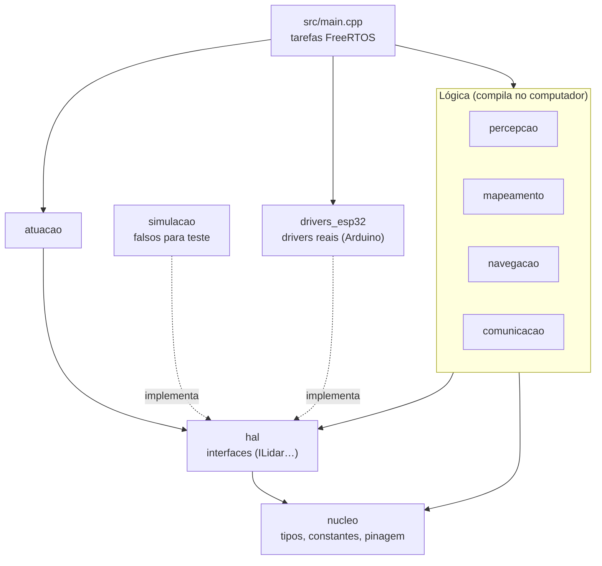
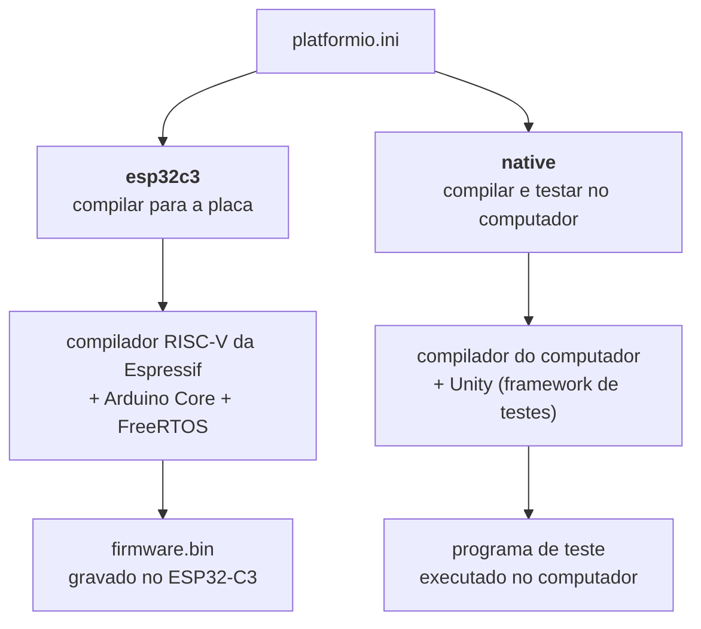
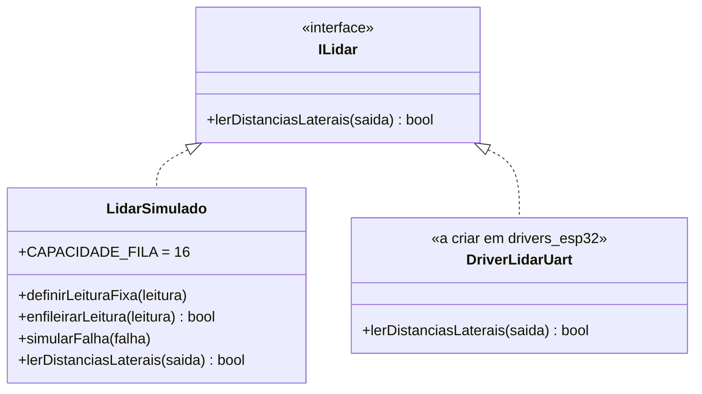

# Firmware: implementação

Esta página documenta o código do firmware do micromouse em `src/firmware`. Ela complementa a [arquitetura de software](software.md), que define as decisões de alto nível, e o [README do firmware](https://github.com/fcte-pi1/2026_2_PI1_Grupo01_Hilmer/tree/main/src/firmware), que traz os comandos do dia a dia.

O estado atual corresponde ao **projeto base** (tarefa [#172](https://github.com/fcte-pi1/2026_2_PI1_Grupo01_Hilmer/issues/172), Sprint 2, HU-02): estrutura de camadas, tipos compartilhados, interface do LiDAR, um LiDAR simulado para testes e as tarefas do FreeRTOS ainda vazias.

## Visão geral

O firmware roda no **ESP32-C3** com o **Arduino Core** (C++17) e é compilado com o **PlatformIO**. O código segue o ciclo *sense-think-act* (perceber, decidir, agir) e é dividido em camadas, uma biblioteca por camada em `lib/`.



**Figura 1.** Camadas do firmware e dependências entre elas: a lógica depende só das interfaces de `hal`, implementadas pelos drivers reais (`drivers_esp32`) e pelos falsos de teste (`simulacao`).

A lógica conhece só as **interfaces** de `hal`. Na placa, `main.cpp` liga cada interface ao driver real de `drivers_esp32`; nos testes, ela é ligada aos falsos de `simulacao`. É isso que permite testar percepção e mapeamento no computador, antes de o hardware estar montado.

## Dois ambientes: placa e computador

O `platformio.ini` define dois ambientes de compilação para o mesmo código:



**Figura 2.** Os dois ambientes de compilação definidos no `platformio.ini`: `esp32c3` gera o firmware gravado na placa e `native` compila e executa os testes no computador.

A lógica do robô (direções, mapa, classificação de paredes) não usa nada do Arduino, por isso compila nos dois ambientes. Assim, ela pode ser testada no computador, sem a placa e sem o sensor. Quando a lógica precisa do LiDAR, os testes usam o `LidarSimulado`, um sensor simulado que devolve as leituras escolhidas pelo próprio teste.

| | `esp32c3` | `native` |
|---|---|---|
| Onde roda | No ESP32-C3 | No computador de quem está desenvolvendo |
| O que inclui | Toda a lógica, `drivers_esp32` e `main.cpp` | A lógica e os falsos de `simulacao` (ignora `drivers_esp32`) |
| Comando | `pio run -e esp32c3` | `pio test -e native` |
| Resultado | `firmware.bin` e o uso de RAM e Flash | Relatório dos testes (aprovados ou com falha) |

## Estrutura de pastas

| Caminho | Conteúdo |
|---|---|
| `platformio.ini` | Ambientes `esp32c3` (placa) e `native` (testes no computador, com Unity) |
| `src/main.cpp` | Ponto de entrada: inicializa o log e cria as tarefas de navegação e telemetria |
| `lib/nucleo` | Tipos compartilhados, constantes do desafio e pinagem |
| `lib/hal` | Interfaces de hardware (`ILidar`; encoders e motores nos próximos épicos) |
| `lib/percepcao` | Classificação `parede`/`livre` (tarefa [#174](https://github.com/fcte-pi1/2026_2_PI1_Grupo01_Hilmer/issues/174)) |
| `lib/mapeamento` | Mapa do labirinto e armazenamento em memória ([#176](https://github.com/fcte-pi1/2026_2_PI1_Grupo01_Hilmer/issues/176), [#179](https://github.com/fcte-pi1/2026_2_PI1_Grupo01_Hilmer/issues/179)) |
| `lib/navegacao` | Localização, decisão de movimento e detecção do objetivo (Épico 02) |
| `lib/atuacao` | Controle dos motores e correção de trajetória (Épico 02) |
| `lib/comunicacao` | Telemetria, serialização JSON e *buffer* de reenvio (Épico 03) |
| `lib/simulacao` | `LidarSimulado` e, depois, o `LabirintoSimulado` ([#224](https://github.com/fcte-pi1/2026_2_PI1_Grupo01_Hilmer/issues/224)) |
| `lib/drivers_esp32` | Drivers que dependem do Arduino: LiDAR por UART, encoders, DRV8833, Wi-Fi |
| `test/` | Testes Unity, uma pasta `test_<modulo>` por módulo |

As pastas ainda vazias têm um arquivo `.gitkeep` para existirem no repositório.

## Regras de dependência

- As camadas de lógica (`nucleo`, `percepcao`, `mapeamento`, `navegacao`, `comunicacao`, `simulacao`) **não incluem `Arduino.h`**. Por isso o ambiente `native` ignora `drivers_esp32` (`lib_ignore` no `platformio.ini`).
- Todo acesso ao hardware passa por uma interface de `hal`.
- **Sem alocação dinâmica** na lógica: o maior labirinto tem 12×4 células, então estruturas de tamanho fixo bastam.
- Todo o código fica no namespace `micromouse`, com um `.h` por conceito e `#pragma once`.

## Núcleo: tipos e operações

Definidos em `lib/nucleo/src/Tipos.h` e `Direcao.h`.

| Tipo | Valores ou campos | Uso |
|---|---|---|
| `Direcao` | `Norte`, `Leste`, `Sul`, `Oeste` | Direção absoluta no labirinto |
| `Lado` | `Frente`, `Esquerda`, `Direita` | Lado relativo ao robô (leituras do LiDAR) |
| `EstadoParede` | `Desconhecido`, `Livre`, `Parede` | Estado de uma parede no mapa |
| `PosicaoCelula` | `linha`, `coluna` | Célula do labirinto; a partida é (0, 0) |
| `Pose` | `celula`, `direcao` | Onde o robô está e para onde está virado |
| `DistanciasLaterais` | `frenteMm`, `esquerdaMm`, `direitaMm` | Leitura do LiDAR, em milímetros |

A ordem de `Direcao` segue o **sentido horário**. As operações de `Direcao.h` usam essa ordem com soma módulo 4, por isso os valores não devem ser reordenados.

| Função | O que faz | Exemplo |
|---|---|---|
| `girarDireita(d)` | Giro de 90° no sentido horário | Norte → Leste |
| `girarEsquerda(d)` | Giro de 90° no sentido anti-horário | Norte → Oeste |
| `oposta(d)` | Giro de 180° | Norte → Sul |
| `direcaoAbsoluta(direcaoDoRobo, lado)` | Converte um lado do robô em direção do labirinto | Robô virado para Leste: esquerda = Norte, direita = Sul |

A `direcaoAbsoluta` é a ponte entre a percepção e o mapa: o LiDAR mede à frente, à esquerda e à direita do robô, e o mapa guarda as paredes por Norte, Sul, Leste e Oeste.

## Constantes

Definidas em `lib/nucleo/src/Configuracao.h`.

| Constante | Valor | Origem |
|---|---|---|
| `MAX_LINHAS_LABIRINTO` | 4 | Maior labirinto da competição (12×4) |
| `MAX_COLUNAS_LABIRINTO` | 12 | Maior labirinto da competição (12×4) |
| `TAMANHO_CELULA_MM` | 180 | Célula de 18 × 18 cm |
| `PERIODO_TELEMETRIA_MS` | 1000 | Envio a cerca de 1 s (arquitetura), dentro dos 2 s do RNF05 |
| `LIMITE_TEMPO_CORRIDA_MS` | 600 000 | 10 minutos por tentativa (RNF03) |

## Pinagem

Definida em `lib/nucleo/src/Pinos.h`, conforme os [diagramas de hardware](hardware-diagramas.md).

| Componente | Sinal | GPIO |
|---|---|---|
| DRV8833, motor M1 | AIN1 / AIN2 | 4 / 5 |
| DRV8833, motor M2 | BIN1 / BIN2 | 6 / 7 |
| Encoder esquerdo | A / B | 0 / 1 |
| Encoder direito | A / B | 3 / 10 |
| LiDAR (UART) | RX do ESP32 / TX do ESP32 | 20 / 21 |

!!! warning "Conflito a validar com a frente de hardware"
    GPIO20 e GPIO21 são os pinos padrão da **UART0** do ESP32-C3, a mesma usada pelo `Serial` (log e gravação). Esse ponto precisa ser resolvido antes dos testes de bancada com o LiDAR.

## Acesso ao LiDAR: `ILidar` e `LidarSimulado`



**Figura 3.** Interface `ILidar` e suas implementações: o `LidarSimulado`, usado nos testes, e o driver real por UART.

**Contrato de `ILidar::lerDistanciasLaterais`:** retorna `true` e preenche `saida` (em mm) quando há leitura válida das três direções; retorna `false` quando o sensor não responde ou a leitura é inválida. Nesse caso, o conteúdo de `saida` não deve ser usado.

**`LidarSimulado`** devolve o que o teste configurar. A cada leitura, segue esta ordem:

1. com a falha ligada (`simularFalha(true)`), a leitura falha e a fila não é consumida;
2. se houver leituras na fila, entrega a mais antiga e a remove;
3. se houver leitura fixa, entrega a leitura fixa;
4. caso contrário, a leitura falha.

A fila é circular, com capacidade fixa de 16 leituras; `enfileirarLeitura` retorna `false` quando ela está cheia.

```cpp
LidarSimulado lidar;
lidar.definirLeituraFixa({500, 500, 500});  // corredor livre
lidar.enfileirarLeitura({90, 90, 270});     // depois, parede à frente e à esquerda
ILidar& sensor = lidar;                     // a lógica recebe só a interface
```

## Labirinto simulado: `LabirintoSimulado`

> **Em desenvolvimento** ([#224](https://github.com/fcte-pi1/2026_2_PI1_Grupo01_Hilmer/issues/224), branch `feat/labirinto-simulado`). A interface, os labirintos de exemplo e o esqueleto dos testes estão prontos; a implementação e o modo labirinto do `LidarSimulado` estão em andamento.

O `LabirintoSimulado` (`lib/simulacao`) é um labirinto com todas as paredes conhecidas, usado como verdade de referência nos testes. Com ele, o `LidarSimulado` deixa de depender de leituras digitadas à mão: basta posicionar o robô numa célula, e o sensor simulado devolve o que o LiDAR real veria ali. Isso permite testar a classificação de paredes ([#174](https://github.com/fcte-pi1/2026_2_PI1_Grupo01_Hilmer/issues/174)) e a atualização do mapa ([#177](https://github.com/fcte-pi1/2026_2_PI1_Grupo01_Hilmer/issues/177)) num labirinto inteiro, sem hardware.

**Formato do labirinto.** O labirinto é escrito em texto, no formato clássico de micromouse. Cada célula ocupa 4 colunas e 2 linhas de texto; `+` marca os cantos, `---` uma parede horizontal e `|` uma parede vertical. A primeira linha é a borda Norte, e a partida (0, 0) é a célula do canto inferior esquerdo, com as mesmas convenções do `Mapa` e de `Direcao.h`.

```text
+---+---+---+---+
|       |       |
+   +---+   +   +
|   |       |   |
+   +   +---+   +
|       |       |
+   +---+   +---+
|   |           |
+---+---+---+---+
```

**Figura 4.** Labirinto 4×4 de exemplo (`LABIRINTO_4X4`), com a partida (0, 0) no canto inferior esquerdo.

Cada parede aparece uma única vez no texto, entre as duas células que ela separa. Por isso, o lado leste de uma célula e o lado oeste da vizinha nunca discordam. Ao carregar o texto, o `LabirintoSimulado` recusa:

| Resultado de `carregar` | Quando acontece |
|---|---|
| `Carregado` | Texto válido |
| `TamanhoInvalido` | O tamanho não é 4×4, 8×4 nem 12×4, ou as linhas têm larguras diferentes |
| `CaractereInvalido` | Caractere fora do formato |
| `ParedeIncompleta` | Parede pela metade, como `- -` |
| `PerimetroAberto` | Falta parede na borda externa |

**Distâncias.** Com o robô no centro da célula, a parede da própria célula está a 90 mm, e cada célula livre no caminho soma 180 mm (`TAMANHO_CELULA_MM`). No labirinto acima, com o robô em (0, 0) virado para o Norte, há três células livres à frente e paredes dos dois lados:

| Pose | Frente | Esquerda | Direita |
|---|:-:|:-:|:-:|
| (0, 0) Norte | 630 mm | 90 mm | 90 mm |
| (1, 0) Norte | 450 mm | 90 mm | 270 mm |
| (3, 0) Leste | 270 mm | 90 mm | 630 mm |

| Operação | O que faz |
|---|---|
| `carregar(texto)` | Lê o labirinto; se o texto for inválido, mantém o anterior |
| `temParede(celula, direcao)` | Se há parede naquele lado da célula (fora do labirinto conta como parede) |
| `distancias(pose, saida)` | Distâncias à frente, à esquerda e à direita para a pose |
| `LidarSimulado::usarLabirinto` e `posicionar(pose)` | Modo labirinto: a leitura passa a vir do labirinto, depois da falha e da fila e antes da leitura fixa (a implementar) |

Os testes ficam em `test/test_labirinto_simulado/`, com um labirinto de exemplo de cada tamanho da competição (4×4, 8×4 e 12×4) em `LabirintosExemplo.h`. Os três foram conferidos: perímetro fechado e todas as células alcançáveis a partir da partida.

## Percepção: classificação de paredes

O módulo de percepção (`lib/percepcao`) implementa a classe `ClassificadorParede`, responsável por classificar se cada lado ao redor do robô está desimpedido (`Livre`) ou obstruído (`Parede`) com base nas leituras de distância do LiDAR.

### Regras de Negócio e Algoritmo

* **Filtragem por Média:** O classificador recebe um vetor de amostras (`DistanciasLaterais`) e calcula a média aritmética para cada direção (`frenteMm`, `esquerdaMm`, `direitaMm`), atenuando ruídos e picos isolados.
* **Limiar Configurável:** O limiar é definido no construtor (valor padrão: **180 mm**).
  * Média $\le$ 180 mm $\rightarrow$ `EstadoParede::Parede` (obstáculo na célula atual).
  * Média $>$ 180 mm $\rightarrow$ `EstadoParede::Livre` (passagem aberta para a próxima célula).
* **Comportamento Fail-Safe:** Se o vetor de amostras recebido estiver vazio, o classificador retorna `EstadoParede::Parede` em todas as direções para evitar colisões.

### Interface da Classe

* **Entrada:** `std::vector<DistanciasLaterais>`
* **Saída:** `micromouse::ResultadoClassificacao` (`frente`, `esquerda` e `direita`)

## Tarefas do FreeRTOS

Criadas em `src/main.cpp`. Navegação e telemetria rodam de forma concorrente, como no diagrama de atividades: o ESP32-C3 tem um único núcleo, e o FreeRTOS alterna entre as tarefas conforme a prioridade de cada uma.

| Tarefa | Período | Prioridade | Pilha | Responsabilidade |
|---|---|---|---|---|
| `tarefaNavegacao` | 10 ms | 2 | 4096 bytes | Ciclo percepção → decisão → atuação |
| `tarefaTelemetria` | 1000 ms (`PERIODO_TELEMETRIA_MS`) | 1 | 4096 bytes | Coleta e envio de telemetria |

A navegação tem prioridade maior para que o envio de dados nunca atrase o controle do robô. Por enquanto, as duas tarefas têm só o laço e a espera; a lógica entra nas tarefas das próximas sprints.

## Testes

Os testes rodam no computador, no ambiente `native`, com o framework **Unity**. Cada módulo tem sua pasta `test/test_<modulo>/`.

| Arquivo | Teste | Verifica |
|---|---|---|
| `test_nucleo/test_direcao.cpp` | `test_girar_direita_percorre_as_quatro_direcoes` | Norte → Leste → Sul → Oeste → Norte |
| | `test_girar_esquerda_desfaz_girar_direita` | Giro à esquerda é o inverso do giro à direita |
| | `test_oposta_inverte_a_direcao` | Norte ↔ Sul, Leste ↔ Oeste |
| | `test_direcao_absoluta_converte_lado_do_robo_em_direcao_do_labirinto` | Frente, esquerda e direita com o robô virado para Leste |
| `test_simulacao/test_lidar_simulado.cpp` | `test_sem_leitura_configurada_a_leitura_falha` | Sem configuração, a leitura falha |
| | `test_leitura_fixa_se_repete_a_cada_chamada` | A leitura fixa se repete |
| | `test_fila_entrega_as_leituras_em_ordem_e_depois_volta_para_a_fixa` | Fila em ordem e retorno à leitura fixa |
| | `test_falha_simulada_retorna_false_e_nao_consome_a_fila` | Falha simulada não perde leituras da fila |
| | `test_fila_cheia_recusa_novas_leituras` | Limite de 16 leituras |
| | `test_pode_ser_usado_pela_interface_ILidar` | O simulado funciona por meio da interface |
| `test_percepcao/test_classificador.cpp` | `test_classificador_parede_proxima` | Média <= 180 mm classificada como Parede |
| | `test_classificador_passagem_livre` | Média > 180 mm classificada como Livre |
| | `test_classificador_valor_no_limiar` | Limite exato de 180 mm |
| | `test_classificador_leituras_com_ruido` | Atenuação de ruído via média |
| | `test_classificador_vetor_vazio` | Vetor vazio assume Parede por segurança |

Para rodar, dentro de `src/firmware`:

```bash
pio test -e native                  # todos os testes
pio test -e native -f test_nucleo   # só um módulo
pio run -e esp32c3                  # compila para a placa
```

Resultado do projeto base, executado em 04/10/2026: **10 de 10 testes aprovados** e build para o ESP32-C3 concluído com 4,2% de RAM e 18,9% de Flash. O registro completo da execução (ambiente, saídas e pendências) está em [Testes de Software](../07-testes/software.md#registro-de-execucao-dos-testes).

### Como ler uma falha

Exemplo real, com um valor esperado alterado de propósito (registrado em [Testes de Software](../07-testes/software.md#verificacao-de-deteccao-de-falhas-teste-negativo)):

```text
test/test_nucleo/test_direcao.cpp:21: test_girar_direita_percorre_as_quatro_direcoes: Expected 2 Was 1  [FAILED]
```

| Parte | Significado |
|---|---|
| `test_direcao.cpp:21` | Arquivo e linha da verificação que falhou |
| `test_girar_direita_percorre_as_quatro_direcoes` | Caso de teste que falhou |
| `Expected 2 Was 1` | O teste esperava 2 (`Sul`) e o código devolveu 1 (`Leste`) |

Ao investigar uma falha, compare o esperado com o obtido: ou o código tem um erro, ou o teste espera um valor errado. Uma falha também faz o PlatformIO mostrar `Program received signal SIGHUP` e o status `ERRORED`, porque o programa de teste termina com o número de falhas como código de saída; isso não é um travamento.

## Rastreabilidade

| Parte do código | Tarefa | HU / requisito |
|---|---|---|
| Estrutura, camadas e padrão de testes | [#172](https://github.com/fcte-pi1/2026_2_PI1_Grupo01_Hilmer/issues/172) Projeto base do firmware | [HU-02](https://github.com/fcte-pi1/2026_2_PI1_Grupo01_Hilmer/issues/36) (RF02) |
| `ILidar`, `DistanciasLaterais` | Base para [#173](https://github.com/fcte-pi1/2026_2_PI1_Grupo01_Hilmer/issues/173) Driver do LiDAR e [#174](https://github.com/fcte-pi1/2026_2_PI1_Grupo01_Hilmer/issues/174) Classificação | [HU-02](https://github.com/fcte-pi1/2026_2_PI1_Grupo01_Hilmer/issues/36) (RF02) |
| `Direcao`, `direcaoAbsoluta`, `EstadoParede` | Base para [#176](https://github.com/fcte-pi1/2026_2_PI1_Grupo01_Hilmer/issues/176) Estrutura do mapa e [#177](https://github.com/fcte-pi1/2026_2_PI1_Grupo01_Hilmer/issues/177) Atualização do mapa | [HU-03](https://github.com/fcte-pi1/2026_2_PI1_Grupo01_Hilmer/issues/37) (RF03) |
| `MAX_LINHAS_LABIRINTO`, `MAX_COLUNAS_LABIRINTO` | Base para [#179](https://github.com/fcte-pi1/2026_2_PI1_Grupo01_Hilmer/issues/179) Mapa em memória | [HU-04](https://github.com/fcte-pi1/2026_2_PI1_Grupo01_Hilmer/issues/38) (RF04) |
| `PERIODO_TELEMETRIA_MS`, `tarefaTelemetria` | Épico 03 (envio e *buffer*) | [HU-08](https://github.com/fcte-pi1/2026_2_PI1_Grupo01_Hilmer/issues/45), [HU-16](https://github.com/fcte-pi1/2026_2_PI1_Grupo01_Hilmer/issues/46) (RF08, RF16, RNF05) |
| `LIMITE_TEMPO_CORRIDA_MS` | Épico 02 (encerramento por tempo) | [HU-01](https://github.com/fcte-pi1/2026_2_PI1_Grupo01_Hilmer/issues/42) (RNF03) |
| `lib/percepcao` (`ClassificadorParede`) | [#174](https://github.com/fcte-pi1/2026_2_PI1_Grupo01_Hilmer/issues/174) Classificação parede/livre | [HU-02](https://github.com/fcte-pi1/2026_2_PI1_Grupo01_Hilmer/issues/36) (RF02) |
| `lib/simulacao` (`LabirintoSimulado`) | [#224](https://github.com/fcte-pi1/2026_2_PI1_Grupo01_Hilmer/issues/224) Simulador de labirinto (em desenvolvimento) | [HU-02](https://github.com/fcte-pi1/2026_2_PI1_Grupo01_Hilmer/issues/36) (RF02) |

## Próximos passos

- **Simulador de labirinto** ([#224](https://github.com/fcte-pi1/2026_2_PI1_Grupo01_Hilmer/issues/224)), em andamento: falta implementar o `LabirintoSimulado`, o modo labirinto do `LidarSimulado` e os testes (veja [Labirinto simulado](#labirinto-simulado-labirintosimulado)).
- **CI do firmware** ([#223](https://github.com/fcte-pi1/2026_2_PI1_Grupo01_Hilmer/issues/223)), concluído no PR [#295](https://github.com/fcte-pi1/2026_2_PI1_Grupo01_Hilmer/pull/295): todo PR para a `main` roda os testes nativos com cobertura mínima de 80% e o build do ESP32-C3. Falta o administrador do repositório proteger a `main` exigindo os dois checks.
- **Tarefas da Sprint 2:** driver do LiDAR, classificação `parede`/`livre`, estrutura do mapa e armazenamento em memória, cada uma na pasta da sua camada e com testes em `test/`.
- **Validar com o hardware:** o conflito dos pinos da UART0 e o primeiro teste gravado na placa (o projeto base foi compilado, mas ainda não gravado).
