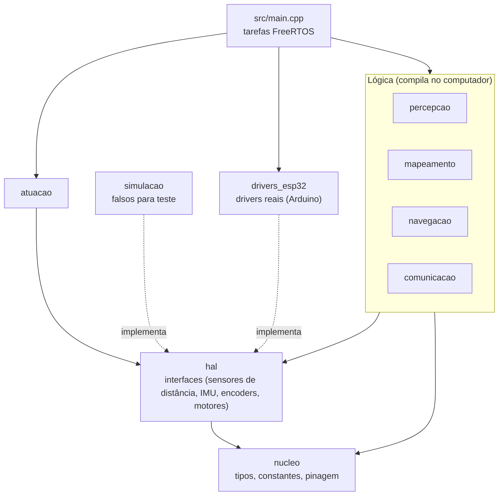
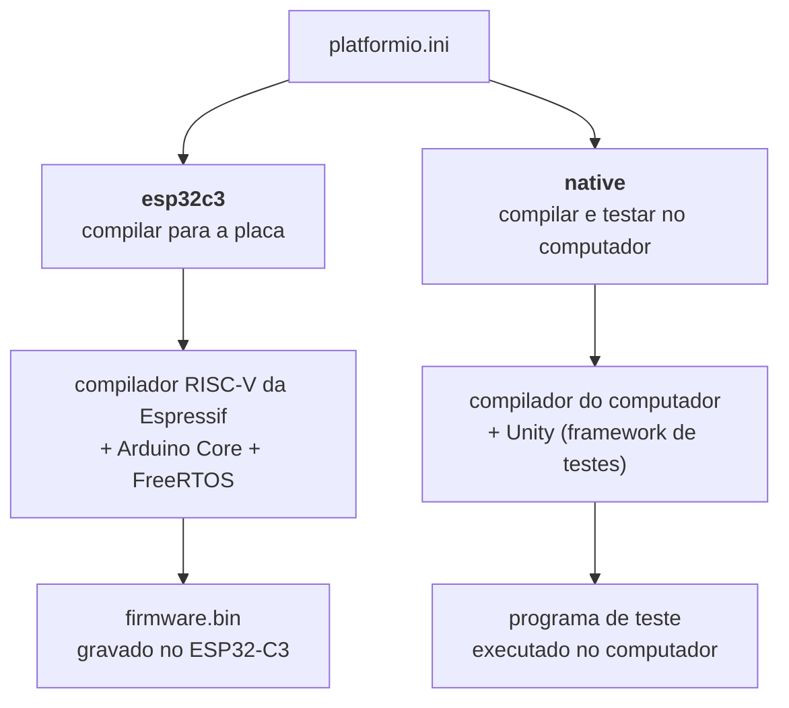
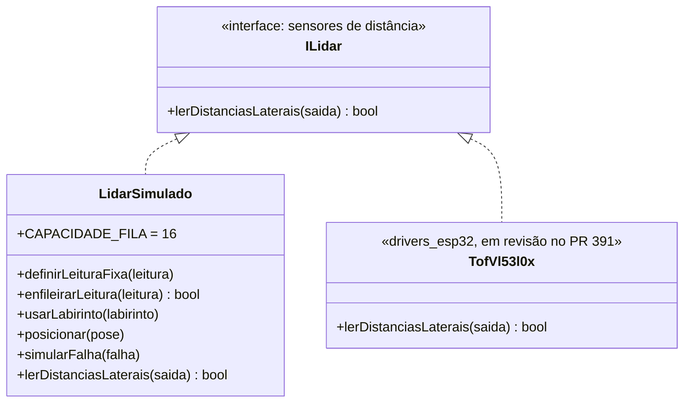
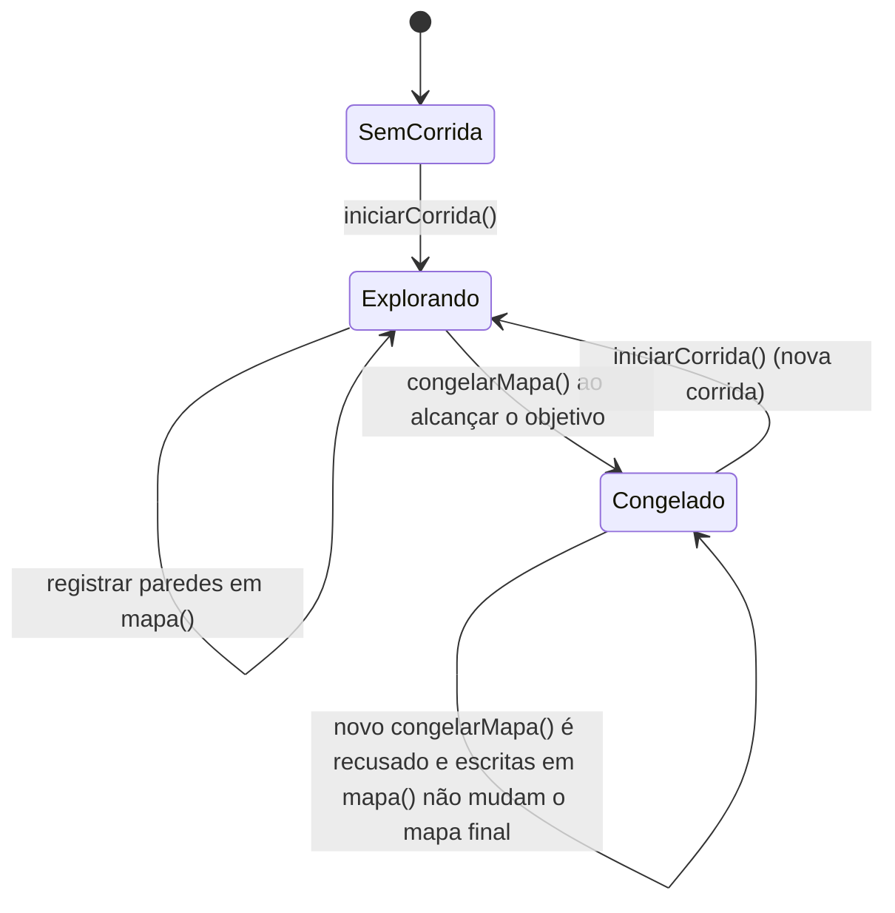
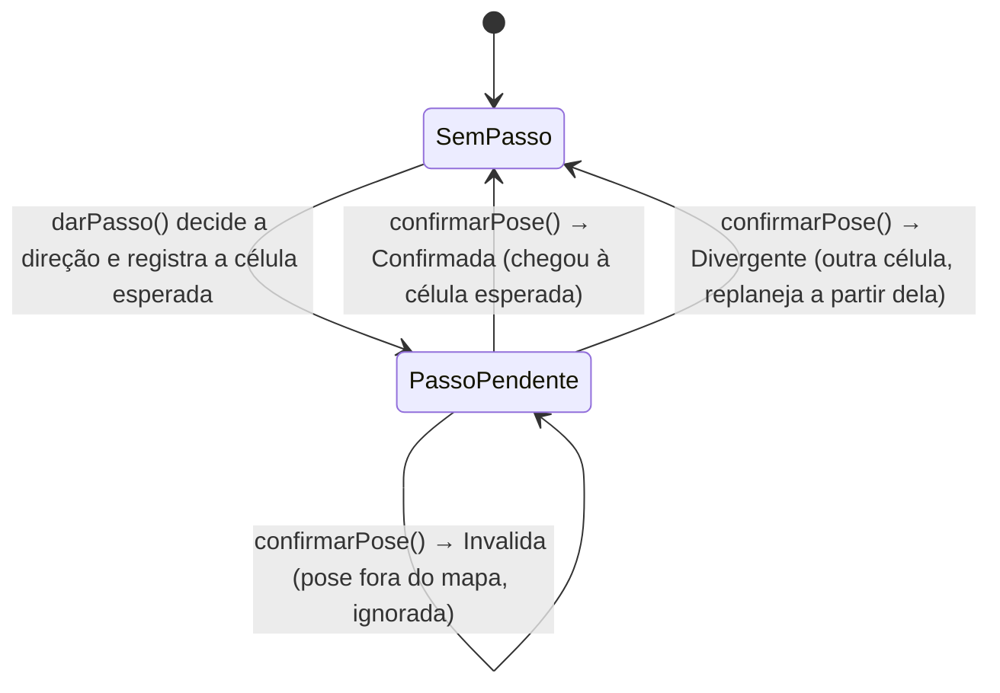
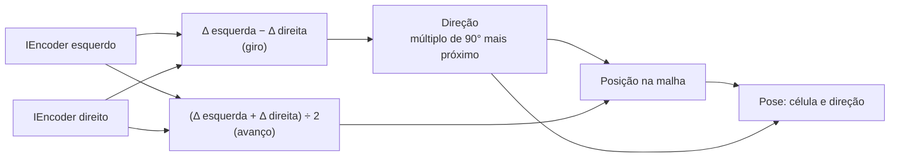
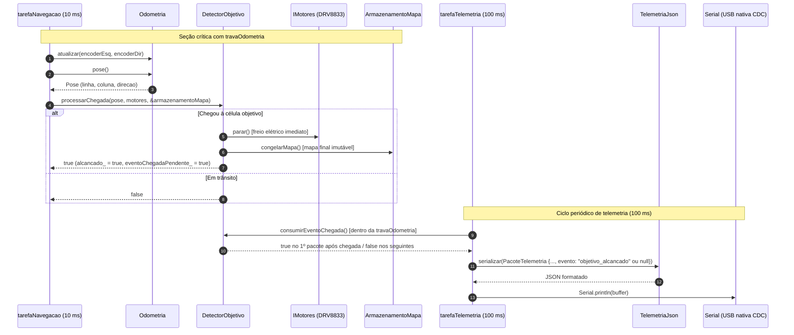
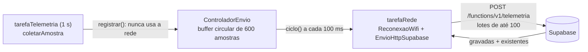
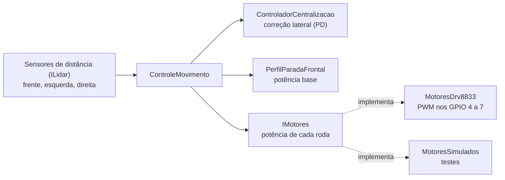

# Firmware: implementação

Esta página documenta o código do firmware do micromouse em `src/firmware`. Ela complementa a [arquitetura de software](software.md), que define as decisões de alto nível, e o [README do firmware](https://github.com/fcte-pi1/2026_2_PI1_Grupo01_Hilmer/tree/main/src/firmware), que traz os comandos do dia a dia.

O firmware começou no **projeto base** ([#172](https://github.com/fcte-pi1/2026_2_PI1_Grupo01_Hilmer/issues/172), Sprint 2) e hoje tem percepção, mapa, navegação, odometria, controle de movimento e telemetria, todos testados no computador. Desde 21/10/2026 ele segue a **Rev 2.0 do hardware**, descrita na seção [Hardware Rev 2.0](#hardware-rev-20) ([#382](https://github.com/fcte-pi1/2026_2_PI1_Grupo01_Hilmer/issues/382)).

## Visão geral

O firmware roda no **ESP32-C3** com o **Arduino Core** (C++17) e é compilado com o **PlatformIO**. O código segue o ciclo *sense-think-act* (perceber, decidir, agir) e é dividido em camadas, uma biblioteca por camada em `lib/`.


```mermaid
flowchart TB
    main["src/main.cpp<br/>tarefas FreeRTOS"]
    subgraph logica["Lógica (compila no computador)"]
        percepcao["percepcao"]
        mapeamento["mapeamento"]
        navegacao["navegacao"]
        comunicacao["comunicacao"]
    end
    atuacao["atuacao"]
    hal["hal<br/>interfaces (sensores de distância, IMU, encoders, motores)"]
    nucleo["nucleo<br/>tipos, constantes, pinagem"]
    simulacao["simulacao<br/>falsos para teste"]
    drivers["drivers_esp32<br/>drivers reais (Arduino)"]

    main --> logica
    main --> atuacao
    main --> drivers
    logica --> hal
    logica --> nucleo
    atuacao --> hal
    hal --> nucleo
    simulacao -. implementa .-> hal
    drivers -. implementa .-> hal
```

**Figura 1.** Camadas do firmware e dependências entre elas: a lógica depende só das interfaces de `hal`, implementadas pelos drivers reais (`drivers_esp32`) e pelos falsos de teste (`simulacao`).

A lógica conhece só as **interfaces** de `hal`. Na placa, `main.cpp` liga cada interface ao driver real de `drivers_esp32`; nos testes, ela é ligada aos falsos de `simulacao`. É isso que permite testar percepção e mapeamento no computador, antes de o hardware estar montado.

## Hardware Rev 2.0

Em 21/10/2026, a eletrônica enviou o esquemático e a lista de componentes da **Rev 2.0**, que é a referência do firmware até nova versão ([4.3 Hardware](hardware.md)).

| Parte | Antes | Rev 2.0 | Efeito no firmware |
|---|---|---|---|
| Placa | ESP32-C3 DevKit | **ESP32-C3 Super Mini** | O log sai pela USB nativa (GPIO18/19), porque a UART0 (GPIO20/21) passou a acionar os motores ([#377](https://github.com/fcte-pi1/2026_2_PI1_Grupo01_Hilmer/issues/377)) |
| Sensores de distância | LiDAR 360° por UART | **3 VL53L0X** (esquerdo, frontal e direito) por I²C | A interface `ILidar` continua; muda o driver por trás dela ([#344](https://github.com/fcte-pi1/2026_2_PI1_Grupo01_Hilmer/issues/344), PR [#391](https://github.com/fcte-pi1/2026_2_PI1_Grupo01_Hilmer/pull/391), em revisão) |
| Orientação | Só encoders | **IMU MPU6050** no mesmo I²C | Ângulo de giro pelo giroscópio ([#378](https://github.com/fcte-pi1/2026_2_PI1_Grupo01_Hilmer/issues/378), PR [#403](https://github.com/fcte-pi1/2026_2_PI1_Grupo01_Hilmer/pull/403), em revisão) |
| Motores | Motor TT | **N20** pelo DRV8833 | Pinos novos; detecção de motor travado ([#341](https://github.com/fcte-pi1/2026_2_PI1_Grupo01_Hilmer/issues/341)) |
| Encoders | Encoder óptico | Encoders dos N20, em GPIO4 a 7 | A odometria ([#187](https://github.com/fcte-pi1/2026_2_PI1_Grupo01_Hilmer/issues/187)) continua; os parâmetros precisam ser recalibrados para o N20 |

Enquanto os encoders não eram integrados à Rev 2.0, o plano previa estimar o deslocamento pelo comando dos motores, corrigido pelos sensores de distância (modo sem encoder, [#380](https://github.com/fcte-pi1/2026_2_PI1_Grupo01_Hilmer/issues/380)). Com os encoders disponíveis, esse modo passa a ser o plano B.

**O LiDAR não é mais usado.** O código dele (`lib/lidar`, decodificador LD06 e `FonteBytesSerial`) ainda está na `main` e deve sair num PR de código. Os registros de teste anteriores a 21/10 em [Testes de software](../07-testes/software.md) foram feitos com o LiDAR simulado e continuam como histórico.

## Dois ambientes: placa e computador

O `platformio.ini` define dois ambientes de compilação para o mesmo código:


```mermaid
flowchart TB
    ini["platformio.ini"]
    ini --> placa["<b>esp32c3</b><br/>compilar para a placa"]
    ini --> pc["<b>native</b><br/>compilar e testar no computador"]
    placa --> p1["compilador RISC-V da Espressif<br/>+ Arduino Core + FreeRTOS"]
    pc --> c1["compilador do computador<br/>+ Unity (framework de testes)"]
    p1 --> p2["firmware.bin<br/>gravado no ESP32-C3"]
    c1 --> c2["programa de teste<br/>executado no computador"]
```

**Figura 2.** Os dois ambientes de compilação definidos no `platformio.ini`: `esp32c3` gera o firmware gravado na placa e `native` compila e executa os testes no computador.

A lógica do robô (direções, mapa, classificação de paredes) não usa nada do Arduino, por isso compila nos dois ambientes. Assim, ela pode ser testada no computador, sem a placa e sem o sensor. Quando a lógica precisa dos sensores de distância, os testes usam o `LidarSimulado`, um sensor simulado que devolve as leituras escolhidas pelo próprio teste.

| | `esp32c3` | `native` |
|---|---|---|
| Onde roda | No ESP32-C3 | No computador de quem está desenvolvendo |
| O que inclui | Toda a lógica, `drivers_esp32` e `main.cpp` | A lógica e os falsos de `simulacao` (ignora `drivers_esp32`) |
| Comando | `pio run -e esp32c3` | `pio test -e native` |
| Resultado | `firmware.bin` e o uso de RAM e Flash | Relatório dos testes (aprovados ou com falha) |

## Estrutura de pastas

| Caminho | Conteúdo |
|---|---|
| `platformio.ini` | Ambientes `esp32c3` (placa) e `native` (testes no computador, com Unity) |
| `src/main.cpp` | Ponto de entrada: inicializa o log e cria as tarefas de navegação e telemetria |
| `lib/nucleo` | Tipos compartilhados, constantes do desafio e pinagem |
| `lib/hal` | Interfaces de hardware: `ILidar` (sensores de distância), `IEncoder`, `IMotores` e `IImu` (PR [#403](https://github.com/fcte-pi1/2026_2_PI1_Grupo01_Hilmer/pull/403), em revisão) |
| `lib/encoders` | Decodificação em quadratura dos encoders, conversão de pulsos em mm e distância por roda ([#186](https://github.com/fcte-pi1/2026_2_PI1_Grupo01_Hilmer/issues/186)) |
| `lib/percepcao` | Classificação `parede`/`livre` (tarefa [#174](https://github.com/fcte-pi1/2026_2_PI1_Grupo01_Hilmer/issues/174)) |
| `lib/mapeamento` | Mapa do labirinto, atualização, armazenamento em memória e mapa final ([#176](https://github.com/fcte-pi1/2026_2_PI1_Grupo01_Hilmer/issues/176), [#177](https://github.com/fcte-pi1/2026_2_PI1_Grupo01_Hilmer/issues/177), [#179](https://github.com/fcte-pi1/2026_2_PI1_Grupo01_Hilmer/issues/179), [#180](https://github.com/fcte-pi1/2026_2_PI1_Grupo01_Hilmer/issues/180)) |
| `lib/navegacao` | Algoritmo de resolução do labirinto por *flood fill* ([#183](https://github.com/fcte-pi1/2026_2_PI1_Grupo01_Hilmer/issues/183)), localização por odometria ([#187](https://github.com/fcte-pi1/2026_2_PI1_Grupo01_Hilmer/issues/187)) e detecção do objetivo ([#189](https://github.com/fcte-pi1/2026_2_PI1_Grupo01_Hilmer/issues/189)) |
| `lib/atuacao` | Controle de movimento: centralização no corredor e parada frontal ([#191](https://github.com/fcte-pi1/2026_2_PI1_Grupo01_Hilmer/issues/191)) |
| `lib/imu` | Calibração do viés e ângulo de giro do giroscópio ([#378](https://github.com/fcte-pi1/2026_2_PI1_Grupo01_Hilmer/issues/378), PR [#403](https://github.com/fcte-pi1/2026_2_PI1_Grupo01_Hilmer/pull/403), em revisão) |
| `lib/tof` | Combinação das leituras dos 3 VL53L0X ([#344](https://github.com/fcte-pi1/2026_2_PI1_Grupo01_Hilmer/issues/344), PR [#391](https://github.com/fcte-pi1/2026_2_PI1_Grupo01_Hilmer/pull/391), em revisão) |
| `lib/lidar` | Código do LiDAR da versão anterior do hardware; **não é usado** e deve ser removido |
| `lib/comunicacao` | Telemetria e eventos pontuais (`TelemetriaJson`, [#189](https://github.com/fcte-pi1/2026_2_PI1_Grupo01_Hilmer/issues/189)), serialização do mapa em JSON ([#178](https://github.com/fcte-pi1/2026_2_PI1_Grupo01_Hilmer/issues/178)) e *buffer* de reenvio (Épico 03) |
| `lib/simulacao` | Falsos para os testes: `LidarSimulado`, `LabirintoSimulado` ([#224](https://github.com/fcte-pi1/2026_2_PI1_Grupo01_Hilmer/issues/224)), `EncoderSimulado`, `MotoresSimulados` e `ImuSimulado` (PR [#403](https://github.com/fcte-pi1/2026_2_PI1_Grupo01_Hilmer/pull/403), em revisão) |
| `lib/drivers_esp32` | Drivers que dependem do Arduino: encoders, motores pelo DRV8833 e, em revisão, os VL53L0X (PR [#391](https://github.com/fcte-pi1/2026_2_PI1_Grupo01_Hilmer/pull/391)); o driver do MPU6050 está em desenvolvimento ([#378](https://github.com/fcte-pi1/2026_2_PI1_Grupo01_Hilmer/issues/378)) |
| `test/` | Testes Unity, uma pasta `test_<modulo>` por módulo |

As pastas ainda vazias têm um arquivo `.gitkeep` para existirem no repositório.

## Regras de dependência

- As camadas de lógica (`nucleo`, `percepcao`, `mapeamento`, `navegacao`, `comunicacao`, `simulacao`) **não incluem `Arduino.h`**. Por isso o ambiente `native` ignora `drivers_esp32` (`lib_ignore` no `platformio.ini`).
- Todo acesso ao hardware passa por uma interface de `hal`.
- **Sem alocação dinâmica** na lógica: o maior labirinto tem 12×4 células, então estruturas de tamanho fixo bastam.
- Todo o código fica no namespace `micromouse`, com um `.h` por conceito e `#pragma once`.

## Núcleo: tipos e operações

Definidos em `lib/nucleo/src/Tipos.h` e `Direcao.h`.

| Tipo | Valores ou campos | Uso |
|---|---|---|
| `Direcao` | `Norte`, `Leste`, `Sul`, `Oeste` | Direção absoluta no labirinto |
| `Lado` | `Frente`, `Esquerda`, `Direita` | Lado relativo ao robô (leituras dos sensores de distância) |
| `EstadoParede` | `Desconhecido`, `Livre`, `Parede` | Estado de uma parede no mapa |
| `PosicaoCelula` | `linha`, `coluna` | Célula do labirinto; a partida é (0, 0) |
| `Pose` | `celula`, `direcao` | Onde o robô está e para onde está virado |
| `DistanciasLaterais` | `frenteMm`, `esquerdaMm`, `direitaMm` | Leitura dos sensores de distância (os 3 VL53L0X na Rev 2.0), em milímetros |

A ordem de `Direcao` segue o **sentido horário**. As operações de `Direcao.h` usam essa ordem com soma módulo 4, por isso os valores não devem ser reordenados.

| Função | O que faz | Exemplo |
|---|---|---|
| `girarDireita(d)` | Giro de 90° no sentido horário | Norte → Leste |
| `girarEsquerda(d)` | Giro de 90° no sentido anti-horário | Norte → Oeste |
| `oposta(d)` | Giro de 180° | Norte → Sul |
| `direcaoAbsoluta(direcaoDoRobo, lado)` | Converte um lado do robô em direção do labirinto | Robô virado para Leste: esquerda = Norte, direita = Sul |

A `direcaoAbsoluta` é a ponte entre a percepção e o mapa: os sensores de distância medem à frente, à esquerda e à direita do robô, e o mapa guarda as paredes por Norte, Sul, Leste e Oeste.

## Constantes

Definidas em `lib/nucleo/src/Configuracao.h`.

| Constante | Valor | Origem |
|---|---|---|
| `MAX_LINHAS_LABIRINTO` | 4 | Maior labirinto da competição (12×4) |
| `MAX_COLUNAS_LABIRINTO` | 12 | Maior labirinto da competição (12×4) |
| `TAMANHO_CELULA_MM` | 180 | Célula de 18 × 18 cm |
| `PERIODO_TELEMETRIA_MS` | 1000 | Envio a cerca de 1 s (arquitetura), dentro dos 2 s do RNF05 |
| `LIMITE_TEMPO_CORRIDA_MS` | 600 000 | 10 minutos por tentativa (RNF03) |

## Pinagem

Definida em `lib/nucleo/src/Pinos.h` ([#377](https://github.com/fcte-pi1/2026_2_PI1_Grupo01_Hilmer/issues/377)), conforme o [esquemático Rev 2.0](hardware.md#42-pinagem-do-esp32-c3).

| Componente | Sinal | GPIO |
|---|---|---|
| I²C dos 3 VL53L0X e do MPU6050 | SDA / SCL | 9 / 8 |
| VL53L0X esquerdo, frontal e direito | XSHUT | 0 / 1 / 2 |
| DRV8833, motor esquerdo | IN1 / IN2 | 10 / 3 |
| DRV8833, motor direito | IN3 / IN4 | 20 / 21 |
| Encoder esquerdo | A / B | 4 / 5 |
| Encoder direito | A / B | 6 / 7 |
| USB nativa (log e gravação) | D− / D+ | 18 / 19 |

**Conferência com o esquemático (23/10/2026):** os 15 pinos do `Pinos.h` da `main` são iguais aos da tabela de pinagem da [4.3 Hardware](hardware.md), publicada no commit `ca175d9`. A versão anterior do esquemático, com o I²C em GPIO6/7, foi substituída pela Rev 2.0 nesse mesmo PR da eletrônica. O teste `test_pinos` confere que nenhum GPIO é usado duas vezes.

!!! warning "Pontos a validar com a eletrônica"
    - **GPIO20/21 (UART0) acionam o motor direito.** O ESP32-C3 manda o log de boot por eles antes de o firmware assumir, o que pode dar um tranco no motor ao ligar. O próprio esquemático pede validação.
    - **GPIO2, GPIO8 e GPIO9 são pinos de *strapping*** (definem o modo de boot). Eles estão com o XSHUT direito e o I²C; a placa precisa iniciar normalmente com esses circuitos ligados.
    - **Leitura da bateria:** o divisor termina em `BAT_ADC_TEST`, sem GPIO, porque o GPIO2, que tem ADC, ficou com o XSHUT. Ainda não há pino definido para medir a bateria.
    - O esquemático ainda descreve os encoders como "reservados; encoder não instalado". Com os encoders disponíveis, a eletrônica precisa atualizar essa nota.

## Sensores de distância: interface `ILidar` e `LidarSimulado`

Na Rev 2.0, o robô mede as paredes com **3 sensores VL53L0X** (esquerdo, frontal e direito), que medem a distância por tempo de voo da luz (*Time of Flight*, ToF). A lógica do firmware recebe essas distâncias pela interface `ILidar`. O nome é herdado da primeira versão do hardware: a interface continuou a mesma, e por isso a percepção, o mapa e o controle de movimento não precisaram mudar. O driver dos VL53L0X está em revisão ([#344](https://github.com/fcte-pi1/2026_2_PI1_Grupo01_Hilmer/issues/344), PR [#391](https://github.com/fcte-pi1/2026_2_PI1_Grupo01_Hilmer/pull/391)).


```mermaid
classDiagram
    class ILidar {
        <<interface: sensores de distância>>
        +lerDistanciasLaterais(saida) bool
    }
    class LidarSimulado {
        +CAPACIDADE_FILA = 16
        +definirLeituraFixa(leitura)
        +enfileirarLeitura(leitura) bool
        +usarLabirinto(labirinto)
        +posicionar(pose)
        +simularFalha(falha)
        +lerDistanciasLaterais(saida) bool
    }
    class TofVl53l0x {
        <<drivers_esp32, em revisão no PR 391>>
        +lerDistanciasLaterais(saida) bool
    }
    ILidar <|.. LidarSimulado
    ILidar <|.. TofVl53l0x
```

**Figura 3.** Interface dos sensores de distância e suas implementações: o `LidarSimulado`, usado nos testes, e o driver dos 3 VL53L0X.

**Contrato de `ILidar::lerDistanciasLaterais`:** retorna `true` e preenche `saida` (em mm) quando há leitura válida das três direções; retorna `false` quando o sensor não responde ou a leitura é inválida. Nesse caso, o conteúdo de `saida` não deve ser usado.

**`LidarSimulado`** devolve o que o teste configurar. A cada leitura, segue esta ordem:

1. com a falha ligada (`simularFalha(true)`), a leitura falha e a fila não é consumida;
2. se houver leituras na fila, entrega a mais antiga e a remove;
3. se o modo labirinto estiver ativo (`usarLabirinto` e `posicionar`), entrega o que o [`LabirintoSimulado`](#labirinto-simulado-labirintosimulado) mostra na pose atual, e a leitura falha se a pose estiver fora do labirinto;
4. se houver leitura fixa, entrega a leitura fixa;
5. caso contrário, a leitura falha.

A fila é circular, com capacidade fixa de 16 leituras; `enfileirarLeitura` retorna `false` quando ela está cheia.

```cpp
LidarSimulado lidar;
lidar.definirLeituraFixa({500, 500, 500});  // corredor livre
lidar.enfileirarLeitura({90, 90, 270});     // depois, parede à frente e à esquerda
ILidar& sensor = lidar;                     // a lógica recebe só a interface
```

## Labirinto simulado: `LabirintoSimulado`

O `LabirintoSimulado` (`lib/simulacao`) é um labirinto com todas as paredes conhecidas, usado como verdade de referência nos testes. Com ele, o `LidarSimulado` deixa de depender de leituras digitadas à mão: basta posicionar o robô numa célula, e o sensor simulado devolve o que os sensores de distância reais veriam ali. Isso permite testar a classificação de paredes ([#174](https://github.com/fcte-pi1/2026_2_PI1_Grupo01_Hilmer/issues/174)) e a atualização do mapa ([#177](https://github.com/fcte-pi1/2026_2_PI1_Grupo01_Hilmer/issues/177)) num labirinto inteiro, sem hardware.

**Formato do labirinto.** O labirinto é escrito em texto, no formato clássico de micromouse. Cada célula ocupa 4 colunas e 2 linhas de texto; `+` marca os cantos, `---` uma parede horizontal e `|` uma parede vertical. A primeira linha é a borda Norte, e a partida (0, 0) é a célula do canto inferior esquerdo, com as mesmas convenções do `Mapa` e de `Direcao.h`.

```text
+---+---+---+---+
|       |       |
+   +---+   +   +
|   |       |   |
+   +   +---+   +
|       |       |
+   +---+   +---+
|   |           |
+---+---+---+---+
```

**Figura 4.** Labirinto 4×4 de exemplo (`LABIRINTO_4X4`), com a partida (0, 0) no canto inferior esquerdo.

Cada parede aparece uma única vez no texto, entre as duas células que ela separa. Por isso, o lado leste de uma célula e o lado oeste da vizinha nunca discordam. Ao carregar o texto, o `LabirintoSimulado` recusa:

| Resultado de `carregar` | Quando acontece |
|---|---|
| `Carregado` | Texto válido |
| `TamanhoInvalido` | O tamanho não é 4×4, 8×4 nem 12×4, ou as linhas têm larguras diferentes |
| `CaractereInvalido` | Caractere fora do formato |
| `ParedeIncompleta` | Parede pela metade, como `- -` |
| `PerimetroAberto` | Falta parede na borda externa |

**Distâncias.** Com o robô no centro da célula, a parede da própria célula está a 90 mm, e cada célula livre no caminho soma 180 mm (`TAMANHO_CELULA_MM`). No labirinto acima, com o robô em (0, 0) virado para o Norte, há três células livres à frente e paredes dos dois lados:

| Pose | Frente | Esquerda | Direita |
|---|:-:|:-:|:-:|
| (0, 0) Norte | 630 mm | 90 mm | 90 mm |
| (1, 0) Norte | 450 mm | 90 mm | 270 mm |
| (3, 0) Leste | 270 mm | 90 mm | 630 mm |

| Operação | O que faz |
|---|---|
| `carregar(texto)` | Lê o labirinto; se o texto for inválido, mantém o anterior |
| `temParede(celula, direcao)` | Se há parede naquele lado da célula (fora do labirinto conta como parede) |
| `distancias(pose, saida)` | Distâncias à frente, à esquerda e à direita para a pose; devolve `false` sem labirinto carregado ou com a célula fora dele |
| `LidarSimulado::usarLabirinto(labirinto)` e `posicionar(pose)` | Modo labirinto: a leitura passa a vir do labirinto, depois da falha e da fila e antes da leitura fixa. O labirinto não é copiado e precisa continuar existindo; sem `posicionar`, vale a leitura fixa |

Os testes ficam em `test/test_labirinto_simulado/`, com um labirinto de exemplo de cada tamanho da competição (4×4, 8×4 e 12×4) em `LabirintosExemplo.h`. Os três têm o perímetro fechado e todas as células alcançáveis a partir da partida, e os testes conferem essas duas propriedades a cada execução. O uso do simulador também está no [README do firmware](https://github.com/fcte-pi1/2026_2_PI1_Grupo01_Hilmer/blob/main/src/firmware/README.md#labirinto-simulado).

## Percepção: classificação de paredes

O módulo de percepção (`lib/percepcao`) implementa a classe `ClassificadorParede`, responsável por processar as medições de distância e classificar se cada lado ao redor do robô (frente, esquerda e direita) está desimpedido (`Livre`) ou obstruído (`Parede`) para alimentar a atualização do mapa (HU-02, [#379](https://github.com/fcte-pi1/2026_2_PI1_Grupo01_Hilmer/issues/379)).

Com a revisão eletrônica Rev 2.0, o LiDAR 360° por UART foi substituído por **3 sensores Time-of-Flight (ToF) VL53L0X** via barramento I²C. Diferentemente do LiDAR centralizado único anterior, os sensores ToF possuem características ópticas distintas, limites físicos operacionais bem delimitados e são fixados em pontos específicos da estrutura mecânica do robô.

### Geometria dos sensores e dedução dos limiares

Os parâmetros físicos do labirinto e do micromouse determinam a faixa nominal de leituras de distância esperadas:

* **Largura do corredor livre:** A célula do labirinto mede 180 mm (`TAMANHO_CELULA_MM`, `Configuracao.h`) e a espessura das paredes de madeira é de 12 mm (`ESPESSURA_PAREDE_MM`, `ConfiguracaoControle.h`), resultando em um vão livre de $180 - 12 = 168\text{ mm}$.
* **Centro do corredor:** Com o robô perfeitamente centralizado, a distância do centro geométrico até a face de cada parede lateral é de $d_{\text{centro\_parede}} = (180 - 12) / 2 = 84\text{ mm}$ (`DISTANCIA_CENTRO_A_PAREDE_MM`).
* **Dimensões do chassi:** O chassi possui meia-largura de 60 mm e meio-comprimento de 50 mm (`estruturas.md`). Se os sensores laterais fossem montados na borda externa do chassi, a distância medida até a parede seria de $84 - 60 = 24\text{ mm}$. Como o datasheet do VL53L0X (ST DocID029104) especifica distância mínima confiável em torno de **30 mm**, a montagem física exige necessariamente sensores recuados em relação à borda externa.
* **Cálculo analítico do limiar de decisão:**
  Para um sensor montado com deslocamento $d_{\text{offset}}$ em relação ao centro do robô na direção de visada:
  $$\begin{aligned}
  d_{\text{parede}} &= d_{\text{centro\_parede}} - d_{\text{offset}} = 84\text{ mm} - d_{\text{offset}} \\
  d_{\text{livre}} &= d_{\text{parede}} + \text{TAMANHO\_CELULA\_MM} = d_{\text{parede}} + 180\text{ mm} \\
  \text{Limiar ideal} &= \frac{d_{\text{parede}} + d_{\text{livre}}}{2} = d_{\text{parede}} + 90\text{ mm}
  \end{aligned}$$
  Adotando provisoriamente um recuo de montagem de $d_{\text{offset}} = 30\text{ mm}$ (sensores a 30 mm do centro):
  - $d_{\text{parede}} = 84 - 30 = 54\text{ mm}$ (garantindo folga segura acima dos 30 mm mínimos).
  - $d_{\text{livre}} = 54 + 180 = 234\text{ mm}$ (ou saturação de fora de alcance em corredores contínuos).
  - Ponto médio ótimo: $54 + 90 = 144\text{ mm}$, parametrizado provisoriamente como **140 mm**.

Esse limiar de 140 mm também assegura perfeita compatibilidade com o ambiente simulado (`LabirintoSimulado`), no qual a parede imediata lê nominalmente 90 mm ($\le 140\text{ mm} \to \text{Parede}$) e o corredor aberto lê $\ge 270\text{ mm}$ ($> 140\text{ mm} \to \text{Livre}$).

### Valores provisórios de configuração (`ConfiguracaoPercepcao.h`)

Os parâmetros da camada de percepção estão isolados em `ConfiguracaoPercepcao.h`:

| Parâmetro | Constante | Valor provisório | Origem / Justificativa |
|---|---|---|---|
| Limiar frontal | `limiarFrenteMm` | **140 mm** | Ponto médio para offset frontal de 30 mm (54 mm vs 234 mm) |
| Limiar esquerdo | `limiarEsquerdaMm` | **140 mm** | Ponto médio para offset lateral de 30 mm (54 mm vs 234 mm) |
| Limiar direito | `limiarDireitaMm` | **140 mm** | Ponto médio para offset lateral de 30 mm (54 mm vs 234 mm) |
| Distância mínima | `distanciaMinimaMm` | **30 mm** | Limite operacional inferior do VL53L0X (datasheet ST DocID029104) |
| Distância máxima | `distanciaMaximaMm` | **1200 mm** | Limite superior operacional confiável para alvos difusos em ambiente interno |
| Código fora de alcance | `DISTANCIA_OUT_OF_RANGE_TOF_MM` | **8190 mm** | Código retornado pelo hardware/driver VL53L0X na ausência de retorno infravermelho |
| Tipo de filtro | `tipoFiltro` | **`Mediana`** | Filtro de mediana de até 16 amostras, imune a ruídos impulsivos pontuais |

> [!WARNING]
> **Valores provisórios:** os limiares e offsets foram calculados a partir da geometria teórica do labirinto e do esquemático Rev 2.0. A calibração final dos offsets e limiares reais depende da validação física na bancada de ensaios com os sensores montados no chassi ([#175](https://github.com/fcte-pi1/2026_2_PI1_Grupo01_Hilmer/issues/175)).

### Regras de Negócio e Algoritmo

1. **Tratamento defensivo de limites operacionais:**
   - **Fora de alcance ($> 1200\text{ mm}$ ou $\ge 8190\text{ mm}$):** Indica ausência de eco refletor próximo (lado livre). O método `tratarDistancia()` satura a medida em $1200\text{ mm}$ ($> \text{limiar} \to \text{Livre}$).
   - **Abaixo do mínimo ($< 30\text{ mm}$):** Indica robô muito próximo ou colado à parede. O método satura a medida em $30\text{ mm}$ ($\le \text{limiar} \to \text{Parede}$).
2. **Filtragem digital contra ruídos espúrios:**
   - Em vez de uma média aritmética simples — suscetível a desvios severos causados por leituras espúrias isoladas (por exemplo, uma perda momentânea de reflexão infravermelha retornando 8190 mm elevaria a média aritmética mesmo em frente a uma parede real) —, o classificador utiliza por padrão um **filtro de mediana** sobre uma janela estática de até 16 amostras.
   - O algoritmo ordena os valores tratados em ordem crescente (via *insertion sort* local, sem alocação dinâmica no heap) e seleciona o elemento mediano, eliminando *outliers* espúrios com custo computacional mínimo. Também suporta o modo `TipoFiltroPercepcao::Media` quando configurado.
3. **Decisão por direção independente:**
   - Cada direção avalia a distância filtrada contra o seu respectivo limiar (`limiarFrenteMm`, `limiarEsquerdaMm`, `limiarDireitaMm`). Se a distância filtrada for $\le \text{limiar}$, classifica como `EstadoParede::Parede`; caso contrário, `EstadoParede::Livre`.
4. **Comportamento Fail-Safe:** Se o vetor de amostras for nulo ou vazio (`quantidade == 0`), retorna `EstadoParede::Desconhecido` para todos os lados.

### Interface da Classe

* **Construtores:**
  - `ClassificadorParede()`: inicializa com a `ConfiguracaoPercepcao` padrão.
  - `explicit ClassificadorParede(uint16_t limiarMm)`: limiar uniforme para todos os lados (compatibilidade).
  - `ClassificadorParede(const ConfiguracaoPercepcao& config)`: configuração customizada completa.
  - `ClassificadorParede(uint16_t frente, uint16_t esquerda, uint16_t direita)`: limiares específicos por direção.
* **Métodos de ajuste e consulta:**
  - `void definirLimiar(uint16_t limiarMm)` / `void definirLimiar(Lado lado, uint16_t limiarMm)`.
  - `void definirLimiares(uint16_t frente, uint16_t esquerda, uint16_t direita)`.
  - `uint16_t obterLimiar() const` / `uint16_t obterLimiar(Lado lado) const`.
  - `const ConfiguracaoPercepcao& obterConfiguracao() const` / `void definirConfiguracao(...)`.
* **Métodos de tratamento e inspeção:**
  - `uint16_t tratarDistancia(uint16_t distanciaBrutaMm) const`: aplica saturação de limites.
  - `bool ehAbaixoDoMinimo(uint16_t distanciaMm) const`: valida se a medida viola o piso confiável.
  - `bool ehForaDeAlcance(uint16_t distanciaMm) const`: valida se a medida excede o teto confiável.
  - `EstadoParede classificarDistancia(Lado lado, uint16_t distanciaMm) const`: classifica uma leitura individual tratada.
* **Classificação de lotes e filtragem:**
  - `uint16_t filtrarAmostras(const uint16_t* valores, size_t quantidade) const`: filtra lote numérico via mediana/média.
  - `ResultadoClassificacao classificar(const DistanciasLaterais* amostras, size_t quantidade) const`.
  - `ResultadoClassificacao classificar(const DistanciasLaterais& leitura) const`: sobrecarga conveniente para amostra única.

## Mapeamento: atualização do mapa

O módulo de mapeamento (`lib/mapeamento`) implementa a classe `AtualizadorMapa`, responsável por integrar a percepção à representação espacial: converte as observações relativas dos sensores de distância (frente, esquerda e direita) na pose atual do robô em direções cardeais absolutas (Norte, Leste, Sul e Oeste) e registra as paredes no `Mapa` ([#177](https://github.com/fcte-pi1/2026_2_PI1_Grupo01_Hilmer/issues/177)).

### Regras de Negócio e Algoritmo

* **Conversão de Eixos:** A partir de `pose.direcao`, calcula a direção absoluta para cada lado via `direcaoAbsoluta`:
  * Robô ao Norte: Frente $\rightarrow$ Norte, Esquerda $\rightarrow$ Oeste, Direita $\rightarrow$ Leste.
  * Robô a Leste: Frente $\rightarrow$ Leste, Esquerda $\rightarrow$ Norte, Direita $\rightarrow$ Sul.
  * Robô ao Sul: Frente $\rightarrow$ Sul, Esquerda $\rightarrow$ Leste, Direita $\rightarrow$ Oeste.
  * Robô a Oeste: Frente $\rightarrow$ Oeste, Esquerda $\rightarrow$ Sul, Direita $\rightarrow$ Norte.
* **Espelhamento Automático:** Cada parede registrada na célula atual atualiza automaticamente a aresta correspondente na célula vizinha via `Mapa::registrarParede`.
* **Tratamento de Conflito:** Se a leitura contradiz o mapa (ex.: sensor detecta livre onde já havia parede), o mapa **preserva o valor antigo** e o atualizador sinaliza `temConflito = true` em `ResultadoAtualizacao`. A política de decisão fica a cargo do algoritmo de navegação (#188).
* **Fail-Safe / Desconhecido:** Classificações com valor `Desconhecido` ou poses fora das dimensões válidas do mapa retornam `Invalida` e não alteram o mapa.

### Interface da Classe

* **Entrada principal:** `Mapa &mapa`, `const Pose &pose`, `const ClassificadorParede::ResultadoClassificacao &classificacao`
* **Sobrecarga de conveniência:** `Mapa &mapa`, `const Pose &pose`, `const ClassificadorParede &classificador`, `const DistanciasLaterais *amostras`, `size_t quantidadeAmostras`, realizando a classificação internamente antes do registro.
* **Saída:** `ResultadoAtualizacao` (`frente`, `esquerda`, `direita` e a flag `temConflito`).

## Mapeamento: mapa final da corrida

Quando o robô alcança a célula objetivo, o mapa do labirinto percorrido precisa ficar guardado e pronto para ser enviado ao servidor, vinculado ao registro da corrida (HU-04, [#180](https://github.com/fcte-pi1/2026_2_PI1_Grupo01_Hilmer/issues/180)). O `ArmazenamentoMapa` (`lib/mapeamento`), que já era o dono do mapa da corrida ([#179](https://github.com/fcte-pi1/2026_2_PI1_Grupo01_Hilmer/issues/179)), passou a guardar também o **mapa final**: uma cópia feita no momento do congelamento.


```mermaid
stateDiagram-v2
    [*] --> SemCorrida
    SemCorrida --> Explorando: iniciarCorrida()
    Explorando --> Explorando: registrar paredes em mapa()
    Explorando --> Congelado: congelarMapa() ao alcançar o objetivo
    Congelado --> Congelado: novo congelarMapa() é recusado e escritas em mapa() não mudam o mapa final
    Congelado --> Explorando: iniciarCorrida() (nova corrida)
```

**Figura 5.** Ciclo de vida do mapa final no `ArmazenamentoMapa`: o congelamento só acontece uma vez por corrida e só uma nova corrida o destrava.

### Regras de Negócio e Algoritmo

* **Congelamento por cópia:** `congelarMapa()` copia o mapa da corrida para `mapaFinal_`. A cópia isola o resultado: a navegação pode continuar escrevendo no mapa da corrida (por exemplo, no caminho de volta à partida) sem alterar o mapa final, nem o JSON gerado a partir dele.
* **Uma vez por corrida:** congelar antes de `iniciarCorrida()` ou congelar de novo é recusado (`false`), e o mapa final continua o da primeira vez. `iniciarCorrida()` destrava o congelamento para a próxima corrida.
* **Leitura protegida:** `mapaFinal()` devolve `nullptr` enquanto o mapa não foi congelado e, depois, um ponteiro `const`, só para leitura.
* **Serialização no formato da [#178](https://github.com/fcte-pi1/2026_2_PI1_Grupo01_Hilmer/issues/178) (tarefa 5.3.3):** `MapaJson::serializarFinal(armazenamento, saida, capacidade)` gera o mesmo JSON de `serializar()`, mas do mapa final. Sem mapa congelado, devolve `0` e deixa `saida` com uma string vazia.
* **Memória sem alocação dinâmica:** os dois mapas ficam dentro do objeto, que passou de 196 para 392 bytes (dois `Mapa` de 195 bytes e dois indicadores), cerca de 0,1% dos 320 KB de RAM do ESP32-C3.

### Interface da Classe

* **`bool congelarMapa()`:** `true` se congelou; `false` se a corrida não foi iniciada ou se o mapa já estava congelado.
* **`bool mapaCongelado() const`:** `true` depois do congelamento, até a próxima `iniciarCorrida()`.
* **`const Mapa* mapaFinal() const`:** o mapa final, ou `nullptr` se ainda não congelou.
* **`static size_t MapaJson::serializarFinal(const ArmazenamentoMapa&, char* saida, size_t capacidade)`:** número de caracteres escritos sem o `\0`; `0` se não congelou, se `saida` é nulo ou se o buffer não comporta o JSON.

## Navegação: algoritmo de resolução do labirinto

O módulo de navegação (`lib/navegacao`) implementa a classe `Navegacao`, que decide para qual célula vizinha o robô deve ir para chegar à célula objetivo, usando só o que o `Mapa` já sabe sobre as paredes (HU-01, [#183](https://github.com/fcte-pi1/2026_2_PI1_Grupo01_Hilmer/issues/183)). Ela não aciona os motores: devolve uma **direção** e a **célula esperada**, e só atualiza a posição do robô quando os sensores a confirmam. Como não depende do Arduino nem aloca memória dinâmica, é testada no ambiente `native`.

O objetivo padrão é o canto diametralmente oposto à partida, `(linhas − 1, colunas − 1)`: (3, 3) no 4×4, (3, 7) no 8×4 e (3, 11) no 12×4. Ele pode ser trocado por `definirObjetivo()`.

### Lógica de decisão de movimentação

A cada decisão, a `Navegacao` executa três etapas:

1. **Calcula a distância de cada célula até o objetivo (*flood fill*).** Uma busca em largura (BFS) parte do objetivo, com distância 0, e se espalha pelas células vizinhas; cada célula recebe o número mínimo de células até o objetivo. A fila é um vetor estático de 48 posições (o maior labirinto, 12×4), sem alocação dinâmica.
2. **Considera o mapa de forma otimista.** Só uma parede confirmada (`EstadoParede::Parede`) bloqueia a passagem, conferida nas duas células que ela separa. Paredes `Livre` e `Desconhecido` são tratadas como passagem. Por isso o algoritmo funciona com o mapa parcial: ele planeja como se o desconhecido estivesse aberto e, quando os sensores de distância revelam uma parede nova, o próximo cálculo já desvia dela. O *flood fill* é refeito em toda decisão, porque o mapa muda a cada célula visitada.
3. **Escolhe a vizinha mais próxima do objetivo.** Entre as quatro vizinhas que estão dentro do mapa e não têm parede conhecida no caminho, escolhe a de **menor distância**. No empate, a preferência é, nesta ordem: **frente** (mantém a direção atual, sem giro), **direita**, **esquerda** e **trás**. Seguir em frente evita manobras, que gastam tempo e acumulam erro de odometria.

A decisão devolve `false`, sem direção, quando o robô já está no objetivo ou quando o objetivo é inalcançável pelas paredes conhecidas (a distância da célula atual é `DISTANCIA_INFINITA`, 255).

| 3 | 2 | 1 | **0** |
|:---:|:---:|:---:|:---:|
| 4 | 3 | 2 | 1 |
| 5 | 4 | 3 | 2 |
| **6** | 5 | 4 | 3 |

**Figura 6.** Distâncias calculadas pelo *flood fill* num mapa 4×4 sem paredes internas conhecidas, com o objetivo (3, 3) no canto superior direito (0) e a partida (0, 0) no canto inferior esquerdo (6). Na partida, virado para o Norte, as vizinhas Norte (1, 0) e Leste (0, 1) empatam com distância 5; o desempate escolhe a frente, o Norte. Se os sensores revelarem uma parede ao Norte, o próximo cálculo descarta essa vizinha e o robô segue para Leste.

### Ciclo de um passo: decisão, movimento e confirmação pelos sensores

A `Navegacao` não considera que o robô andou só porque decidiu andar. Um passo tem três etapas, e cada uma tem um responsável:

| Etapa | Responsável | O que acontece |
|---|---|---|
| 1. Decidir | `Navegacao::darPasso(direcao)` | Aplica a lógica acima, devolve a direção e registra a célula esperada (`obterCelulaEsperada()`). A pose **não muda** |
| 2. Mover | Controle de movimento ([#184](https://github.com/fcte-pi1/2026_2_PI1_Grupo01_Hilmer/issues/184)), com os motores da [#341](https://github.com/fcte-pi1/2026_2_PI1_Grupo01_Hilmer/issues/341) | Gira até a direção e anda uma célula (18 cm) |
| 3. Confirmar | Sensores, como a odometria dos encoders ([#187](https://github.com/fcte-pi1/2026_2_PI1_Grupo01_Hilmer/issues/187)), por `Navegacao::confirmarPose(pose)` | Informa a célula e a direção medidas; a pose medida passa a ser a pose da navegação |


```mermaid
stateDiagram-v2
    [*] --> SemPasso
    SemPasso --> PassoPendente: darPasso() decide a direção e registra a célula esperada
    PassoPendente --> PassoPendente: confirmarPose() → EmAndamento (ainda na célula de origem)
    PassoPendente --> PassoPendente: confirmarPose() → Invalida (pose fora do mapa, ignorada)
    PassoPendente --> SemPasso: confirmarPose() → Confirmada (chegou à célula esperada)
    PassoPendente --> SemPasso: confirmarPose() → Divergente (outra célula, replaneja a partir dela)
```

**Figura 7.** Estados de um passo na `Navegacao`: enquanto há passo pendente, `darPasso()` recusa um novo passo, e só a confirmação dos sensores conclui ou cancela o passo.

| `ResultadoConfirmacao` | Quando | Efeito |
|---|---|---|
| `Confirmada` | A pose medida está na célula esperada (ou não havia passo pendente) | Adota a pose medida e conclui o passo |
| `EmAndamento` | A pose medida ainda está na célula de origem | Adota a pose (por exemplo, a nova direção depois do giro) e mantém o passo pendente |
| `Divergente` | A pose medida está em outra célula (patinagem, deriva) | Adota a pose medida e cancela o passo; o próximo `darPasso()` replaneja a partir dela |
| `Invalida` | A pose medida está fora do mapa | Ignora a medida; a pose e o passo pendente não mudam |

A pose medida é sempre a referência: a navegação nunca “teletransporta” o robô para a célula que ela mesma escolheu. Se uma roda patinar ou uma parede impedir o movimento, os sensores informam onde o robô de fato está, e a decisão seguinte parte dali.

### Regras de Negócio e Algoritmo

* **Leitura antes da decisão:** a decisão usa as paredes da célula atual que já estão no mapa. Por isso o ciclo da navegação deve ler os sensores de distância e atualizar o mapa (`AtualizadorMapa`, [#177](https://github.com/fcte-pi1/2026_2_PI1_Grupo01_Hilmer/issues/177)) antes de cada `darPasso()`; se a leitura falhar, o robô não decide e lê de novo, em vez de avançar com a parede da frente desconhecida. Os testes nos labirintos simulados seguem essa ordem; na `tarefaNavegacao` ela entra com a integração ao movimento.
* **Parede de trás:** os sensores de distância medem frente, esquerda e direita. A parede de trás é a passagem por onde o robô veio ou, na partida, a borda do labirinto, que o `Mapa` já conhece.
* **Becos sem saída:** ao entrar num beco, as paredes reveladas aumentam a distância da célula, e o *flood fill* passa a apontar para trás; o robô volta sem precisar de regra especial.
* **Sem custo de giro:** a distância conta células, não giros. O desempate pela frente reduz manobras, mas o caminho escolhido não é necessariamente o de menos curvas.
* **Erros de sensor:** uma parede classificada como `Livre` por engano é tratada como passagem. A correção do erro acumulado pelas paredes é a [#188](https://github.com/fcte-pi1/2026_2_PI1_Grupo01_Hilmer/issues/188).

### Interface da Classe

* **Construtores:** `Navegacao(const Mapa&)`, com o objetivo no canto oposto e a partida em (0, 0) virada para o Norte; `Navegacao(const Mapa&, PosicaoCelula objetivo, Pose poseInicial)`, com objetivo e pose inicial escolhidos.
* **`bool darPasso(Direcao& direcao)`:** decide e inicia um passo; `false` se já há passo pendente, se não há caminho ou se o robô já está no objetivo.
* **`ResultadoConfirmacao confirmarPose(const Pose& poseMedida)`:** atualiza a pose com a medida dos sensores e a compara com o passo pendente.
* **`bool passoPendente() const`** e **`PosicaoCelula obterCelulaEsperada() const`:** estado do passo, para o controle de movimento saber para onde levar o robô.
* **`bool decidirProximaDirecao(Direcao& direcao)`:** só a decisão, sem iniciar passo; usada por `darPasso()`.
* **`uint8_t obterDistancia(PosicaoCelula) const`:** distância calculada para uma célula; `DISTANCIA_INFINITA` (255) se inalcançável ou fora do mapa.
* **`bool atingiuObjetivo() const`**, **`obterPose()`**, **`obterPosicao()`**, **`obterDirecao()`**, **`obterObjetivo()`:** consultas.
* **`definirPose(const Pose&)`** e **`moverPara(linha, coluna, direcao)`:** reposicionam o robô sem comparar com um passo (por exemplo, na partida) e cancelam o passo pendente. **`definirObjetivo(PosicaoCelula)`** troca o objetivo e recalcula as distâncias.

## Comunicação: serialização do mapa em JSON

O módulo de comunicação (`lib/comunicacao`) implementa a classe `MapaJson`, responsável por converter o `Mapa` em JSON para o envio na telemetria com a biblioteca ArduinoJson ([#178](https://github.com/fcte-pi1/2026_2_PI1_Grupo01_Hilmer/issues/178)). O formato foi combinado com os nomes das colunas da tabela `mapa_celulas` do banco, para que a lista de células possa ser inserida nela só acrescentando o `corrida_id`. Como não depende do Arduino, a serialização é testada no ambiente `native`.

```json
{
  "dimensao": "4x4",
  "linhas": 4,
  "colunas": 4,
  "celulas": [
    {"linha": 0, "coluna": 0, "parede_norte": null, "parede_sul": true,
     "parede_leste": null, "parede_oeste": true}
  ]
}
```

**Figura 8.** JSON de um mapa 4×4 recém-criado (só o perímetro conhecido), formatado aqui para leitura: a saída real não tem espaços nem quebras de linha.

| Campo | Valor |
|---|---|
| `dimensao` | `"4x4"`, `"8x4"` ou `"12x4"` (colunas × linhas, como `labirintos.tipo`) |
| `linhas`, `colunas` | Tamanho do labirinto |
| `linha`, `coluna` | Posição da célula, da linha 0 à última e, em cada linha, da coluna 0 à última; a partida é (0, 0) |
| `parede_norte`, `parede_sul`, `parede_leste`, `parede_oeste` | `true` se há parede, `false` se está livre e `null` se ainda é desconhecida |

### Regras de Negócio e Algoritmo

* **Buffer do chamador:** `MapaJson::serializar(mapa, saida, capacidade)` escreve o JSON num buffer de tamanho fixo fornecido por quem chama, terminado em `\0`. A ArduinoJson usa memória dinâmica só durante a conversão e a libera ao final.
* **Tamanho máximo:** `TAMANHO_MAX_JSON_MAPA` (5.100 bytes) é o maior tamanho, sem o `\0`, do JSON de um mapa 12×4 com as 48 células conhecidas e todas as paredes internas `Livre`. É o pior caso, porque `false` ocupa mais caracteres que `true` ou `null`, e o perímetro continua `true`. Esse buffer é maior que a pilha das tarefas (4.096 bytes), então precisa ser `static` ou global.
* **Fail-safe de capacidade:** se o buffer não comporta o JSON inteiro, ou é nulo, ou tem capacidade zero, a função devolve `0` e deixa `saida` com uma string vazia, sem escrever além da capacidade informada.
* **Imutabilidade e determinismo:** serializar não altera o `Mapa` (a telemetria só lê; a navegação segue com o mesmo mapa, HU-04), e duas serializações do mesmo mapa produzem o mesmo texto.

### Interface da Classe

* **Entrada:** `const Mapa &mapa`, `char *saida`, `size_t capacidade` (tamanho de `saida` em bytes, incluindo o `\0`)
* **Saída:** `size_t`, o número de caracteres escritos sem o `\0`; `0` quando a serialização falha
* **Mapa final:** `MapaJson::serializarFinal(const ArmazenamentoMapa &armazenamento, char *saida, size_t capacidade)` serializa o mapa congelado ao alcançar o objetivo, com as mesmas regras de buffer (veja [Mapeamento: mapa final da corrida](#mapeamento-mapa-final-da-corrida))

## Navegação: odometria

A `Odometria` (`lib/navegacao`) estima a **pose do robô**, isto é, a célula (linha e coluna) e a direção (Norte, Leste, Sul ou Oeste), a partir das contagens dos dois encoders ([#187](https://github.com/fcte-pi1/2026_2_PI1_Grupo01_Hilmer/issues/187), HU-05). A arquitetura não tem IMU: a rotação vem da diferença entre as rodas e o avanço vem da média delas (odometria diferencial). A lógica não depende do Arduino e só usa inteiros, porque o ESP32-C3 não tem unidade de ponto flutuante.


```mermaid
flowchart LR
    E["IEncoder esquerdo"] --> D["Δ esquerda − Δ direita<br/>(giro)"]
    R["IEncoder direito"] --> D
    E --> M["(Δ esquerda + Δ direita) ÷ 2<br/>(avanço)"]
    R --> M
    D --> H["Direção<br/>múltiplo de 90° mais próximo"]
    H --> P["Posição na malha"]
    M --> P
    P --> C["Pose: célula e direção"]
    H --> C
```

**Figura 7.** Da contagem dos encoders à pose: a diferença entre as rodas gira a direção, e a média das rodas avança o robô na direção atual.

### Regras de Negócio e Algoritmo

* **Convenção de sinal:** a contagem de cada roda aumenta quando ela avança (`IEncoder`). Girar para a direita (sentido horário, Norte para Leste) faz a roda esquerda avançar mais, então `contagem esquerda − contagem direita` cresce.
* **Orientação:** o giro acumulado é a diferença entre as rodas dividida por `pulsosDiferenciaisPor90Graus`, arredondada para o múltiplo de 90° mais próximo. Uma roda um pouco mais rápida em linha reta não muda a direção, e a direção só passa para a seguinte depois de 45°.
* **Posição:** o avanço (média dos deslocamentos das rodas) soma-se à posição na direção atual. A pose inicial é o centro da célula informada (partida em (0, 0)), e a célula muda ao cruzar a parede, a meia célula do centro. Um giro no lugar não muda a célula, e a marcha à ré funciona. Norte aumenta a linha e Leste aumenta a coluna.
* **Limites:** fora de 0 a 255, a célula é limitada a esses valores e `posicaoValida()` devolve `false`. As contas usam inteiros de 64 bits, sem estouro.
* **Reinício:** `reiniciar(pose, contagens)` reposiciona o robô e sincroniza a referência com contagens que não estão em zero, por exemplo depois de zerar os encoders.
* **Erro acumulado:** a odometria acumula erro (patinagem, arredondamento). A correção pelas paredes é a [#188](https://github.com/fcte-pi1/2026_2_PI1_Grupo01_Hilmer/issues/188).

**Parâmetros** (`ConfiguracaoOdometria.h`):

| Parâmetro | Valor | Origem |
|---|---|---|
| Distância por pulso | 251 µm | π × 32 mm ÷ 400 pulsos por volta, do documento de parâmetros da eletrônica (roda de 32 mm; ver `ConfiguracaoEncoder.h`) |
| Diferença de pulsos por giro de 90° | 625 (**provisório**) | Supõe bitola de 100 mm, que ainda não consta em nenhum documento; a calibração na bancada define o valor |
| Tamanho da célula | 180 mm | `TAMANHO_CELULA_MM` |

### Interface da Classe

* **`Odometria(configuracao, inicial)`:** parâmetros e pose de partida (padrão: célula (0, 0) virada para o Norte).
* **`void atualizar(int32_t contagemEsquerda, int32_t contagemDireita)`** e **`atualizar(const IEncoder&, const IEncoder&)`:** atualiza a pose a partir das contagens acumuladas.
* **`Pose pose() const`:** célula e direção estimadas. **`bool posicaoValida() const`:** `false` se a posição saiu de 0 a 255.
* **`void reiniciar(Pose, contagemEsquerda, contagemDireita)`:** define a pose e a referência das contagens.
* **`letraDaDirecao(Direcao)`** (`Direcao.h`): `'N'`, `'L'`, `'S'` ou `'O'`, os valores da coluna `orientacao` do banco.

**No `main.cpp`.** A tarefa de navegação chama `atualizar` a cada 10 ms, um intervalo curto o bastante para cada atualização trazer um giro ou um avanço, e não os dois. A tarefa de telemetria lê a pose e acrescenta à linha de JSON dos encoders os campos `linha`, `coluna`, `orientacao` e `pose_valida`. Como as duas tarefas usam a mesma `Odometria`, todo acesso passa por uma seção crítica. O comando `Z` da bancada zera os encoders e reinicia a odometria na pose atual.

## Navegação: robustez da pose e do passo

A revisão do algoritmo de resolução ([#183](https://github.com/fcte-pi1/2026_2_PI1_Grupo01_Hilmer/issues/183), PR [#349](https://github.com/fcte-pi1/2026_2_PI1_Grupo01_Hilmer/pull/349)) encontrou dois problemas na `Navegacao` (`lib/navegacao`), corrigidos na [#357](https://github.com/fcte-pi1/2026_2_PI1_Grupo01_Hilmer/issues/357) (PR [#400](https://github.com/fcte-pi1/2026_2_PI1_Grupo01_Hilmer/pull/400)):

1. **Leitura fora do vetor.** `definirPose`, `moverPara` e o construtor aceitavam qualquer célula. Com uma pose fora do mapa, `decidirProximaDirecao` lia `distancias_` fora dos limites (comportamento indefinido, confirmado com o AddressSanitizer). Isso pode acontecer na prática: a `Odometria` limita a célula a 0..255 quando o robô sai da malha, e o `ArmazenamentoMapa::iniciarCorrida` troca o mapa por outro tamanho, deixando a pose antiga fora do mapa novo.
2. **Passo pendente que nunca terminava.** Se o sensor registrasse uma parede no caminho depois de o passo ser planejado, o robô continuava na origem, `confirmarPose` devolvia `EmAndamento` para sempre e `darPasso` recusava qualquer passo novo: o robô ficava parado.

### Regras de Negócio e Algoritmo

* **Toda pose é validada contra o mapa** (`Mapa::posValida`). Uma pose fora do mapa nunca é usada para ler o vetor de distâncias.

| Entrada da pose | Com célula fora do mapa |
|---|---|
| `definirPose(pose)` | Devolve `false` e nada muda: a pose e o passo pendente continuam os anteriores |
| `moverPara(linha, coluna, direcao)` | Mesmo comportamento (usa `definirPose`) |
| Construtor com pose inicial | Ignora a célula e começa na partida (0, 0), mantendo a direção informada |
| `confirmarPose(poseMedida)` | Devolve `Invalida` e nada muda (já era assim) |
| Pose que ficou fora porque o mapa foi trocado | `decidirProximaDirecao` e `darPasso` devolvem `false`, sem ler o vetor |

* **Passo bloqueado por parede:** se o robô ainda está na célula de origem e o mapa já mostra uma `Parede` entre a origem e a célula esperada, `confirmarPose` cancela o passo e devolve o novo resultado **`Bloqueado`**. O próximo `darPasso` replaneja a partir da pose atual.

| Resultado de `confirmarPose` | Quando | O que acontece |
|---|---|---|
| `Confirmada` | Robô na célula esperada (ou sem passo pendente) | Adota a pose; o passo termina |
| `EmAndamento` | Robô ainda na origem, sem parede no caminho | Adota a pose; o passo continua pendente |
| **`Bloqueado`** | Robô ainda na origem e há parede no caminho | Adota a pose; **o passo é cancelado** para replanejar |
| `Divergente` | Robô em outra célula | Adota a pose medida; o passo é cancelado para replanejar |
| `Invalida` | Pose medida fora do mapa | Ignora a pose; nada muda |

* **Ordem com o mapa da corrida:** a `Navegacao` guarda uma referência ao mapa e calcula o objetivo padrão (canto oposto à partida) na construção. Por isso, ela deve ser criada **depois** de `ArmazenamentoMapa::iniciarCorrida(...)`. Se o mapa for trocado por outro tamanho, é preciso chamar `definirObjetivo()` e `definirPose()` de novo.

### Interface da Classe

* **`bool definirPose(const Pose&)`** e **`bool moverPara(linha, coluna, direcao)`:** passaram de `void` para `bool`; `false` quando a célula está fora do mapa.
* **`void cancelarPasso()`:** novo; cancela o passo pendente, e o próximo `darPasso()` replaneja.
* **`ResultadoConfirmacao::Bloqueado`:** novo valor do resultado de `confirmarPose`.

## Navegação: detecção do objetivo e evento na telemetria

O módulo de navegação (`lib/navegacao`) implementa a classe `DetectorObjetivo`, responsável por identificar o instante em que o robô alcança a célula de destino (canto diametralmente oposto à partida), acionar a parada imediata dos motores, disparar o congelamento do mapa final e sinalizar o evento pontual correspondente ([#189](https://github.com/fcte-pi1/2026_2_PI1_Grupo01_Hilmer/issues/189), HU-07 / RF-07).

Em conjunto, a camada de comunicação (`lib/comunicacao`) provê a classe `TelemetriaJson`, que encapsula os dados de telemetria periódica e insere o evento pontual `"objetivo_alcancado"` em um único payload JSON transmitido via serial (USB nativa CDC), formatado com estrutura compatível com a tabela `telemetria` do Supabase para futura ingestão na nuvem ([#236](https://github.com/fcte-pi1/2026_2_PI1_Grupo01_Hilmer/issues/236)) e acompanhamento no dashboard web (HU-14).


```mermaid
sequenceDiagram
    autonumber
    participant N as tarefaNavegacao (10 ms)
    participant O as Odometria
    participant D as DetectorObjetivo
    participant M as IMotores (DRV8833)
    participant A as ArmazenamentoMapa
    participant T as tarefaTelemetria (100 ms)
    participant J as TelemetriaJson
    participant S as Serial (USB nativa CDC)

    Note over N,A: Seção crítica com travaOdometria
    N->>O: atualizar(encoderEsq, encoderDir)
    N->>O: pose()
    O-->>N: Pose (linha, coluna, direcao)
    N->>D: processarChegada(pose, motores, &armazenamentoMapa)
    alt Chegou à célula objetivo
        D->>M: parar() [freio elétrico imediato]
        D->>A: congelarMapa() [mapa final imutável]
        D-->>N: true (alcancado_ = true, eventoChegadaPendente_ = true)
    else Em trânsito
        D-->>N: false
    end
    Note over T,S: Ciclo periódico de telemetria (100 ms)
    T->>D: consumirEventoChegada() [dentro da travaOdometria]
    D-->>T: true no 1º pacote após chegada / false nos seguintes
    T->>J: serializar(PacoteTelemetria {..., evento: "objetivo_alcancado" ou null})
    J-->>T: JSON formatado
    T->>S: Serial.println(buffer)
```

**Figura 8.** Fluxo de detecção da célula objetivo: ao confirmar que a célula da pose coincide com o destino sob a seção crítica `travaOdometria`, o robô freia imediatamente, congela o mapa explorado e envia o evento pontual único pela telemetria serial.

### Regras de Negócio e Algoritmo

* **Cálculo da célula objetivo:**
  O labirinto do micromouse inicia na célula `(0, 0)` no canto inferior esquerdo. O objetivo padrão do desafio situa-se no canto diametralmente oposto: linha `linhas - 1` e coluna `colunas - 1`.
  * $4 \times 4$: célula objetivo em `(3, 3)`.
  * $8 \times 4$: célula objetivo em `(3, 7)`.
  * $12 \times 4$: célula objetivo em `(3, 11)`.
  * Dimensões genéricas ou customizadas são calculadas por `DetectorObjetivo::calcularObjetivo(linhas, colunas)`. Caso alguma dimensão seja zero, retorna de forma segura `(0, 0)` (*fail-safe*).
* **Critério de detecção na malha:**
  A verificação de chegada (`alcancouObjetivo`) compara as coordenadas discretas `(linha, coluna)` da célula atual com a célula objetivo configurada. A detecção é **invariante à orientação**: o robô é considerado no objetivo independentemente de estar virado para Norte, Leste, Sul ou Oeste.
* **Parada imediata dos motores e congelamento do mapa:**
  Ao detectar que o robô adentrou a célula objetivo, o método `processarChegada` invoca imediatamente `motores.parar()`, aciona `armazenamento->congelarMapa()` e atualiza a flag interna `alcancado_ = true`. No driver de hardware (`MotoresDrv8833`), a parada atua via freio elétrico (entradas IN1 e IN2 em nível alto simultaneamente no DRV8833), eliminando a inércia mecânica e prevenindo ultrapassagens (*overshoot*).
* **Idempotência do freio:**
  Após a primeira detecção de chegada, o `DetectorObjetivo` comuta seu estado interno para `alcancado_ = true`. Em todos os ciclos subsequentes de 10 ms da `tarefaNavegacao`, qualquer invocação repetida de `processarChegada` mantém os motores travados em parada (`motores.parar()`), garantindo idempotência e prevenindo qualquer reacionamento de motores.
* **Congelamento do mapa final:**
  Caso seja fornecido o ponteiro para `ArmazenamentoMapa`, a chegada ao objetivo aciona automaticamente `armazenamento->congelarMapa()`. Isso cria uma cópia imutável das paredes exploradas até o momento da vitória ([#180](https://github.com/fcte-pi1/2026_2_PI1_Grupo01_Hilmer/issues/180), HU-04), disponibilizando-a para serialização via `MapaJson::serializarFinal`.
* **Emissão pontual de evento na telemetria:**
  A estrutura `PacoteTelemetria` transporta as medições e os campos alinhados com a tabela `telemetria`. Para garantir que o evento de chegada seja estritamente **pontual** (uma única linha na telemetria), a `tarefaTelemetria` invoca `detectorObjetivo.consumirEventoChegada()` dentro da seção crítica `travaOdometria`. O campo `const char* evento` recebe `"objetivo_alcancado"` em apenas um único pacote imediatamente após a chegada; nos pacotes seguintes, o método retorna `false` e o campo permanece `nullptr`, sendo serializado como `null` no JSON. O comando serial de zeramento `'Z'` também limpa o evento pendente via `resetar()`.
* **Reinício de corrida:**
  O método `resetar()` restaura o indicador `alcancado_` e limpa qualquer evento pendente (`eventoChegadaPendente_ = false`), permitindo que novas corridas ou tentativas sejam iniciadas na mesma sessão sem necessidade de reiniciar o microcontrolador.

### Interface das Classes

#### `DetectorObjetivo` (`lib/navegacao`)

* **`static PosicaoCelula calcularObjetivo(uint8_t linhas, uint8_t colunas)`:** calcula a coordenada `(linhas - 1, colunas - 1)`; devolve `(0, 0)` se alguma dimensão for nula.
* **`static PosicaoCelula calcularObjetivo(DimensaoMapa dimensao)`:** calcula a coordenada correspondente para os labirintos pré-definidos (4×4, 8×4, 12×4).
* **`static bool alcancouObjetivo(const PosicaoCelula& atual, const PosicaoCelula& objetivo)`:** devolve `true` se as coordenadas forem coincidentes.
* **`explicit DetectorObjetivo(DimensaoMapa dimensao = DimensaoMapa::Labirinto4x4)`:** construtor padrão inicializado para a dimensão indicada.
* **`explicit DetectorObjetivo(PosicaoCelula objetivo)`** e **`DetectorObjetivo(uint8_t linhas, uint8_t colunas)`:** construtores alternativos para célula ou dimensões arbitrárias.
* **`bool alcancouObjetivo(const PosicaoCelula& atual) const`** e **`alcancouObjetivo(const Pose& pose) const`:** verifica se a célula/pose informada atingiu o objetivo configurado.
* **`bool processarChegada(const Pose& pose, IMotores& motores, ArmazenamentoMapa* armazenamento = nullptr)`:** verifica a pose, freia os motores imediatamente caso atingido e congela o mapa em `ArmazenamentoMapa` se fornecido. Devolve `true` se o objetivo foi alcançado.
* **`bool consumirEventoChegada()`:** consulta e consome a flag de evento pontual de chegada. Retorna `true` no primeiro consumo e `false` nos seguintes.
* **`PosicaoCelula celulaObjetivo() const`** e **`void definirObjetivo(...)`:** consulta e atualização dinâmica da célula alvo.
* **`bool objetivoAlcancado() const`:** consulta o status do objetivo.
* **`void resetar()`:** zera o flag de objetivo alcançado e limpa eventos pendentes.

#### `TelemetriaJson` (`lib/comunicacao`)

* **`struct PacoteTelemetria`:** estrutura com campos alinhados à tabela `telemetria` do Supabase (`numeroSequencia`, `pose`, `velocidade`, `tensaoBateria`, `evento`) e diagnósticos de baixo nível (`pulsosEsq`, `pulsosDir`, `esqMm`, `dirMm`, `medioMm`, `poseValida`).
* **`static size_t serializar(const PacoteTelemetria& pacote, char* saida, size_t capacidade)`:** serializa o pacote para formato JSON compacto. Devolve o total de bytes gravados (sem o `\0`) ou `0` caso o buffer seja insuficiente, nulo ou com capacidade zero (*fail-safe*).

| Campo no JSON | Coluna na tabela `telemetria` | Descrição |
|---|---|---|
| `numero_sequencia` | `numero_sequencia` (INT) | Sequencial monotônico incremental por corrida |
| `posicao_linha` | `posicao_linha` (INT) | Coordenada atual da linha na malha (0 a N-1) |
| `posicao_coluna` | `posicao_coluna` (INT) | Coordenada atual da coluna na malha (0 a M-1) |
| `orientacao` | `orientacao` (VARCHAR(2)) | Letra da direção: "N", "S", "L", "O" |
| `velocidade` | `velocidade` (FLOAT) | Velocidade linear instantânea em m/s |
| `tensao_bateria` | `tensao_bateria` (FLOAT) | Tensão instantânea da bateria em Volts |
| `evento` | `evento` (VARCHAR(30)) | Evento pontual (`"objetivo_alcancado"`, `"colisao"` ou `null`) |

**No `main.cpp`:**
Na `tarefaNavegacao`, a atualização da pose e a chamada `detectorObjetivo.processarChegada(pose, motores, &armazenamentoMapa)` executam sob a seção crítica `travaOdometria`. Caso o objetivo seja alcançado, o loop mantém os motores freados. Na `tarefaTelemetria` (100 ms), o evento pontual é consumido de forma atômica (`detectorObjetivo.consumirEventoChegada()`) também sob `travaOdometria`, garantindo que apenas um pacote envie `"evento": "objetivo_alcancado"` pela Serial (USB CDC) e os pacotes seguintes recebam `null`. O comando serial `'Z'` reinicia a medição de deslocamento e zera o detector via `resetar()`.

> [!NOTE]
> A inicialização com `Labirinto4x4` no `main.cpp` é **provisória** para validação de bancada. Em labirintos 8x4 ou 12x4, o tamanho deve ser recebido por comando dinâmico antes de iniciar a corrida. A duplicidade entre a instância de `DetectorObjetivo` em `main.cpp` e o `detector_` interno de `Navegacao` será unificada quando a classe `Navegacao` assumir o controle do laço de controle.

## Comunicação: envio da telemetria ao Supabase, *buffer* e reenvio

A telemetria vai ao Supabase pelas Edge Functions, por HTTPS, a cada 1 s e sem atrasar a navegação ([#236](https://github.com/fcte-pi1/2026_2_PI1_Grupo01_Hilmer/issues/236)), **sem perder amostras quando o Wi-Fi cai e sem duplicá-las quando ele volta** ([#238](https://github.com/fcte-pi1/2026_2_PI1_Grupo01_Hilmer/issues/238)); o código está no PR [#412](https://github.com/fcte-pi1/2026_2_PI1_Grupo01_Hilmer/pull/412). O robô nunca escreve direto nas tabelas: ele chama as funções `corridas` ([#233](https://github.com/fcte-pi1/2026_2_PI1_Grupo01_Hilmer/issues/233)) e `telemetria` ([#229](https://github.com/fcte-pi1/2026_2_PI1_Grupo01_Hilmer/issues/229)), e a chave `anon` só lê. Atende à [HU-08](https://github.com/fcte-pi1/2026_2_PI1_Grupo01_Hilmer/issues/45) (RF08), à [HU-16](https://github.com/fcte-pi1/2026_2_PI1_Grupo01_Hilmer/issues/46) (RF16) e ao RNF05.


```mermaid
flowchart LR
    tel["tarefaTelemetria (1 s)<br/>coletarAmostra"] -->|"registrar(): nunca usa a rede"| buf["ControladorEnvio<br/>buffer circular de 600 amostras"]
    buf -->|"ciclo() a cada 100 ms"| rede["tarefaRede<br/>ReconexaoWifi + EnvioHttpSupabase"]
    rede -->|"POST /functions/v1/telemetria<br/>lotes de até 100"| sb[("Supabase")]
    sb -->|"gravadas + existentes"| rede
```

**Figura 13.** Caminho de uma amostra: a coleta só guarda no *buffer*; a tarefa de rede envia em lotes e só tira do *buffer* o que o servidor confirmou.

### Regras de Negócio e Algoritmo

* **Duas tarefas, nenhuma espera na coleta:** a `tarefaTelemetria` monta a amostra a cada 1 s e a entrega ao `ControladorEnvio::registrar()`, que nunca usa a rede. As chamadas HTTPS, que bloqueiam por até 5 s, ficam só na `tarefaRede`. As duas compartilham o *buffer* por uma seção crítica curta (`TravaSecaoCritica`), que só é segurada nas cópias, nunca durante uma chamada de rede.
* **Buffer circular de tamanho fixo:** 600 amostras (10 minutos a 1 por segundo, o RNF03), de 24 bytes cada, cerca de 14 KB, sem alocação dinâmica. Cheio, ele sobrescreve a amostra mais antiga e conta a perda. Reiniciar o ESP32 perde o *buffer* (gravar na flash ficou fora do escopo).
* **Numeração na coleta:** o `numero_sequencia` é dado em `registrar()` e nunca muda. Se a resposta de um lote se perde, ele é reenviado com os mesmos números, e o servidor ignora o que já tem (`ON CONFLICT (corrida_id, numero_sequencia) DO NOTHING`).
* **Remoção só com confirmação:** um lote só sai do *buffer* com resposta `2xx` cujas contagens fecham (`gravadas + existentes` igual ao tamanho do lote). Sem isso, ele fica e é tentado de novo.
* **Reenvio em ordem, com espera crescente:** do mais antigo para o mais novo, em lotes de até 100 amostras (o limite do servidor), um lote por ciclo da tarefa de rede. Depois de uma falha, a espera é de 1 s e dobra a cada falha seguida, até 30 s; um sucesso volta a 1 s.
* **Classificação das respostas (`PoliticaReenvio`):** sem resposta, `408`, `429` e `5xx` são tentados de novo; `400`, `404`, `413` e `422` descartam o lote e contam como erro, para um lote inválido não travar a fila; `401`, `403` e códigos desconhecidos pausam o envio, porque a chave ou o token estão errados e insistir não resolve.
* **Encerramento só com o buffer vazio:** a consolidação do servidor calcula tempo, velocidades e status pela telemetria gravada, então o `POST /corridas/{id}/encerrar` só sai depois de o *buffer* esvaziar, com `status` `concluida` (chegou ao objetivo) ou `nao_concluida` (acabaram os 10 minutos). Se não esvaziar em 10 s, o encerramento fica marcado como atrasado, o robô segue sem esperar e as tentativas continuam quando a rede voltar.
* **Wi-Fi com espera crescente (`ReconexaoWifi`):** a tarefa de rede tenta conectar por até 10 s; se não der, espera 1 s, depois 2 s, 4 s, até 30 s, e volta a 1 s depois de conectar. Uma queda com a rede já conectada é tentada de novo na hora e contada. A reconexão automática do próprio Wi-Fi do ESP32 fica desligada, para só a `ReconexaoWifi` decidir.
* **Fluxo de uma corrida:** com o Wi-Fi conectado, a tarefa de rede cria a corrida (`POST /corridas`, labirinto 4×4 por enquanto) e só então a coleta começa, com o tempo contado a partir dali. Se a criação falhar, ela é tentada de novo com a mesma espera crescente. Na chegada ao objetivo, ou aos 10 minutos, a coleta registra a última amostra (estado `parado`, com o evento `objetivo_alcancado` quando houver) e pede o encerramento.
* **HTTPS e credenciais:** toda chamada leva os cabeçalhos `apikey` e `Authorization: Bearer` com a chave `anon` (exigidos pelo gateway do Supabase) e o `x-device-token` (conferido pelas funções). O servidor é validado pelo certificado raiz configurado; a opção de não validar o certificado existe só para a bancada e é avisada no log. As credenciais ficam em `include/credenciais.h`, fora do Git; sem esse arquivo o firmware compila, inicia e não envia nada.
* **Contrato do lote:** os nomes dos campos são os das colunas da tabela `telemetria` e as unidades são as do banco (m/s, V, A e s, com três casas). A velocidade vai zerada até a estimativa sem encoder ([#380](https://github.com/fcte-pi1/2026_2_PI1_Grupo01_Hilmer/issues/380)) entrar na telemetria, e a tensão e a corrente vão zeradas porque a Rev 2.0 não mede a bateria.

```json
{"corrida_id":7,"amostras":[{"numero_sequencia":3,"posicao_linha":1,"posicao_coluna":2,"orientacao":"L","velocidade":0.120,"tensao_bateria":7.400,"corrente_bateria":-0.250,"tempo_decorrido":1.500,"estado_corrida":"explorando"}]}
```

**Figura 14.** Lote com uma amostra, como sai do `serializarLote` (exemplo do teste do contrato). O campo `evento` só aparece quando existe.

| Mensagem no log | Quando |
|---|---|
| `envio_desligado` | Sem `include/credenciais.h`: o envio não começa |
| `corrida_criada` (com o `corrida_id`) | O servidor criou a corrida; a coleta começa |
| `falha_criar_corrida` (com o `codigo`) | Não criou; tenta de novo com espera crescente |
| `envio` (a cada 10 s) | Contadores: `ocupacao` do *buffer*, `perdidas` por *buffer* cheio, `confirmadas`, `existentes`, `descartadas`, `tentativas`, `falhas`, `reenvios`, `wifi_quedas` e `pausado` |
| `envio_pausado` | O servidor respondeu `401` ou `403`: o envio para |
| `corrida_encerrada` | O servidor confirmou o encerramento |

| Parâmetro | Arquivo | Valor |
|---|---|---|
| Capacidade do *buffer* | `ConfiguracaoReenvio.h` | 600 amostras, cerca de 14 KB |
| Maior lote | `ConfiguracaoReenvio.h` | 100 amostras |
| Espera entre tentativas de envio | `ConfiguracaoReenvio.h` | 1 s, dobrando até 30 s |
| Tempo limite do encerramento | `ConfiguracaoReenvio.h` | 10 s |
| Tempo limite de uma chamada HTTPS | `ConfiguracaoRede.h` | 5 s |
| Ciclo da tarefa de rede | `ConfiguracaoRede.h` | 100 ms |
| Tempo para o Wi-Fi conectar e esperas entre tentativas | `ConfiguracaoRede.h` | 10 s; 1 s dobrando até 30 s |
| Espaço do JSON do lote | `ConfiguracaoRede.h` | 280 bytes por amostra, cerca de 28 KB |

Todos são **provisórios**: nada foi medido com o Wi-Fi real. O envio ocupa cerca de 45 KB de RAM fixa (*buffer*, cópia do lote e JSON), de 320 KB do ESP32-C3.

### Interface das Classes

* **`ControladorEnvio`** (`lib/comunicacao`): `iniciarCorrida(id)`, `registrar(amostra)` (devolve o número de sequência dado), `ciclo(agoraMs)` (devolve `Ocioso`, `Aguardando`, `Enviado`, `Falhou`, `Descartado`, `Pausado` ou `Encerrada`), `solicitarEncerramento(agoraMs)`, `encerrada()`, `encerramentoAtrasado(agoraMs)`, `pausado()`, `retomar()`, `ocupacao()`, `amostrasPerdidas()` e `contadores()`.
* **`BufferCircular`** e **`PoliticaReenvio`** (`lib/comunicacao`): o *buffer* de tamanho fixo e a classificação das respostas com a espera crescente.
* **`ContratoTelemetria.h`** (`lib/comunicacao`): `serializarLote`, `lerRespostaLote`, `lerIdCorrida`, `serializarCriacaoCorrida`, `serializarEncerramento` e `montarAmostra`.
* **`ReconexaoWifi`** (`lib/comunicacao`) sobre **`IRedeWifi`** (`lib/hal`): `ciclo(agoraMs)` diz se a rede está conectada e cuida das tentativas; `tentativas()` e `quedas()` vão para o log.
* **`CredenciaisSupabase.h`** (`lib/comunicacao`): `credenciaisValidas` (só `https`, com certificado ou com a exceção de bancada) e `montarUrlFuncao`.
* **`IEnvioTelemetria`** e **`ITrava`** (`lib/hal`), com os falsos `EnvioSimulado` e `TravaNula` (`lib/simulacao`) para os testes.
* **`EnvioHttpSupabase`**, **`RedeWifiEsp32`** e **`TravaSecaoCritica`** (`lib/drivers_esp32`): o cliente HTTPS real (`criarCorrida`, `enviarLote`, `encerrarCorrida`, `definirResultadoCorrida`), o Wi-Fi do ESP32 em modo estação e a `ITrava` pela seção crítica do FreeRTOS.

**Rastreabilidade:** `lib/comunicacao` (`ControladorEnvio`, `BufferCircular`, `PoliticaReenvio`, `ContratoTelemetria`, `ReconexaoWifi`, `CredenciaisSupabase`), `lib/hal` (`IEnvioTelemetria`, `ITrava`, `IRedeWifi`) e `lib/drivers_esp32` (`EnvioHttpSupabase`, `RedeWifiEsp32`, `TravaSecaoCritica`) atendem às tarefas [#236](https://github.com/fcte-pi1/2026_2_PI1_Grupo01_Hilmer/issues/236), da [HU-08](https://github.com/fcte-pi1/2026_2_PI1_Grupo01_Hilmer/issues/45) (RF08), e [#238](https://github.com/fcte-pi1/2026_2_PI1_Grupo01_Hilmer/issues/238), da [HU-16](https://github.com/fcte-pi1/2026_2_PI1_Grupo01_Hilmer/issues/46) (RF16).

**Pendências:** a Edge Function `telemetria` ([#229](https://github.com/fcte-pi1/2026_2_PI1_Grupo01_Hilmer/issues/229), PR [#398](https://github.com/fcte-pi1/2026_2_PI1_Grupo01_Hilmer/pull/398)) ainda não está no ar; até lá, o servidor responde `404` e os lotes são descartados (contados em `descartadas`). O teste com o Wi-Fi real fica para a bancada (ED2), e o teste ponta a ponta, para a [#232](https://github.com/fcte-pi1/2026_2_PI1_Grupo01_Hilmer/issues/232). O labirinto da corrida é fixo em 4×4 até o tamanho ser escolhido antes da largada.

## Tarefas do FreeRTOS

Criadas em `src/main.cpp`. Navegação e telemetria rodam de forma concorrente, como no diagrama de atividades: o ESP32-C3 tem um único núcleo, e o FreeRTOS alterna entre as tarefas conforme a prioridade de cada uma.

| Tarefa | Período | Prioridade | Pilha | Responsabilidade |
|---|---|---|---|---|
| `tarefaNavegacao` | 10 ms | 2 | 4096 bytes | Ciclo percepção → decisão → atuação |
| `tarefaTelemetria` | 1000 ms (`PERIODO_TELEMETRIA_MS`) | 1 | 4096 bytes | Coleta da telemetria: monta a amostra e a guarda no *buffer* de envio |
| `tarefaRede` | 100 ms (`PERIODO_CICLO_REDE_MS`) | 1 | 10 240 bytes (o TLS precisa de pilha) | Wi-Fi, criação da corrida, um lote por ciclo e o encerramento ([#238](https://github.com/fcte-pi1/2026_2_PI1_Grupo01_Hilmer/issues/238)) |

A navegação tem prioridade maior para que o envio de dados nunca atrase o controle do robô. Por enquanto, as duas tarefas têm só o laço e a espera; a lógica entra nas tarefas das próximas sprints.

## Atuação: centralização no corredor e parada frontal

O módulo de atuação (`lib/atuacao`) leva o robô em linha reta mantendo-o no centro do corredor e o faz desacelerar e parar antes de uma parede frontal ([#191](https://github.com/fcte-pi1/2026_2_PI1_Grupo01_Hilmer/issues/191), PR [#359](https://github.com/fcte-pi1/2026_2_PI1_Grupo01_Hilmer/pull/359)). Atende aos critérios 1 e 2 da [HU-12](https://github.com/fcte-pi1/2026_2_PI1_Grupo01_Hilmer/issues/182) (RF-12). Como não depende do Arduino, é testado no ambiente `native`; só o driver do DRV8833 fica em `drivers_esp32`.


```mermaid
flowchart LR
    lidar["Sensores de distância (ILidar)<br/>frente, esquerda, direita"] --> controle["ControleMovimento"]
    controle --> lateral["ControladorCentralizacao<br/>correção lateral (PD)"]
    controle --> frontal["PerfilParadaFrontal<br/>potência base"]
    controle --> motores["IMotores<br/>potência de cada roda"]
    motores -. implementa .-> drv["MotoresDrv8833<br/>PWM nos GPIO 4 a 7"]
    motores -. implementa .-> sim["MotoresSimulados<br/>testes"]
```

**Figura 9.** Fluxo do controle de movimento: a cada leitura dos sensores de distância, a distância frontal define a potência base, as distâncias laterais definem a correção, e o resultado vai para os motores pela interface `IMotores`.

### Geometria considerada

| Medida | Valor | Origem |
|---|---|---|
| Célula do labirinto | 180 mm, já com a parede | `TAMANHO_CELULA_MM` e tema do PI1 |
| Espessura da parede | 12 mm | Tema do PI1 |
| Chassi | 100 mm de comprimento × 120 mm de largura | [Estruturas](estruturas.md) |
| Distância do centro do robô a cada parede, centralizado | (180 − 12) / 2 = **84 mm** | `DISTANCIA_CENTRO_A_PAREDE_MM` |
| Folga entre o chassi e cada parede, centralizado | 84 − 60 = **24 mm** | Calculada |
| Folga até a parede da frente, parado no centro da célula | 84 − 50 = **34 mm** | Calculada |

O cálculo foi feito para um único sensor no centro do robô, com o feixe abaixo do topo das paredes (5 cm). Na Rev 2.0, cada VL53L0X fica numa posição diferente do chassi, que a estrutura ainda vai informar; os limiares serão recalculados para os 3 sensores na [#379](https://github.com/fcte-pi1/2026_2_PI1_Grupo01_Hilmer/issues/379). A folga lateral é pequena: ao virar de volta para o centro, a traseira do chassi gira para o lado da parede. Por isso o controle corrige com ângulos pequenos e ganhos baixos.

### Regras de Negócio e Algoritmo

* **Erro lateral:** deslocamento do robô para a direita do centro, em mm. Com parede dos dois lados, é `(esquerda − direita) / 2`; só com a da esquerda, `esquerda − 84`; só com a da direita, `84 − direita`. Leituras acima de 180 mm contam como lado sem parede; sem parede nenhuma, não há correção e o robô segue reto.
* **Correção PD:** `(20 × erro + 15 × derivada) / 10`, em unidades de potência, limitada a 250. A derivada é a variação do erro entre leituras, em mm/s, com filtro passa-baixa de 40% contra o ruído dos sensores de distância. Ela recomeça do zero quando a referência muda (por exemplo, quando uma parede lateral acaba), para não reagir ao salto da leitura.
* **Aplicação nas rodas:** a correção é subtraída da roda esquerda e somada à direita (positiva vira para a esquerda) e nunca passa de 60% da potência base, para nenhuma roda girar para trás perto da parada.
* **Parada frontal:** potência de cruzeiro (400 de 1000) até 264 mm da parede, rampa linear até a mínima (150) e parada a 84 mm, o centro da célula. Parado, o robô freia e fica travado até a navegação chamar `reiniciar()`.
* **Fail-safe dos sensores de distância:** sem leitura válida, o robô segue reto na potência mínima e sem correção; depois de 500 ms sem leitura, freia.
* **Motores:** potência de −1000 a 1000 por roda, positiva para a frente (a mesma convenção do `IEncoder`). O `MotoresDrv8833` usa PWM de 20 kHz e 10 bits, no modo *fast decay* do DRV8833, e freia ligando IN1 e IN2. O motor direito é invertido no `main.cpp`, pela montagem espelhada.

Os ganhos, as potências e as distâncias de desaceleração estão em `ConfiguracaoControle.h` e são **provisórios**: foram ajustados numa simulação do corredor ([Testes de Software](../07-testes/software.md)) e precisam ser confirmados na bancada.

### Interface da Classe

* **`ControleMovimento::atualizar(ILidar&, IMotores&, dtMs)`:** lê os sensores de distância, calcula e aplica nos motores; chame uma vez por leitura nova (cerca de 100 ms). Devolve o `EstadoMovimento`: `Cruzeiro`, `Desacelerando`, `ParadoNaParede`, `SemLeitura` ou `ParadoSemLeitura`.
* **`ControleMovimento::calcular(const DistanciasLaterais*, dtMs)`:** a mesma conta sem acessar o hardware; `nullptr` representa a falta de leitura. Devolve `PotenciaRodas` (`esquerda`, `direita`).
* **`ControleMovimento::reiniciar()`:** destrava a parada e esquece o histórico da centralização, para um novo trecho reto.
* **`ControladorCentralizacao::calcular(leitura, dtMs)`** e **`PerfilParadaFrontal::potenciaBase(frenteMm)`:** as duas partes, testadas separadamente.

**Rastreabilidade:** `lib/atuacao` (`ControleMovimento`, `ControladorCentralizacao`, `PerfilParadaFrontal`, `SinaisDrv8833`), `lib/hal/IMotores`, `lib/simulacao/MotoresSimulados` e `lib/drivers_esp32/MotoresDrv8833` atendem à tarefa [#191](https://github.com/fcte-pi1/2026_2_PI1_Grupo01_Hilmer/issues/191), da [HU-12](https://github.com/fcte-pi1/2026_2_PI1_Grupo01_Hilmer/issues/182) (RF-12).

**Pendências:** o critério 3 da HU-12 (teste de bancada no labirinto sem contato com as paredes) depende do chassi montado e da pista 4×4. O `ControleMovimento` ainda não está na tarefa de navegação: entra junto com os sensores de distância e a navegação ([#183](https://github.com/fcte-pi1/2026_2_PI1_Grupo01_Hilmer/issues/183)).

## Testes

Os testes rodam no computador, no ambiente `native`, com o framework **Unity**. Cada módulo tem sua pasta `test/test_<modulo>/`.

| Arquivo | Teste | Verifica |
|---|---|---|
| `test_nucleo/test_direcao.cpp` | `test_girar_direita_percorre_as_quatro_direcoes` | Norte → Leste → Sul → Oeste → Norte |
| | `test_girar_esquerda_desfaz_girar_direita` | Giro à esquerda é o inverso do giro à direita |
| | `test_oposta_inverte_a_direcao` | Norte ↔ Sul, Leste ↔ Oeste |
| | `test_direcao_absoluta_converte_lado_do_robo_em_direcao_do_labirinto` | Frente, esquerda e direita com o robô virado para Leste |
| `test_simulacao/test_lidar_simulado.cpp` | `test_sem_leitura_configurada_a_leitura_falha` | Sem configuração, a leitura falha |
| | `test_leitura_fixa_se_repete_a_cada_chamada` | A leitura fixa se repete |
| | `test_fila_entrega_as_leituras_em_ordem_e_depois_volta_para_a_fixa` | Fila em ordem e retorno à leitura fixa |
| | `test_falha_simulada_retorna_false_e_nao_consome_a_fila` | Falha simulada não perde leituras da fila |
| | `test_fila_cheia_recusa_novas_leituras` | Limite de 16 leituras |
| | `test_pode_ser_usado_pela_interface_ILidar` | O simulado funciona por meio da interface |
| `test_percepcao/test_classificador.cpp` | `test_classificador_parede_proxima` | Média <= 180 mm classificada como Parede |
| | `test_classificador_passagem_livre` | Média > 180 mm classificada como Livre |
| | `test_classificador_valor_no_limiar` | Limite exato de 180 mm |
| | `test_classificador_limiar_configuravel` | Alteração e consulta do limiar dinâmico em tempo de execução |
| | `test_classificador_leituras_com_ruido` | Atenuação de ruído via média |
| | `test_classificador_vetor_vazio` | Vetor de amostras vazio assume Desconhecido por segurança (*fail-safe*) |
| `test_atualizador_mapa/test_atualizador_mapa.cpp` | `test_registro_nova_parede` | Registra parede interior desconhecida como Registrada |
| | `test_registro_parede_ja_conhecida` | Mesma leitura repetida retorna JaConhecida |
| | `test_sem_conflito_ao_percorrer_labirinto` | Percorre células mantendo temConflito falso |
| | `test_parede_desconhecida_nao_registrada` | Desconhecido não altera mapa e retorna Invalida |
| | `test_parede_compartilhada_sem_conflito` | Paredes compartilhadas entre vizinhas coincidem |
| | `test_mapa_final_identico_ao_labirinto_4x4` | Exploração completa gera mapa idêntico ao labirinto |
| | `test_conflito_preserva_mapa_e_sinaliza_tem_conflito` | Conflito marca temConflito e preserva valor antigo |
| | `test_conversao_direcoes_nas_quatro_orientacoes` | Conversão correta nas 4 orientações cardeais |
| | `test_pose_fora_do_mapa_retorna_invalida` | Pose fora dos limites retorna Invalida |
| | `test_sobrecarga_multiplas_amostras_com_classificador` | Sobrecarga com múltiplas amostras filtra ruído |
| `test_integracao_mapa/test_integracao_mapa.cpp` | `test_mapa_final_identico_ao_labirinto_4x4` | Robô simulado explora labirinto 4×4 e mapa fica idêntico |
| | `test_mapa_final_identico_ao_labirinto_8x4` | Robô simulado explora labirinto 8×4 e mapa fica idêntico |
| | `test_mapa_final_identico_ao_labirinto_12x4` | Robô simulado explora labirinto 12×4 e mapa fica idêntico |
| | `test_mapa_nao_e_identico_antes_de_explorar` | Mapa inicial difere do labirinto antes da exploração |
| | `test_uma_celula_registra_so_as_tres_paredes_que_o_sensor_ve` | Registra apenas as paredes observadas na célula atual |
| `test_json_mapa/test_json_mapa.cpp` | `test_mapa_vazio_4x4_tem_so_o_perimetro_conhecido` | Mapa novo: só o perímetro sai `true`, o resto `null` |
| | `test_cabecalho_traz_dimensao_linhas_e_colunas` | Início do JSON do 12×4 traz `dimensao`, `linhas` e `colunas` corretos |
| | `test_parede_livre_e_parede_viram_false_e_true` | `Parede` vira `true` e `Livre` vira `false` |
| | `test_parede_registrada_aparece_nas_duas_celulas_vizinhas` | A mesma parede aparece espelhada nas duas células que ela separa |
| | `test_json_tem_exatamente_os_campos_combinados_para_a_telemetria` | Objeto raiz com 4 campos e cada célula com 6, sem campo a mais ou a menos |
| | `test_json_sai_compacto_sem_espacos_nem_quebras_de_linha` | Saída sem espaço, tab ou quebra de linha |
| | `test_dimensao_combina_com_as_linhas_e_as_colunas_nos_tres_tamanhos` | `"4x4"/4/4`, `"8x4"/4/8` e `"12x4"/4/12` nos três tamanhos da competição |
| | `test_serializa_mapa_4x4_completo` | Mapa 4×4 com todas as paredes internas: ida e volta bate célula a célula |
| | `test_serializa_mapa_8x4` | Mapa 8×4 parcialmente preenchido: ida e volta bate célula a célula |
| | `test_serializa_mapa_12x4_completo` | Mapa 12×4 com todas as paredes internas, dentro de `TAMANHO_MAX_JSON_MAPA` |
| | `test_serializa_mapa_12x4_parcial` | Mapa 12×4 com poucas paredes conhecidas, como no meio de uma corrida |
| | `test_mapa_12x4_completo_e_reconstruido_a_partir_do_json` | O JSON do 12×4 completo remonta um `Mapa` idêntico (`==`) ao original |
| | `test_mapa_parcial_reconstruido_mantem_as_paredes_desconhecidas` | `null` volta como `Desconhecido`, não como `Livre`, na reconstrução |
| | `test_serializar_nao_altera_o_mapa` | `serializar` não muda o `Mapa` original (HU-04) |
| | `test_serializacoes_repetidas_do_mesmo_mapa_geram_o_mesmo_json` | Duas serializações do mesmo mapa produzem o mesmo texto |
| | `test_pior_caso_cabe_em_tamanho_max_json_mapa` | 12×4 com todas as paredes `Livre` (o pior caso) cabe em `TAMANHO_MAX_JSON_MAPA`, com folga menor que 10% |
| | `test_buffer_pequeno_devolve_zero_e_deixa_string_vazia` | Buffer pequeno demais devolve `0` e deixa string vazia |
| | `test_buffer_com_o_tamanho_exato_serve_e_um_a_menos_nao` | Capacidade exata (JSON + `\0`) funciona; um byte a menos falha |
| | `test_buffer_nulo_ou_sem_capacidade_devolve_zero` | Buffer nulo ou capacidade zero devolvem `0` |
| | `test_nao_escreve_depois_do_fim_da_capacidade_informada` | Nada é escrito além da capacidade informada, no sucesso e na falha |
| | `test_capacidade_de_um_byte_devolve_zero_e_string_vazia` | Capacidade de 1 byte devolve `0` e grava só o `\0` |
| | `test_dimensao_fora_do_enum_sai_como_texto_vazio` | Valor fora do enum `DimensaoMapa` sai com `dimensao` vazio, sem travar (*fail-safe*) |
| `test_armazenamento_mapa/test_armazenamento_mapa.cpp` | `test_congelamento_do_mapa` | Ciclo de vida do congelamento: recusa sem corrida e em dobro, isolamento do mapa final e destrave com nova corrida |
| `test_mapa_final/test_mapa_final.cpp` | `test_congelamento_ao_sinalizar_objetivo` | Ao sinalizar o objetivo, o mapa é congelado uma única vez e guarda as paredes descobertas |
| | `test_serializacao_mapa_final_formato_5_3_3` | `serializarFinal` recusa antes de congelar e, depois, gera o JSON da #178 (16 células no 4×4); buffer pequeno devolve `0` |
| | `test_mapa_final_testado_no_labirinto_simulado` | Robô simulado vai de (0, 0) ao objetivo (3, 3) no labirinto 4×4, congela e serializa o mapa explorado |
| | `test_mapa_final_permanece_inalterado_apos_novos_registros` | Escritas depois do congelamento mudam só o mapa da corrida; o JSON do mapa final continua idêntico |
| `test_resolucao_mapa/test_resolucao_mapa.cpp` | `test_flood_fill_mapa_vazio_4x4` | Sem paredes internas, a distância de cada célula até (3, 3) é a de Manhattan; na partida, o empate escolhe a frente (Norte) |
| | `test_contorno_parede_conhecida` | Com parede conhecida ao Norte da partida, a decisão é Leste |
| | `test_sem_caminho_ate_objetivo` | Partida cercada por paredes: distância `DISTANCIA_INFINITA` e decisão recusada |
| | `test_dar_passo_aguarda_confirmacao_dos_sensores` | `darPasso()` registra a célula esperada sem mudar a pose e recusa um segundo passo pendente |
| | `test_confirmar_pose_em_andamento_e_chegada` | Pose na origem mantém o passo (`EmAndamento`); na célula esperada, conclui (`Confirmada`) |
| | `test_confirmar_pose_divergente_replaneja` | Pose em outra célula é adotada (`Divergente`) e o passo seguinte replaneja a partir dela |
| | `test_confirmar_pose_invalida_ignorada` | Pose fora do mapa é ignorada (`Invalida`): pose e passo pendente não mudam |
| | `test_atingimento_de_objetivo` | No objetivo, não há decisão nem passo |
| | `test_resolucao_labirinto_4x4_simulado` | Com o mapa vazio, o robô simulado vai de (0, 0) a (3, 3) no `LABIRINTO_4X4`, confirmando cada passo e sem atravessar parede real |
| | `test_resolucao_labirinto_8x4_simulado` | O mesmo no `LABIRINTO_8X4`, até (3, 7) |
| | `test_resolucao_labirinto_12x4_simulado` | O mesmo no `LABIRINTO_12X4`, até (3, 11) |
| | `test_resolucao_com_falhas_de_leitura` | Com o sensor de distância falhando uma a cada 3 leituras, o robô não decide sem leitura e ainda chega ao objetivo do 4×4 |
| `test_odometria/test_odometria.cpp` | `test_comeca_na_celula_0_0_virada_para_o_norte` | Pose inicial (0, 0) virada para o Norte e posição válida |
| | `test_uma_celula_para_o_norte_aumenta_a_linha` | Uma célula de avanço sobe a linha em 1 |
| | `test_a_celula_muda_ao_cruzar_a_parede_a_meia_celula` | A célula só muda depois de passar da parede, a meia célula do centro |
| | `test_marcha_a_re_volta_a_celula_anterior` | Marcha à ré volta à célula anterior |
| | `test_atualizar_de_uma_vez_ou_em_passos_da_o_mesmo_resultado` | Atualizar de uma vez ou em passos pequenos dá a mesma pose |
| | `test_giro_de_90_graus_para_a_direita_vai_para_leste` | Giro de 90° à direita vira para o Leste |
| | `test_giro_de_90_graus_para_a_esquerda_vai_para_oeste` | Giro de 90° à esquerda vira para o Oeste |
| | `test_giro_de_180_graus_vira_para_o_sul_nos_dois_sentidos` | Giro de 180° vira para o Sul nos dois sentidos |
| | `test_quatro_giros_para_a_direita_voltam_ao_norte` | Quatro giros à direita voltam ao Norte |
| | `test_giro_no_lugar_nao_muda_a_celula` | Giro no lugar não muda a célula |
| | `test_o_giro_so_passa_para_a_direcao_seguinte_depois_de_45_graus` | A direção só muda depois de 45° |
| | `test_uma_roda_um_pouco_mais_rapida_nao_muda_a_direcao_em_linha_reta` | Uma roda um pouco mais rápida em linha reta não gira o robô |
| | `test_percurso_em_L_dois_para_o_norte_e_dois_para_o_leste` | Percurso em L termina em (2, 2) virado para o Leste |
| | `test_percurso_em_U_e_volta_a_linha_da_partida` | Percurso em U volta à linha da partida |
| | `test_serpentina_pelo_labirinto_12x4` | Serpentina completa no 12×4 termina em (3, 0) virado para o Oeste |
| | `test_erro_pequeno_em_cada_celula_nao_atrapalha_um_corredor_de_11_celulas` | Erro de 1% em uma roda não atrapalha um corredor de 11 células |
| | `test_reiniciar_define_a_pose_e_usa_as_contagens_como_referencia` | `reiniciar` define a pose e a referência das contagens |
| | `test_atualizar_le_os_dois_encoders` | Atualização lendo dois `EncoderSimulado` |
| | `test_posicao_negativa_e_invalida_e_a_celula_fica_em_zero` | Posição negativa é inválida e a célula fica em 0 |
| | `test_posicao_acima_de_255_celulas_e_invalida_e_satura` | Acima de 255 a posição é inválida e a célula satura |
| | `test_contagem_muito_grande_nao_estoura` | Contagens extremas não estouram |
| `test_nucleo/test_direcao.cpp` | `test_letra_da_direcao_segue_o_banco_de_dados` | `N`, `L`, `S` e `O` como na coluna `orientacao` |

Para rodar, dentro de `src/firmware`:

```bash
pio test -e native                  # todos os testes
pio test -e native -f test_nucleo   # só um módulo
pio run -e esp32c3                  # compila para a placa
```

Resultado do projeto base, executado em 04/10/2026: **10 de 10 testes aprovados** e build para o ESP32-C3 concluído com 4,2% de RAM e 18,9% de Flash. O registro completo da execução (ambiente, saídas e pendências) está em [Testes de Software](../07-testes/software.md#registro-de-execucao-dos-testes).

### Como ler uma falha

Exemplo real, com um valor esperado alterado de propósito (registrado em [Testes de Software](../07-testes/software.md#verificacao-de-deteccao-de-falhas-teste-negativo)):

```text
test/test_nucleo/test_direcao.cpp:21: test_girar_direita_percorre_as_quatro_direcoes: Expected 2 Was 1  [FAILED]
```

| Parte | Significado |
|---|---|
| `test_direcao.cpp:21` | Arquivo e linha da verificação que falhou |
| `test_girar_direita_percorre_as_quatro_direcoes` | Caso de teste que falhou |
| `Expected 2 Was 1` | O teste esperava 2 (`Sul`) e o código devolveu 1 (`Leste`) |

Ao investigar uma falha, compare o esperado com o obtido: ou o código tem um erro, ou o teste espera um valor errado. Uma falha também faz o PlatformIO mostrar `Program received signal SIGHUP` e o status `ERRORED`, porque o programa de teste termina com o número de falhas como código de saída; isso não é um travamento.

## Rastreabilidade

| Parte do código | Tarefa | HU / requisito |
|---|---|---|
| Estrutura, camadas e padrão de testes | [#172](https://github.com/fcte-pi1/2026_2_PI1_Grupo01_Hilmer/issues/172) Projeto base do firmware | [HU-02](https://github.com/fcte-pi1/2026_2_PI1_Grupo01_Hilmer/issues/36) (RF02) |
| `ILidar`, `DistanciasLaterais` | Base para [#344](https://github.com/fcte-pi1/2026_2_PI1_Grupo01_Hilmer/issues/344) Driver dos VL53L0X (antes, [#173](https://github.com/fcte-pi1/2026_2_PI1_Grupo01_Hilmer/issues/173), do LiDAR) e [#174](https://github.com/fcte-pi1/2026_2_PI1_Grupo01_Hilmer/issues/174) Classificação | [HU-02](https://github.com/fcte-pi1/2026_2_PI1_Grupo01_Hilmer/issues/36) (RF02) |
| `Direcao`, `direcaoAbsoluta`, `EstadoParede` | Base para [#176](https://github.com/fcte-pi1/2026_2_PI1_Grupo01_Hilmer/issues/176) Estrutura do mapa e [#177](https://github.com/fcte-pi1/2026_2_PI1_Grupo01_Hilmer/issues/177) Atualização do mapa | [HU-03](https://github.com/fcte-pi1/2026_2_PI1_Grupo01_Hilmer/issues/37) (RF03) |
| `MAX_LINHAS_LABIRINTO`, `MAX_COLUNAS_LABIRINTO` | Base para [#179](https://github.com/fcte-pi1/2026_2_PI1_Grupo01_Hilmer/issues/179) Mapa em memória | [HU-04](https://github.com/fcte-pi1/2026_2_PI1_Grupo01_Hilmer/issues/38) (RF04) |
| `Pinos.h` (pinagem Rev 2.0) e log pela USB nativa | [#377](https://github.com/fcte-pi1/2026_2_PI1_Grupo01_Hilmer/issues/377) Pinagem Rev 2.0 e placa Super Mini | [HU-02](https://github.com/fcte-pi1/2026_2_PI1_Grupo01_Hilmer/issues/36) (RF02) |
| `PERIODO_TELEMETRIA_MS`, `tarefaTelemetria` | Épico 03 (envio e *buffer*) | [HU-08](https://github.com/fcte-pi1/2026_2_PI1_Grupo01_Hilmer/issues/45), [HU-16](https://github.com/fcte-pi1/2026_2_PI1_Grupo01_Hilmer/issues/46) (RF08, RF16, RNF05) |
| `LIMITE_TEMPO_CORRIDA_MS` | Épico 02 (encerramento por tempo) | [HU-01](https://github.com/fcte-pi1/2026_2_PI1_Grupo01_Hilmer/issues/42) (RNF03) |
| `lib/percepcao` (`ClassificadorParede`) | [#174](https://github.com/fcte-pi1/2026_2_PI1_Grupo01_Hilmer/issues/174) Classificação parede/livre | [HU-02](https://github.com/fcte-pi1/2026_2_PI1_Grupo01_Hilmer/issues/36) (RF02) |
| `lib/simulacao` (`LabirintoSimulado`) | [#224](https://github.com/fcte-pi1/2026_2_PI1_Grupo01_Hilmer/issues/224) Simulador de labirinto | [HU-02](https://github.com/fcte-pi1/2026_2_PI1_Grupo01_Hilmer/issues/36) (RF02) |
| `lib/comunicacao` (`MapaJson`) | [#178](https://github.com/fcte-pi1/2026_2_PI1_Grupo01_Hilmer/issues/178) Formato JSON do mapa | [HU-03](https://github.com/fcte-pi1/2026_2_PI1_Grupo01_Hilmer/issues/37) (RF03) |
| `ArmazenamentoMapa::congelarMapa`, `mapaFinal`, `MapaJson::serializarFinal` | [#180](https://github.com/fcte-pi1/2026_2_PI1_Grupo01_Hilmer/issues/180) Mapa final serializado | [HU-04](https://github.com/fcte-pi1/2026_2_PI1_Grupo01_Hilmer/issues/38) (RF04) |
| `lib/navegacao` (`Navegacao`) | [#183](https://github.com/fcte-pi1/2026_2_PI1_Grupo01_Hilmer/issues/183) Algoritmo de resolução sobre o mapa | [HU-01](https://github.com/fcte-pi1/2026_2_PI1_Grupo01_Hilmer/issues/42) (RF01) |
| `lib/navegacao` (`Odometria`) | [#187](https://github.com/fcte-pi1/2026_2_PI1_Grupo01_Hilmer/issues/187) Orientação e posição na malha | [HU-05](https://github.com/fcte-pi1/2026_2_PI1_Grupo01_Hilmer/issues/41) (RF05) |
| `lib/navegacao` (`DetectorObjetivo`), `lib/comunicacao` (`TelemetriaJson`) | [#189](https://github.com/fcte-pi1/2026_2_PI1_Grupo01_Hilmer/issues/189) Detecção da célula objetivo e evento na telemetria | [HU-07](https://github.com/fcte-pi1/2026_2_PI1_Grupo01_Hilmer/issues/43) (RF07) |
| `lib/navegacao` (`Navegacao`: validação da pose, `cancelarPasso`, `Bloqueado`) | [#357](https://github.com/fcte-pi1/2026_2_PI1_Grupo01_Hilmer/issues/357) Robustez da navegação | [HU-01](https://github.com/fcte-pi1/2026_2_PI1_Grupo01_Hilmer/issues/42) (RF01) |
| `lib/comunicacao` (`ControladorEnvio`, `BufferCircular`, `PoliticaReenvio`, `ContratoTelemetria`, `ReconexaoWifi`, `CredenciaisSupabase`), `lib/drivers_esp32` (`EnvioHttpSupabase`, `RedeWifiEsp32`, `TravaSecaoCritica`), `tarefaRede` | [#236](https://github.com/fcte-pi1/2026_2_PI1_Grupo01_Hilmer/issues/236) Envio de telemetria do ESP32 ao Supabase e [#238](https://github.com/fcte-pi1/2026_2_PI1_Grupo01_Hilmer/issues/238) Buffer local e reenvio sem duplicação | [HU-08](https://github.com/fcte-pi1/2026_2_PI1_Grupo01_Hilmer/issues/45), [HU-16](https://github.com/fcte-pi1/2026_2_PI1_Grupo01_Hilmer/issues/46) (RF08, RF16, RNF05) |

## Próximos passos

- **Simulador de labirinto** ([#224](https://github.com/fcte-pi1/2026_2_PI1_Grupo01_Hilmer/issues/224)), concluído: a atualização do mapa ([#177](https://github.com/fcte-pi1/2026_2_PI1_Grupo01_Hilmer/issues/177)) já pode ser validada num labirinto simulado inteiro (veja [Labirinto simulado](#labirinto-simulado-labirintosimulado)).
- **CI do firmware** ([#223](https://github.com/fcte-pi1/2026_2_PI1_Grupo01_Hilmer/issues/223)), concluído no PR [#295](https://github.com/fcte-pi1/2026_2_PI1_Grupo01_Hilmer/pull/295): todo PR para a `main` roda os testes nativos com cobertura mínima de 80% e o build do ESP32-C3. Os checks são obrigatórios na proteção da `main`.
- **Rev 2.0 do hardware:** pinagem concluída ([#377](https://github.com/fcte-pi1/2026_2_PI1_Grupo01_Hilmer/issues/377)); em revisão, o driver dos 3 VL53L0X (PR [#391](https://github.com/fcte-pi1/2026_2_PI1_Grupo01_Hilmer/pull/391)), a IMU (PR [#403](https://github.com/fcte-pi1/2026_2_PI1_Grupo01_Hilmer/pull/403)) e a detecção de motor travado (PR [#396](https://github.com/fcte-pi1/2026_2_PI1_Grupo01_Hilmer/pull/396)); abertos, os limiares para os VL53L0X ([#379](https://github.com/fcte-pi1/2026_2_PI1_Grupo01_Hilmer/issues/379)) e o deslocamento sem encoder ([#380](https://github.com/fcte-pi1/2026_2_PI1_Grupo01_Hilmer/issues/380)). A remoção do código do LiDAR (`lib/lidar`) e a troca do nome `ILidar` para um nome de sensor de distância ficam para um PR de código.
- **Validar com o hardware:** a bancada da Rev 2.0 ([#381](https://github.com/fcte-pi1/2026_2_PI1_Grupo01_Hilmer/issues/381)): I²C com os 3 VL53L0X e o MPU6050, motores N20 e o tranco no boot pelos GPIO20/21 (veja [Pinagem](#pinagem)).
- **Formato JSON do mapa** ([#178](https://github.com/fcte-pi1/2026_2_PI1_Grupo01_Hilmer/issues/178)): o formato foi validado com as outras equipes. O dashboard ([#239](https://github.com/fcte-pi1/2026_2_PI1_Grupo01_Hilmer/issues/239)) aceitou o JSON e vai tratar `null` como área não explorada, e a tabela `mapa_celulas` passou a aceitar `null` nas colunas `parede_*` ([#228](https://github.com/fcte-pi1/2026_2_PI1_Grupo01_Hilmer/issues/228), PR [#328](https://github.com/fcte-pi1/2026_2_PI1_Grupo01_Hilmer/pull/328)). Falta o envio de fato da lista de células ao banco, que entra com a telemetria (Épico 03).
- **Mapa final serializado** ([#180](https://github.com/fcte-pi1/2026_2_PI1_Grupo01_Hilmer/issues/180), PR [#330](https://github.com/fcte-pi1/2026_2_PI1_Grupo01_Hilmer/pull/330)), concluído: o mapa é congelado e serializado ao alcançar o objetivo e testado no labirinto simulado. Falta a navegação chamar `congelarMapa()` quando detectar o objetivo (Épico 02) e o envio do JSON do mapa final ao servidor, vinculado à corrida criada pela Edge Function `corridas` ([#233](https://github.com/fcte-pi1/2026_2_PI1_Grupo01_Hilmer/issues/233)), no Épico 03.
- **Algoritmo de resolução sobre o mapa** ([#183](https://github.com/fcte-pi1/2026_2_PI1_Grupo01_Hilmer/issues/183)), concluído: a `Navegacao` decide o próximo passo por *flood fill* com o mapa parcial e foi testada nos labirintos simulados 4×4, 8×4 e 12×4 (veja [Navegação: algoritmo de resolução do labirinto](#navegacao-algoritmo-de-resolucao-do-labirinto)). Falta ligar a navegação ao robô: o controle de movimento ([#184](https://github.com/fcte-pi1/2026_2_PI1_Grupo01_Hilmer/issues/184)) executa a direção decidida, e a odometria ([#187](https://github.com/fcte-pi1/2026_2_PI1_Grupo01_Hilmer/issues/187), PR [#343](https://github.com/fcte-pi1/2026_2_PI1_Grupo01_Hilmer/pull/343)) informa a pose a `confirmarPose()`, dentro de `tarefaNavegacao`.
- **Detecção do objetivo** ([#189](https://github.com/fcte-pi1/2026_2_PI1_Grupo01_Hilmer/issues/189), PR [#351](https://github.com/fcte-pi1/2026_2_PI1_Grupo01_Hilmer/pull/351)), concluídos: o robô detecta a chegada à célula objetivo (canto diametralmente oposto à partida), freia os motores imediatamente via DRV8833, congela o mapa explorado através de `congelarMapa()` e emite o evento `objetivo_alcancado` na telemetria JSON periódica. Falta o envio do JSON do mapa final ao servidor, vinculado à corrida criada pela Edge Function `corridas` ([#233](https://github.com/fcte-pi1/2026_2_PI1_Grupo01_Hilmer/issues/233)), no Épico 03.
- **Odometria** ([#187](https://github.com/fcte-pi1/2026_2_PI1_Grupo01_Hilmer/issues/187)): a lógica, os testes no computador e a ligação no `main.cpp` estão prontos. Falta a bancada: medir os pulsos de diferença entre as rodas num giro de 90° (hoje 625, provisório), testar giros de 90° e 180° e um percurso de 3 células, e registrar o erro.

## Histórico de versões

| **Versão** | **Data** | **Descrição** | **Autor(es)** | **Revisor(es)** |
|:----------:|:--------:|---------------|---------------|-----------------|
| 0.1 | 04/10/2026 | Projeto base: camadas, ambientes, tipos, pinagem, `ILidar` e `LidarSimulado`, tarefas do FreeRTOS e testes ([#172](https://github.com/fcte-pi1/2026_2_PI1_Grupo01_Hilmer/issues/172)) | Ana Carolina Fialho | — |
| 0.2 | 05/10/2026 | Classificação parede/livre ([#174](https://github.com/fcte-pi1/2026_2_PI1_Grupo01_Hilmer/issues/174)) | Rafael Lima | — |
| 0.3 | 07/10/2026 | Início do labirinto simulado ([#224](https://github.com/fcte-pi1/2026_2_PI1_Grupo01_Hilmer/issues/224)) | Ana Carolina Fialho | — |
| 0.4 | 13/10/2026 | Labirinto simulado concluído; ajustes do classificador; atualização do mapa ([#224](https://github.com/fcte-pi1/2026_2_PI1_Grupo01_Hilmer/issues/224), [#174](https://github.com/fcte-pi1/2026_2_PI1_Grupo01_Hilmer/issues/174), [#177](https://github.com/fcte-pi1/2026_2_PI1_Grupo01_Hilmer/issues/177)) | Cláudio Henrique, Rafael Lima | — |
| 0.5 | 16/10/2026 | Formato JSON do mapa e sua validação; mapa final serializado ([#178](https://github.com/fcte-pi1/2026_2_PI1_Grupo01_Hilmer/issues/178), [#180](https://github.com/fcte-pi1/2026_2_PI1_Grupo01_Hilmer/issues/180)) | Marllon Fausto, Cláudio Henrique, Eduardo Viana | — |
| 0.6 | 19/10/2026 | Odometria; centralização no corredor e parada frontal ([#187](https://github.com/fcte-pi1/2026_2_PI1_Grupo01_Hilmer/issues/187), [#191](https://github.com/fcte-pi1/2026_2_PI1_Grupo01_Hilmer/issues/191)) | Cláudio Henrique, Eduardo Viana | — |
| 0.7 | 22/10/2026 | Algoritmo de resolução; detecção do objetivo e evento na telemetria ([#183](https://github.com/fcte-pi1/2026_2_PI1_Grupo01_Hilmer/issues/183), [#189](https://github.com/fcte-pi1/2026_2_PI1_Grupo01_Hilmer/issues/189)) | Rafael Lima | — |
| 1.0 | 23/10/2026 | Atualização para a Rev 2.0 do hardware: seção nova, pinagem conferida com o esquemático, sensores de distância VL53L0X no lugar do LiDAR, pastas e próximos passos; criação deste histórico ([#382](https://github.com/fcte-pi1/2026_2_PI1_Grupo01_Hilmer/issues/382)) | Ana Carolina Fialho | — |
| 1.1 | 24/10/2026 | Envio da telemetria ao Supabase: *buffer* circular, reenvio sem duplicação, cliente HTTPS, Wi-Fi com espera crescente e tarefa de rede ([#236](https://github.com/fcte-pi1/2026_2_PI1_Grupo01_Hilmer/issues/236), [#238](https://github.com/fcte-pi1/2026_2_PI1_Grupo01_Hilmer/issues/238)) | Cláudio Henrique, Eduardo Viana | — |
