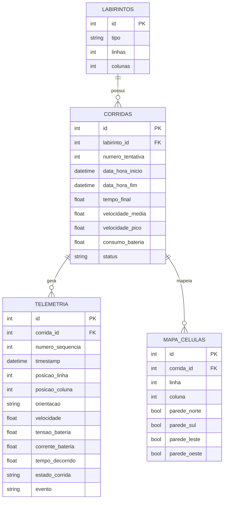

# Projeto Conceitual de Software

- [Explicações adicionais](https://drive.google.com/file/d/1WWIz6609c7Y7zAQRBWHSbX0t2vEJ2z1A/view?usp=sharing)
- [Noções de UML](https://drive.google.com/file/d/1l1yt2ittHuRKIXVXYT76P1HriR07pK-t/view?usp=sharing)
- [Requisitos](https://engsoftmoderna.info/cap3.html)

> **Itens fundamentais:**
> - **Diagrama Atividades UML:** descrever e explicar o fluxo do comportamento funcional do produto proposto, evidenciando, de forma clara e estruturada, como as atividades são executadas, em que ordem e sob quais condições. Esse diagrama permite compreender o funcionamento dinâmico do sistema, destacando:
>   - os principais atores (usuários ou sistemas externos) envolvidos no processo;
>   - as atividades de negócio realizadas por cada ator ou pelo próprio sistema;
>   - os insumos (entradas) necessários para a execução das atividades;
>   - os resultados (saídas) gerados ao longo do fluxo;
>   - os pontos de decisão, paralelismo e sincronização das atividades;
>   - Entre as notações mais relevantes, destacam-se o estado inicial e final, atividades, nós de decisão e junção, barras de bifurcação, Raias (*swimlanes*) e Fluxos de controle.
> - **_Backlog_ do Produto**
>   - Detalhar os requisitos funcionais (RF) com a técnica de documentação e especificação de história de usuário (HU);
>   - Protótipos de interface gráfica do *software* em alta fidelidade.
>     - **Todas HUs devem conter sua descrição (Eu-Como-Para), critérios de aceitação e protótipos de interface, documentadas no github.**
>   - Exporte as informações do Backlog do Produto no GitHub Projects [em formato CSV](https://docs.github.com/en/issues/planning-and-tracking-with-projects/managing-your-project/exporting-your-projects-data), e [renderize em Markdown](https://www.google.com/search?q=convert+CSV+file+to+Markdown+table) no formato a seguir:


### Diagrama de Atividades UML


O diagrama acima descreve o comportamento funcional do software do micromouse, desde o
início do desafio até o encerramento do registro da corrida. O fluxo está organizado em
três raias (*swimlanes*), cada uma representando um ator do sistema:

- **Usuário/Operador**: pessoa responsável por posicionar o robô no labirinto e iniciar o desafio.
- **Micromouse (Firmware)**: sistema embarcado que executa a navegação autônoma, o
  reconhecimento do ambiente e a coleta de telemetria.
- **Sistema Web (Backend + Dashboard)**: sistema externo responsável por receber, persistir
  e exibir os dados de telemetria em tempo real.

#### Fluxo principal

O processo é iniciado pelo **Usuário**, que posiciona o micromouse na célula inicial do
labirinto e sinaliza o início do desafio (insumo: posicionamento físico do robô).

O **Micromouse** então executa uma rotina de autocalibração dos sensores de distância e do
sensor inercial (IMU) (RF13, RNF8). Esse é o primeiro ponto de decisão do fluxo: caso a
calibração falhe, a atividade é repetida até ser bem-sucedida; caso contrário, o sistema
sinaliza que está pronto para o desafio (RNF9).

A partir daí, o fluxo se bifurca em duas atividades que ocorrem **em paralelo** (barra de
bifurcação/*fork*), refletindo o fato de que navegação e telemetria são processos
concorrentes durante toda a corrida:

**1. Navegação pelo labirinto (loop)**
O micromouse reconhece o ambiente ao seu redor, identificando paredes (RF2), atualiza sua
localização por odometria e o mapa do labirinto (RF3, RF5). A cada ciclo, dois pontos de
decisão tratam condições excepcionais: se uma colisão com parede é detectada, o sistema
trata a colisão e retoma a exploração sem perder o mapeamento já capturado (RF12, RF17); se
o piso apresenta irregularidades, o sistema executa uma rotina para sobrepujar o obstáculo
(RF11). Superadas essas condições, o robô calcula e executa o próximo movimento (RF1). Um
terceiro ponto de decisão verifica se a célula objetivo foi alcançada (RF7): em caso
negativo, o ciclo se repete; em caso positivo, o mapa final do labirinto percorrido é
armazenado (RF4), encerrando essa atividade.

**2. Transmissão de telemetria (loop contínuo)**
Em paralelo à navegação, o micromouse coleta e transmite continuamente dados de telemetria
(posição, velocidade e nível de bateria, RF8). Esses dados são recebidos pelo **Sistema
Web**, que primeiro os armazena em um buffer para garantir estabilidade caso haja
interrupções de conexão (RF16), em seguida os persiste no banco de dados, vinculados a um
identificador único de corrida (RF9, RF15), e por fim atualiza o dashboard em tempo real
com o mapa bidimensional, o trajeto percorrido, a velocidade média e o consumo de bateria
(RF6, RF14). Esse ciclo se repete enquanto a corrida estiver ativa.

Quando a atividade de navegação é concluída (mapa final armazenado), o **Sistema Web** é
notificado e encerra o registro da corrida (RF15), disponibilizando o labirinto percorrido
para consulta posterior no histórico (RF10), o que marca o nó final do fluxo.

#### Insumos e resultados

| Insumo | Origem | Resultado | Destino |
|---|---|---|---|
| Posicionamento do robô / início do desafio | Usuário | Próxima ação calculada | Micromouse |
| Leituras do LiDAR e dos *encoders* | Hardware | Mapa do labirinto e localização atualizados | Micromouse |
| Dados de telemetria (posição, velocidade, bateria) | Micromouse | Registro persistido da corrida | Sistema Web |
| Dados persistidos da corrida | Sistema Web | Dashboard atualizado e histórico consultável | Usuário |

#### Pontos de decisão, paralelismo e sincronização

- **Decisões**: sucesso da calibração; ocorrência de colisão; irregularidade do piso; e
  alcance da célula objetivo. Cada uma determina se o fluxo segue adiante ou retorna a uma
  atividade anterior (repetição).
- **Paralelismo**: após a sinalização de sistema pronto, a barra de bifurcação inicia duas
  atividades concorrentes e independentes, navegação e transmissão de telemetria, que são
  executadas simultaneamente durante toda a corrida.
- **Sincronização**: a conclusão da navegação (mapa final armazenado) sincroniza com o
  Sistema Web para o encerramento do registro da corrida, unificando os dois ramos
  paralelos antes do nó final.


### Requisitos Funcionais

<u>[RF-01](https://github.com/fcte-pi1/2026_2_PI1_Grupo01_Hilmer/issues/3): Navegação pelo labirinto</u>

| ID (Link Github Projects) | Título | Prioridade |
|:------| :-- | :--- |
| [HU-01](#hu-01) | Percorrer o labirinto de forma autônoma até o objetivo | Must have |

<u>[RF-02](https://github.com/fcte-pi1/2026_2_PI1_Grupo01_Hilmer/issues/5): Reconhecimento de ambiente</u>

| ID (Link Github Projects) | Título | Prioridade |
|:------| :-- | :--- |
| [HU-02](#hu-02) | Reconhecer paredes e piso em cada célula | Must have |

<u>[RF-03](https://github.com/fcte-pi1/2026_2_PI1_Grupo01_Hilmer/issues/6): Construção do mapa do labirinto</u>

| ID (Link Github Projects) | Título | Prioridade |
|:------| :-- | :--- |
| [HU-03](#hu-03) | Construir o mapa quadriculado durante o percurso | Must have |

<u>[RF-04](https://github.com/fcte-pi1/2026_2_PI1_Grupo01_Hilmer/issues/7): Armazenamento do mapa do labirinto</u>

| ID (Link Github Projects) | Título | Prioridade |
|:------| :-- | :--- |
| [HU-04](#hu-04) | Armazenar o mapa do labirinto percorrido | Must have |

<u>[RF-05](https://github.com/fcte-pi1/2026_2_PI1_Grupo01_Hilmer/issues/8): Localização do robô</u>

| ID (Link Github Projects) | Título | Prioridade |
|:------| :-- | :--- |
| [HU-05](#hu-05) | Estimar a posição do robô por odometria | Must have |

<u>[RF-06](https://github.com/fcte-pi1/2026_2_PI1_Grupo01_Hilmer/issues/9): Percurso do robô</u>

| ID (Link Github Projects) | Título | Prioridade |
|:------| :-- | :--- |
| [HU-06](#hu-06) | Visualizar o percurso do robô sobre o mapa | Should have |

<u>[RF-07](https://github.com/fcte-pi1/2026_2_PI1_Grupo01_Hilmer/issues/10): Detecção do objetivo</u>

| ID (Link Github Projects) | Título | Prioridade |
|:------| :-- | :--- |
| [HU-07](#hu-07) | Detectar e sinalizar a chegada à célula objetivo | Must have |

<u>[RF-08](https://github.com/fcte-pi1/2026_2_PI1_Grupo01_Hilmer/issues/11): Telemetria em tempo real</u>

| ID (Link Github Projects) | Título | Prioridade |
|:------| :-- | :--- |
| [HU-08](#hu-08) | Acompanhar a telemetria do robô em tempo real | Must have |

<u>[RF-09](https://github.com/fcte-pi1/2026_2_PI1_Grupo01_Hilmer/issues/12): Armazenamento em banco de dados</u>

| ID (Link Github Projects) | Título | Prioridade |
|:------| :-- | :--- |
| [HU-09](#hu-09) | Persistir a telemetria das corridas no banco de dados | Must have |

<u>[RF-10](https://github.com/fcte-pi1/2026_2_PI1_Grupo01_Hilmer/issues/13): Consulta de todos os labirintos</u>

| ID (Link Github Projects) | Título | Prioridade |
|:------| :-- | :--- |
| [HU-10](#hu-10) | Consultar o histórico de todas as corridas | Should have |

<u>[RF-11](https://github.com/fcte-pi1/2026_2_PI1_Grupo01_Hilmer/issues/14): Sobrepujar condições do solo</u>

| ID (Link Github Projects) | Título | Prioridade |
|:------| :-- | :--- |
| [HU-11](#hu-11) | Compensar irregularidades do solo | Should have |

<u>[RF-12](https://github.com/fcte-pi1/2026_2_PI1_Grupo01_Hilmer/issues/15): Tratamento de colisões</u>

| ID (Link Github Projects) | Título | Prioridade |
|:------| :-- | :--- |
| [HU-12](#hu-12) | Evitar colisões com as paredes | Must have |

<u>[RF-13](https://github.com/fcte-pi1/2026_2_PI1_Grupo01_Hilmer/issues/16): Calibração de Hardware</u>

| ID (Link Github Projects) | Título | Prioridade |
|:------| :-- | :--- |
| [HU-13](#hu-13) | Autocalibrar os sensores antes da largada | Must have |

<u>[RF-14](https://github.com/fcte-pi1/2026_2_PI1_Grupo01_Hilmer/issues/17): Dashboard de Telemetria</u>

| ID (Link Github Projects) | Título | Prioridade |
|:------| :-- | :--- |
| [HU-14](#hu-14) | Supervisionar a corrida pelo dashboard web | Must have |

<u>[RF-15](https://github.com/fcte-pi1/2026_2_PI1_Grupo01_Hilmer/issues/18): Gestão de Corridas</u>

| ID (Link Github Projects) | Título | Prioridade |
|:------| :-- | :--- |
| [HU-15](#hu-15) | Registrar e filtrar corridas por tipo de labirinto | Must have |

<u>[RF-16](https://github.com/fcte-pi1/2026_2_PI1_Grupo01_Hilmer/issues/28): Estabilização de telemetria</u>

| ID (Link Github Projects) | Título | Prioridade |
|:------| :-- | :--- |
| [HU-16](#hu-16) | Não perder telemetria em quedas de conexão | Must have |

<u>[RF-17](https://github.com/fcte-pi1/2026_2_PI1_Grupo01_Hilmer/issues/29): Recuperação de Impacto</u>

| ID (Link Github Projects) | Título | Prioridade |
|:------| :-- | :--- |
| [HU-17](#hu-17) | Recuperar-se de colisões sem perder o mapa | Should have |

### Requisitos Não-Funcionais

| ID (Link Github Projects) | Título | Prioridade | Rastreabilidade |
|:--------------------------| :-- | :--- |:----------------|
| [RNF-01](https://github.com/fcte-pi1/2026_2_PI1_Grupo01_Hilmer/issues/19) | Dimensão máxima: até 16,5 cm de comprimento e largura, sem restrição de altura | Must have | RF-01/HU-01, RF-12/HU-12 |
| [RNF-02](https://github.com/fcte-pi1/2026_2_PI1_Grupo01_Hilmer/issues/20) | Locomoção somente terrestre: proibidos voo, salto, escalada ou propulsão por combustão/foguete | Must have | RF-01/HU-01, RF-11/HU-11 |
| [RNF-03](https://github.com/fcte-pi1/2026_2_PI1_Grupo01_Hilmer/issues/21) | Tempo limite: cada labirinto concluído em até 10 minutos | Must have | RF-01/HU-01, RF-14/HU-14 |
| [RNF-04](https://github.com/fcte-pi1/2026_2_PI1_Grupo01_Hilmer/issues/22) | Autonomia de bateria suficiente para os 3 labirintos consecutivos | Should have | RF-01/HU-01, RF-08/HU-08 |
| [RNF-05](https://github.com/fcte-pi1/2026_2_PI1_Grupo01_Hilmer/issues/23) | Latência da telemetria: exibição em até 2 s após a leitura do sensor | Should have | RF-08/HU-08, RF-14/HU-14, RF-16/HU-16 |
| [RNF-06](https://github.com/fcte-pi1/2026_2_PI1_Grupo01_Hilmer/issues/24) | Resistência mecânica a esforços e colisões sem perda de funcionamento | Must have | RF-12/HU-12, RF-17/HU-17 |
| [RNF-07](https://github.com/fcte-pi1/2026_2_PI1_Grupo01_Hilmer/issues/25) | Autonomia do sistema: 100% das decisões tomadas sem intervenção humana | Must have | RF-01/HU-01, RF-07/HU-07 |
| [RNF-08](https://github.com/fcte-pi1/2026_2_PI1_Grupo01_Hilmer/issues/26) | Inicialização de hardware: autocalibração concluída em até 1 s | Must have | RF-13/HU-13 |
| [RNF-09](https://github.com/fcte-pi1/2026_2_PI1_Grupo01_Hilmer/issues/27) | Inicialização de software: sistema pronto para o desafio em até 2 s | Should have | RF-13/HU-13, RF-14/HU-14 |

### Detalhamento das Histórias de Usuário

As HUs com interface gráfica (HU-06, HU-07, HU-08, HU-10, HU-14 e HU-15) estão vinculadas aos *frames* de alta fidelidade do [Protótipo Funcional Navegável](#prototipo-navegavel). As demais são executadas no *firmware* embarcado ou no *back-end* e não possuem tela própria; nesses casos é indicado o elemento do protótipo em que seu resultado se torna visível ao usuário.

---

<a id="hu-01"></a>

#### HU-01: Percorrer o Labirinto de Forma Autônoma até o Objetivo
* **Requisitos Associados:** [RF-01](https://github.com/fcte-pi1/2026_2_PI1_Grupo01_Hilmer/issues/3), [RNF-01](https://github.com/fcte-pi1/2026_2_PI1_Grupo01_Hilmer/issues/19), [RNF-02](https://github.com/fcte-pi1/2026_2_PI1_Grupo01_Hilmer/issues/20), [RNF-03](https://github.com/fcte-pi1/2026_2_PI1_Grupo01_Hilmer/issues/21), [RNF-04](https://github.com/fcte-pi1/2026_2_PI1_Grupo01_Hilmer/issues/22), [RNF-07](https://github.com/fcte-pi1/2026_2_PI1_Grupo01_Hilmer/issues/25)
* **Descrição:**
  * **Eu, como** equipe competidora,
  * **Quero** que o micromouse percorra o labirinto de forma totalmente autônoma, da célula de partida até a célula de destino,
  * **Para que** o desafio seja cumprido dentro do tempo regulamentar.
* **Critérios de Aceitação:**
  1. Após a largada, o robô deve calcular e executar o próximo movimento exclusivamente com base no mapa e nas leituras dos sensores, sem nenhuma intervenção humana (RNF-07).
  2. O robô deve alcançar a célula de destino (canto oposto ao início) nos três labirintos (4×4, 8×4 e 12×4), cada um em até 10 minutos (RNF-03).
  3. O deslocamento deve ocorrer apenas por locomoção terrestre sobre rodas (RNF-02).
  4. Caso o tempo de 10 minutos se esgote, o robô deve encerrar a tentativa e reportar o status `Não concluído`.
* **Protótipo da HU:** Não possui tela própria (*firmware*). O deslocamento é refletido pelo traçado `Robot Path` no [Frame 02_Running](https://www.figma.com/design/90hJ4r7jT0yDMtCwJ0yzy9/Prot%C3%B3tipo-Telemetria-Web?node-id=13-211).

---

<a id="hu-02"></a>

#### HU-02: Reconhecer Paredes e Piso em Cada Célula
* **Requisitos Associados:** [RF-02](https://github.com/fcte-pi1/2026_2_PI1_Grupo01_Hilmer/issues/5)
* **Descrição:**
  * **Eu, como** equipe responsável pela navegação autônoma,
  * **Quero** que o micromouse identifique a presença de paredes à frente, à esquerda e à direita de cada célula,
  * **Para que** o algoritmo de navegação saiba quais passagens estão livres e o mapa seja construído corretamente.
* **Critérios de Aceitação:**
  1. Ao chegar ao centro de cada célula (18 × 18 cm), o robô deve classificar os lados frontal, esquerdo e direito como `parede` ou `livre` a partir das leituras do LiDAR ToF 360°.
  2. A classificação deve ser feita com base em um limiar de distância definido em calibração, filtrando leituras espúrias (ex.: média de múltiplas amostras).
  3. Em teste de bancada com as configurações de parede conhecidas, a taxa de acerto da classificação deve ser de 100% nas células avaliadas.
* **Protótipo da HU:** Não possui tela própria (*firmware*). As paredes identificadas são refletidas no `Maze Grid` do [Frame 02_Running](https://www.figma.com/design/90hJ4r7jT0yDMtCwJ0yzy9/Prot%C3%B3tipo-Telemetria-Web?node-id=13-211).

---

<a id="hu-03"></a>

#### HU-03: Construir o Mapa Quadriculado durante o Percurso
* **Requisitos Associados:** [RF-03](https://github.com/fcte-pi1/2026_2_PI1_Grupo01_Hilmer/issues/6)
* **Descrição:**
  * **Eu, como** equipe responsável pela navegação autônoma,
  * **Quero** que o micromouse monte um mapa quadriculado do labirinto à medida que o percorre,
  * **Para que** o algoritmo de navegação planeje rotas com base no terreno já conhecido e o mapa possa ser reproduzido no *dashboard*.
* **Critérios de Aceitação:**
  1. O mapa deve ser representado como uma matriz de células com as dimensões do labirinto em execução (4×4, 8×4 ou 12×4), registrando as quatro paredes de cada célula.
  2. Cada célula visitada deve ter suas paredes gravadas no mapa, mantendo a consistência entre células vizinhas (a parede leste de uma célula é a parede oeste da vizinha).
  3. As atualizações do mapa devem ser enviadas na telemetria para exibição no *dashboard*.
* **Protótipo da HU:** Não possui tela própria (*firmware*). O mapa construído é exibido no `Maze Grid` do [Frame 02_Running](https://www.figma.com/design/90hJ4r7jT0yDMtCwJ0yzy9/Prot%C3%B3tipo-Telemetria-Web?node-id=13-211).

---

<a id="hu-04"></a>

#### HU-04: Armazenar o Mapa do Labirinto Percorrido
* **Requisitos Associados:** [RF-04](https://github.com/fcte-pi1/2026_2_PI1_Grupo01_Hilmer/issues/7)
* **Descrição:**
  * **Eu, como** equipe responsável pela navegação autônoma,
  * **Quero** que o mapa do labirinto seja mantido em memória durante a corrida e armazenado ao final,
  * **Para que** o robô planeje rotas eficientes e o mapa percorrido fique disponível para consulta posterior.
* **Critérios de Aceitação:**
  1. O mapa deve permanecer em memória durante toda a corrida, inclusive após colisões ou perda de conexão.
  2. A estrutura de armazenamento deve comportar o maior labirinto da competição (12×4 células).
  3. Ao alcançar a célula objetivo, o mapa final do labirinto percorrido deve ser armazenado e enviado ao servidor, vinculado ao registro da corrida (HU-09).
* **Protótipo da HU:** Não possui tela própria (*firmware*). O mapa final é exibido no `Maze Grid` do [Frame 03_Completed](https://www.figma.com/design/90hJ4r7jT0yDMtCwJ0yzy9/Prot%C3%B3tipo-Telemetria-Web?node-id=14-337).

---

<a id="hu-05"></a>

#### HU-05: Estimar a Posição do Robô por Odometria
* **Requisitos Associados:** [RF-05](https://github.com/fcte-pi1/2026_2_PI1_Grupo01_Hilmer/issues/8)
* **Descrição:**
  * **Eu, como** equipe responsável pela navegação autônoma,
  * **Quero** que o micromouse estime continuamente sua posição (célula) e orientação no labirinto,
  * **Para que** ele saiba onde está no mapa e o *dashboard* exiba sua localização real.
* **Critérios de Aceitação:**
  1. A posição deve ser estimada a partir da contagem dos *encoders* de efeito Hall e a orientação a partir do giroscópio da IMU, com a célula de partida como origem (0, 0).
  2. A cada célula percorrida, a posição discreta (linha, coluna) e a orientação (N, S, L, O) devem ser atualizadas e enviadas na telemetria.
  3. O erro acumulado deve ser corrigido usando as paredes detectadas como referência (alinhamento ao centro da célula).
  4. Ao final de uma corrida em bancada, a célula estimada pelo robô deve coincidir com a célula real em que ele se encontra.
* **Protótipo da HU:** Não possui tela própria (*firmware*). A posição estimada é exibida pelo marcador `Robot` no [Frame 02_Running](https://www.figma.com/design/90hJ4r7jT0yDMtCwJ0yzy9/Prot%C3%B3tipo-Telemetria-Web?node-id=13-211).

---

<a id="hu-06"></a>

#### HU-06: Visualizar o Percurso do Robô sobre o Mapa
* **Requisitos Associados:** [RF-06](https://github.com/fcte-pi1/2026_2_PI1_Grupo01_Hilmer/issues/9)
* **Descrição:**
  * **Eu, como** operador de bancada ou avaliador da competição,
  * **Quero** visualizar graficamente o labirinto e o percurso feito pelo micromouse em tempo real,
  * **Para que** eu possa analisar e validar a estratégia de exploração do robô.
* **Critérios de Aceitação:**
  1. A malha do labirinto deve apresentar fundo escuro (`#0F172A`) com a célula de partida em verde suave no canto inferior e a de chegada em vermelho no canto oposto.
  2. O traçado (`Robot Path`) deve ser atualizado ortogonalmente em tempo real conforme a odometria do robô avança.
  3. O marcador `Robot` deve indicar a célula atualmente ocupada pelo micromouse.
  4. Ao término da corrida, o traçado completo deve permanecer visível sobre o mapa.
* **Protótipo da HU:**
  * [Frame 01_Idle (Aguardando Largada)](https://www.figma.com/design/90hJ4r7jT0yDMtCwJ0yzy9/Prot%C3%B3tipo-Telemetria-Web?node-id=7-121)
  * [Frame 02_Running (Em Execução)](https://www.figma.com/design/90hJ4r7jT0yDMtCwJ0yzy9/Prot%C3%B3tipo-Telemetria-Web?node-id=13-211)
  * [Frame 03_Completed (Desafio Concluído)](https://www.figma.com/design/90hJ4r7jT0yDMtCwJ0yzy9/Prot%C3%B3tipo-Telemetria-Web?node-id=14-337)

---

<a id="hu-07"></a>

#### HU-07: Detectar e Sinalizar a Chegada à Célula Objetivo
* **Requisitos Associados:** [RF-07](https://github.com/fcte-pi1/2026_2_PI1_Grupo01_Hilmer/issues/10), [RNF-07](https://github.com/fcte-pi1/2026_2_PI1_Grupo01_Hilmer/issues/25)
* **Descrição:**
  * **Eu, como** operador de bancada ou avaliador da competição,
  * **Quero** que o micromouse reconheça quando alcançou a célula de destino e que isso seja sinalizado no *dashboard*,
  * **Para que** a conclusão do desafio seja registrada sem depender de verificação manual.
* **Critérios de Aceitação:**
  1. Ao chegar à célula de destino (canto oposto ao início), o robô deve parar os motores e enviar o evento `objetivo alcançado` na telemetria.
  2. Ao receber o evento, o badge de status do *dashboard* deve transitar para `DESAFIO CUMPRIDO: SIM` (verde) e o cronômetro deve ser congelado.
  3. A detecção deve ocorrer de forma autônoma, sem acionamento manual (RNF-07).
* **Protótipo da HU:**
  * [Frame 03_Completed (Desafio Concluído)](https://www.figma.com/design/90hJ4r7jT0yDMtCwJ0yzy9/Prot%C3%B3tipo-Telemetria-Web?node-id=14-337)

---

<a id="hu-08"></a>

#### HU-08: Acompanhar a Telemetria do Robô em Tempo Real
* **Requisitos Associados:** [RF-08](https://github.com/fcte-pi1/2026_2_PI1_Grupo01_Hilmer/issues/11), [RNF-04](https://github.com/fcte-pi1/2026_2_PI1_Grupo01_Hilmer/issues/22), [RNF-05](https://github.com/fcte-pi1/2026_2_PI1_Grupo01_Hilmer/issues/23)
* **Descrição:**
  * **Eu, como** operador de bancada,
  * **Quero** acompanhar em tempo real os dados de telemetria enviados pelo micromouse,
  * **Para que** eu possa monitorar as condições e o funcionamento do robô durante o desafio.
* **Critérios de Aceitação:**
  1. O ESP32-C3 deve enviar pacotes de telemetria contendo posição na malha, velocidade, tensão/corrente da bateria, tempo decorrido e estado da corrida, com carimbo de tempo e número de sequência.
  2. Os dados devem ser exibidos no *dashboard* em até 2 s após a leitura do sensor correspondente (RNF-05).
  3. Devem ser exibidos cards dedicados de telemetria contendo consumo de bateria (%, V, mA), velocidade média/pico e cronômetro da tentativa atual.
* **Protótipo da HU:**
  * [Frame 02_Running (Em Execução)](https://www.figma.com/design/90hJ4r7jT0yDMtCwJ0yzy9/Prot%C3%B3tipo-Telemetria-Web?node-id=13-211)

---

<a id="hu-09"></a>

#### HU-09: Persistir a Telemetria das Corridas no Banco de Dados
* **Requisitos Associados:** [RF-09](https://github.com/fcte-pi1/2026_2_PI1_Grupo01_Hilmer/issues/12)
* **Descrição:**
  * **Eu, como** membro da equipe,
  * **Quero** que os dados de telemetria de cada corrida sejam armazenados no banco de dados,
  * **Para que** possam ser consultados, comparados e analisados após a corrida.
* **Critérios de Aceitação:**
  1. As amostras de telemetria recebidas durante a corrida (posição, velocidade, tensão/corrente da bateria e tempo) devem ser persistidas vinculadas ao identificador da corrida (HU-15).
  2. Ao término (objetivo alcançado, tempo esgotado ou interrupção), o registro deve ser consolidado com tempo final, velocidade média e de pico, consumo de bateria, status (`Concluído` / `Não concluído`) e o mapa final (HU-04).
  3. Os dados persistidos devem permanecer disponíveis para consulta após o encerramento do sistema.
* **Protótipo da HU:** Não possui tela própria (*back-end*). A persistência é acionada na transição para o [Frame 03_Completed](https://www.figma.com/design/90hJ4r7jT0yDMtCwJ0yzy9/Prot%C3%B3tipo-Telemetria-Web?node-id=14-337) e os dados aparecem no [Frame 04_History_View](https://www.figma.com/design/90hJ4r7jT0yDMtCwJ0yzy9/Prot%C3%B3tipo-Telemetria-Web?node-id=21-411).

---

<a id="hu-10"></a>

#### HU-10: Consultar o Histórico de Todas as Corridas
* **Requisitos Associados:** [RF-10](https://github.com/fcte-pi1/2026_2_PI1_Grupo01_Hilmer/issues/13)
* **Descrição:**
  * **Eu, como** membro da equipe ou docente avaliador,
  * **Quero** acessar o histórico de todas as corridas persistidas em banco de dados,
  * **Para que** eu possa auditar a evolução do desempenho, verificar a pontuação por tentativa e comparar os tempos finais consolidados.
* **Critérios de Aceitação:**
  1. A navegação entre a telemetria ao vivo e o histórico deve ocorrer de forma instantânea via abas no cabeçalho global.
  2. A visualização padrão (`Todos os Labirintos`) deve listar tabularmente todas as corridas salvas no banco com Data/Hora, Labirinto, Tentativa/Nota, Tempo Final, Velocidade, Bateria e Status.
* **Protótipo da HU:**
  * [Frame 04_History_View (Todos os Labirintos)](https://www.figma.com/design/90hJ4r7jT0yDMtCwJ0yzy9/Prot%C3%B3tipo-Telemetria-Web?node-id=21-411)

---

<a id="hu-11"></a>

#### HU-11: Compensar Irregularidades do Solo
* **Requisitos Associados:** [RF-11](https://github.com/fcte-pi1/2026_2_PI1_Grupo01_Hilmer/issues/14), [RNF-02](https://github.com/fcte-pi1/2026_2_PI1_Grupo01_Hilmer/issues/20)
* **Descrição:**
  * **Eu, como** equipe competidora,
  * **Quero** que o micromouse mantenha tração e trajetória ao passar por pequenas irregularidades no piso,
  * **Para que** o percurso não seja interrompido por desníveis ou emendas do labirinto.
* **Critérios de Aceitação:**
  1. O robô deve transpor desníveis e emendas do piso do labirinto apenas por locomoção terrestre sobre rodas (RNF-02).
  2. O controle de velocidade deve compensar a diferença de rotação entre as rodas (medida pelos *encoders*) ao passar pela irregularidade, mantendo a trajetória.
  3. A estimativa de posição (HU-05) não deve perder a célula corrente após a passagem pela irregularidade.
* **Protótipo da HU:** Não possui tela própria (*firmware*); não há representação gráfica específica no protótipo.

---

<a id="hu-12"></a>

#### HU-12: Evitar Colisões com as Paredes
* **Requisitos Associados:** [RF-12](https://github.com/fcte-pi1/2026_2_PI1_Grupo01_Hilmer/issues/15), [RNF-01](https://github.com/fcte-pi1/2026_2_PI1_Grupo01_Hilmer/issues/19), [RNF-06](https://github.com/fcte-pi1/2026_2_PI1_Grupo01_Hilmer/issues/24)
* **Descrição:**
  * **Eu, como** equipe competidora,
  * **Quero** que o micromouse mantenha distância segura das paredes durante o deslocamento,
  * **Para que** ele não danifique sua estrutura nem perca tempo e posição com impactos.
* **Critérios de Aceitação:**
  1. Durante o deslocamento em linha reta, o robô deve corrigir sua trajetória (controle dos motores) para se manter centralizado no corredor com base nas distâncias laterais medidas.
  2. O robô deve reduzir a velocidade e parar antes de atingir uma parede frontal detectada.
  3. Em teste de bancada percorrendo o labirinto completo, não deve haver contato do chassi com as paredes.
* **Protótipo da HU:** Não possui tela própria (*firmware*); não há representação gráfica específica no protótipo.

---

<a id="hu-13"></a>

#### HU-13: Autocalibrar os Sensores antes da Largada
* **Requisitos Associados:** [RF-13](https://github.com/fcte-pi1/2026_2_PI1_Grupo01_Hilmer/issues/16), [RNF-08](https://github.com/fcte-pi1/2026_2_PI1_Grupo01_Hilmer/issues/26), [RNF-09](https://github.com/fcte-pi1/2026_2_PI1_Grupo01_Hilmer/issues/27)
* **Descrição:**
  * **Eu, como** operador de bancada,
  * **Quero** que o micromouse execute automaticamente uma rotina de calibração dos sensores de distância e inerciais ao ser ligado,
  * **Para que** as leituras sejam confiáveis desde a primeira célula, sem ajustes manuais antes de cada tentativa.
* **Critérios de Aceitação:**
  1. Ao ser ligado na célula de partida, o robô deve calibrar o sensor de distância (LiDAR ToF), a IMU (*offset* do giroscópio com o robô parado) e zerar a contagem dos *encoders*.
  2. Cada execução da autocalibração deve ser concluída em até 1 s (RNF-08) e, quando a primeira execução for bem-sucedida, o sistema deve estar pronto para largada em até 2 s após ligado (RNF-09).
  3. Caso algum sensor não responda ou retorne valores fora da faixa esperada, a calibração deve ser considerada malsucedida e a rotina deve ser executada novamente; o robô não deve iniciar o deslocamento enquanto a calibração não for bem-sucedida, e cada falha deve ser reportada na telemetria.
  4. Concluída a calibração com sucesso, o estado do robô deve ser informado ao *dashboard* como `Aguardando Largada`.
* **Protótipo da HU:** Não possui tela própria (*firmware*). O resultado é visível no [Frame 01_Idle](https://www.figma.com/design/90hJ4r7jT0yDMtCwJ0yzy9/Prot%C3%B3tipo-Telemetria-Web?node-id=7-121), que representa o robô calibrado e aguardando largada.

---

<a id="hu-14"></a>

#### HU-14: Supervisionar a Corrida pelo Dashboard Web
* **Requisitos Associados:** [RF-14](https://github.com/fcte-pi1/2026_2_PI1_Grupo01_Hilmer/issues/17), [RNF-03](https://github.com/fcte-pi1/2026_2_PI1_Grupo01_Hilmer/issues/22), [RNF-05](https://github.com/fcte-pi1/2026_2_PI1_Grupo01_Hilmer/issues/23), [RNF-09](https://github.com/fcte-pi1/2026_2_PI1_Grupo01_Hilmer/issues/27)
* **Descrição:**
  * **Eu, como** operador de bancada ou avaliador da competição,
  * **Quero** um *dashboard* web que reúna o mapa bidimensional, o trajeto, a velocidade média e o consumo de bateria do micromouse,
  * **Para que** eu tenha controle visual completo sobre a execução autônoma do robô e possa validar o cumprimento do desafio dentro do teto regulamentar de 10 minutos.
* **Critérios de Aceitação:**
  1. A tela de telemetria ao vivo deve reunir, em uma única visualização, o mapa do labirinto com o trajeto (HU-06) e o painel lateral de cards de telemetria (HU-08).
  2. O cronômetro deve exibir o tempo da tentativa atual com marcador explícito do limite de 10:00 min (RNF-03).
  3. O *dashboard* deve refletir os estados da corrida: `Aguardando Largada`, `Em Execução` e `Desafio Concluído`.
  4. Deve haver controles para iniciar a corrida (`INICIAR CORRIDA`) e para reiniciar uma nova tentativa (`RESETAR / NOVA TENTATIVA`).
* **Protótipo da HU:**
  * [Frame 01_Idle (Aguardando Largada)](https://www.figma.com/design/90hJ4r7jT0yDMtCwJ0yzy9/Prot%C3%B3tipo-Telemetria-Web?node-id=7-121)
  * [Frame 02_Running (Em Execução)](https://www.figma.com/design/90hJ4r7jT0yDMtCwJ0yzy9/Prot%C3%B3tipo-Telemetria-Web?node-id=13-211)
  * [Frame 03_Completed (Desafio Concluído)](https://www.figma.com/design/90hJ4r7jT0yDMtCwJ0yzy9/Prot%C3%B3tipo-Telemetria-Web?node-id=14-337)

---

<a id="hu-15"></a>

#### HU-15: Registrar e Filtrar Corridas por Tipo de Labirinto
* **Requisitos Associados:** [RF-15](https://github.com/fcte-pi1/2026_2_PI1_Grupo01_Hilmer/issues/18)
* **Descrição:**
  * **Eu, como** membro da equipe ou docente avaliador,
  * **Quero** que cada tentativa seja registrada com um identificador único e o tipo de labirinto, e poder filtrar o histórico por esse tipo,
  * **Para que** eu possa comparar o desempenho do robô em cada configuração de labirinto.
* **Critérios de Aceitação:**
  1. Ao iniciar uma corrida, o sistema deve criar um registro com identificador único, data/hora, tipo de labirinto (`4×4`, `8×4` ou `12×4`) e número da tentativa.
  2. Nenhuma corrida pode ser gravada sem tipo de labirinto associado.
  3. Ao fim da corrida, o registro deve ser encerrado e disponibilizado no histórico de consulta.
  4. O controle segmentado de filtros deve permitir isolar os registros exclusivamente por labirinto (`4×4`, `8×4` ou `12×4`).
* **Protótipo da HU:**
  * [Frame 04_History_View_M1 (Filtro Labirinto 1)](https://www.figma.com/design/90hJ4r7jT0yDMtCwJ0yzy9/Prot%C3%B3tipo-Telemetria-Web?node-id=21-573)
  * [Frame 04_History_View_M2 (Filtro Labirinto 2)](https://www.figma.com/design/90hJ4r7jT0yDMtCwJ0yzy9/Prot%C3%B3tipo-Telemetria-Web?node-id=21-655)
  * [Frame 04_History_View_M3 (Filtro Labirinto 3)](https://www.figma.com/design/90hJ4r7jT0yDMtCwJ0yzy9/Prot%C3%B3tipo-Telemetria-Web?node-id=21-737)

---

<a id="hu-16"></a>

#### HU-16: Não Perder Telemetria em Quedas de Conexão
* **Requisitos Associados:** [RF-16](https://github.com/fcte-pi1/2026_2_PI1_Grupo01_Hilmer/issues/28), [RNF-05](https://github.com/fcte-pi1/2026_2_PI1_Grupo01_Hilmer/issues/23)
* **Descrição:**
  * **Eu, como** operador de bancada,
  * **Quero** que os dados de telemetria sejam mantidos em *buffer* quando houver instabilidade na conexão,
  * **Para que** nenhum dado da corrida seja perdido e o histórico fique completo.
* **Critérios de Aceitação:**
  1. Enquanto a conexão estiver indisponível, o robô deve armazenar os pacotes de telemetria em *buffer* local, sem interromper a navegação.
  2. Restabelecida a conexão, os pacotes do *buffer* devem ser reenviados em ordem cronológica.
  3. O sistema web deve receber a telemetria em *buffer* antes da persistência, ordenando os pacotes pelo número de sequência e descartando duplicados.
* **Protótipo da HU:** Não possui tela própria (*firmware*/*back-end*). O resultado é visível na atualização contínua dos cards de telemetria do [Frame 02_Running](https://www.figma.com/design/90hJ4r7jT0yDMtCwJ0yzy9/Prot%C3%B3tipo-Telemetria-Web?node-id=13-211).

---

<a id="hu-17"></a>

#### HU-17: Recuperar-se de Colisões sem Perder o Mapa
* **Requisitos Associados:** [RF-17](https://github.com/fcte-pi1/2026_2_PI1_Grupo01_Hilmer/issues/29), [RNF-06](https://github.com/fcte-pi1/2026_2_PI1_Grupo01_Hilmer/issues/24)
* **Descrição:**
  * **Eu, como** equipe competidora,
  * **Quero** que o micromouse detecte uma colisão e retome a exploração a partir de onde estava,
  * **Para que** um impacto não invalide a corrida nem descarte o mapeamento já realizado.
* **Critérios de Aceitação:**
  1. A colisão deve ser detectada por variação brusca de aceleração na IMU ou por travamento das rodas (*encoders* parados com motores acionados).
  2. Após a detecção, o robô deve recuar, realinhar-se ao centro da célula e retomar a navegação.
  3. O mapa construído (HU-03/HU-04) e a posição estimada (HU-05) devem ser preservados após a recuperação.
  4. O evento de colisão deve ser registrado na telemetria da corrida.
* **Protótipo da HU:** Não possui tela própria (*firmware*); não há representação gráfica específica no protótipo.

<a id="prototipo-navegavel"></a>

## Protótipo Funcional do Software, Navegável

> **Nota de Integração:** Os protótipos de interface estão vinculados diretamente às Histórias de Usuário (HUs) do [Backlog do Produto](#backlog-do-produto) acima, que contêm a descrição (*Eu-Como-Para*), os critérios de aceitação e os links para os *frames* de alta fidelidade no Figma.

### 1. Acesso ao Projeto no Figma
* **Ambiente Interativo (Flow 1):** [Executar Protótipo Navegável](https://www.figma.com/proto/90hJ4r7jT0yDMtCwJ0yzy9/Prot%C3%B3tipo-Telemetria-Web?node-id=7-121&p=f&t=jkjBO9W8kCzgRT8u-1&scaling=min-zoom&content-scaling=fixed&page-id=0%3A1&starting-point-node-id=7%3A121)
* **Canvas de Design (Estrutura de Frames):** [Acessar Arquivo de Design](https://www.figma.com/design/90hJ4r7jT0yDMtCwJ0yzy9/Prot%C3%B3tipo-Telemetria-Web?node-id=0-1&t=axS6kELL1SrmfIfD-1)

---

### 2. Mapeamento de Telas e Estados Operacionais

A interface do sistema web foi concebida para atender à supervisão de bancada e à persistência dos resultados, dividindo-se entre a visualização dinâmica de corrida e a área analítica de banco de dados. Como cada HU corresponde ao RF de mesmo número, a coluna de HUs também indica os RFs atendidos (ex.: HU-06 ↔ RF-06):

| Identificador | Nome da Vista / Estado | Descrição Funcional | HUs / RFs atendidos | RNFs |
| :---: | :--- | :--- | :---: | :---: |
| `01_Idle` | Aguardando Largada | Robô alinhado na célula verde de largada, sensores e odometria sincronizados, métricas nominais zeradas e acionamento manual de início. | HU-06, HU-13, HU-14 | RNF-09 |
| `02_Running` | Telemetria ao Vivo | Plotagem vetorial em tempo real da rota percorrida sobre a malha escura, atualização contínua de velocidade média, consumo de bateria e cronometragem. | HU-01, HU-02, HU-03, HU-05, HU-06, HU-08, HU-14, HU-16 | RNF-03, RNF-05 |
| `03_Completed` | Conclusão do Desafio | Detecção de chegada ao objetivo diametralmente oposto, travamento do cronômetro, sinalização verde de `DESAFIO CUMPRIDO: SIM` e acionamento de persistência. | HU-04, HU-06, HU-07, HU-09, HU-14 | RNF-03 |
| `04_History_View` | Consulta Consolidada | Tabela do banco de dados exibindo o histórico de todas as corridas realizadas com identificadores únicos, tempos, velocidades e status de aprovação. | HU-09, HU-10 | — |
| `04_History_View_M1..M3` | Filtros por Labirinto | Visão tabular segmentada isolando individualmente as execuções dos labirintos 4×4, 8×4 ou 12×4. | HU-15 | — |

---

### 3. Matriz Consolidada de Rastreabilidade dos Requisitos

| ID | Requisito Formal | Implementação no Protótipo |
| :---: | :--- | :--- |
| **RF-03 / RF-06** | Construção do mapa e percurso do robô | Frame `Maze Grid` com malha dimensional ortogonal de fundo (RF-03) e vetor dinâmico alaranjado `Robot Path` indicando a rota percorrida e a odometria (RF-06). |
| **RF-05** | Localização do robô | Marcador circular `Robot` indicando em tempo real a célula discreta ocupada pelo micromouse. |
| **RF-07** | Detecção do objetivo | Célula de destino com realce avermelhado no canto diametralmente oposto; aciona o badge de missão cumprida ao ser interceptada. |
| **RF-08 / RF-14** | Telemetria / Dashboard Web | Painel lateral contendo cartões desacoplados em auto layout para consumo de bateria, velocidade média (com pico) e tempo. |
| **RF-09** | Armazenamento em banco de dados | Transição para o estado `03_Completed`, consolidando métricas finais para envio ao repositório relacional. |
| **RF-10** | Consulta de todos os labirintos | Modo de visualização global da tabela histórica agregando as corridas de todas as configurações. |
| **RF-15** | Gestão de Corridas / Filtros | Barra de controle segmentado (`Todos`, `4×4`, `8×4`, `12×4`) permitindo a filtragem imediata das consultas. |
| **RNF-03** | Tempo limite de execução | Cronômetro com marcador explícito do teto de 10:00 minutos regulamentares da bateria de testes. |

---

### 4. Roteiro Operacional de Navegação do Protótipo

1. **Estado Inicial (`01_Idle`):** Clique no botão primário **`INICIAR CORRIDA`** na barra lateral para iniciar a transmissão de pacotes e avançar para `02_Running`.
2. **Execução e Conclusão (`02_Running` $\rightarrow$ `03_Completed`):** A navegação progride dinamicamente via *After delay* com *Smart Animate* até alcançar a célula de chegada oposta, disparando o badge verde de conclusão e o congelamento do cronômetro.
3. **Nova Tentativa:** No frame `03_Completed`, o botão **`RESETAR / NOVA TENTATIVA`** reinicia o ciclo em `01_Idle` para nova passagem de bancada.
4. **Auditoria de Histórico:** No cabeçalho global, clique em **`Histórico de Consultas`** para alternar para a visão analítica (`04_History_View`), navegando entre os filtros de labirinto para inspecionar os dados persistidos.
5. **Filtragem de Dados:** Na tela de histórico, clique nos botões de controle segmentado (`Todos`, `Labirinto 1`, `Labirinto 2`, `Labirinto 3`) para alternar a exibição filtrada dos registros. Para voltar à bancada ao vivo, selecione a aba **`Telemetria ao Vivo`**.

### Descrição da Arquitetura da Solução de Software Proposta

**Propósito do software:** dois subsistemas cooperantes. O firmware embarcado no
micromouse é responsável pela navegação autônoma, e o sistema web é responsável por
receber, persistir e apresentar a telemetria em tempo real e o histórico de corridas.

**Padrão arquitetural (justificativa):**

- **Firmware:** arquitetura em camadas orientada ao ciclo *sense-think-act* (percepção,
  decisão e atuação), com duas tarefas concorrentes (navegação e telemetria), conforme o
  *fork* já representado no [Diagrama de Atividades](#diagrama-de-atividades-uml).
- **Sistema Web:** arquitetura *Backend as a Service* (BaaS) sobre **Supabase**, em vez
  de um servidor backend próprio. O Postgres do Supabase expõe automaticamente uma API
  REST (PostgREST) para a ingestão de telemetria e as consultas do dashboard, e o
  Supabase Realtime notifica o frontend a cada nova linha inserida. Isso elimina a
  necessidade de hospedar e manter um servidor Node/Express separado: firmware,
  frontend e banco falam com o mesmo provedor. Lógica que não cabe em SQL puro (por
  exemplo, consolidar as métricas finais de uma corrida ao encerrá-la) fica em uma
  Supabase Edge Function.

**Linguagens de programação:**

- Firmware: **C++** (Arduino Core para ESP32-C3)
- Lógica de servidor (Edge Functions): **TypeScript** (Deno, runtime das Edge Functions do Supabase)
- Frontend: **JavaScript/TypeScript**

**Frameworks e bibliotecas:**

- Firmware: `WiFi.h` e `HTTPClient.h` para o envio de telemetria via HTTP, `ArduinoJson`
  para serialização dos pacotes, leitura dos *encoders* por interrupção de GPIO
  (quadratura A/B), PWM nativo do ESP32-C3 para o DRV8833 (`GPIO4` a `GPIO7`), e leitura
  do LiDAR TOF 360° por UART, no *baud rate* informado no manual do módulo comprado.
- Sistema Web: SDK oficial **`supabase-js`** no frontend, usado tanto para consultas
  (histórico de corridas) quanto para assinar mudanças em tempo real via Realtime
  (substitui um servidor Socket.IO próprio); Supabase Edge Functions em TypeScript para
  a lógica de encerramento de corrida.
- Frontend: **React** + Vite + **Recharts** (gráficos de telemetria).

O ESP32-C3 envia telemetria por HTTP POST periódico (cerca de 1 s) direto ao endpoint
REST do Supabase, em vez de manter um cliente WebSocket embarcado: é mais simples de
implementar em C++ e já atende à latência de 2 s do RNF05. O frontend recebe cada nova
leitura em tempo real pelo Supabase Realtime. Se uma requisição falhar, o firmware
guarda o pacote em *buffer* local e reenvia depois (HU-16/RF16); a deduplicação e a
ordenação por número de sequência ficam a cargo de uma restrição `UNIQUE
(corrida_id, numero_sequencia)` na própria tabela, com inserção via `upsert` (`ON
CONFLICT DO NOTHING`), sem precisar de um serviço à parte para isso. O acesso de
escrita do firmware é restrito por uma política de *Row Level Security* que só permite
`INSERT` na tabela de telemetria.

**Banco de dados:** **Relacional (PostgreSQL)**, no plano gratuito do **Supabase**. Os
dados são bem estruturados e relacionais (corrida com N leituras de telemetria e N
células de mapa), o que favorece um banco relacional sobre um NoSQL.

**Persistência de dados (MER):**

- `labirintos`: id, tipo (`4x4`, `8x4` ou `12x4`), linhas, colunas.
- `corridas`: id, labirinto_id (FK), numero_tentativa, data_hora_inicio,
  data_hora_fim, tempo_final, velocidade_media, velocidade_pico, consumo_bateria,
  status (`em_andamento`, `concluida` ou `nao_concluida`). Relaciona-se 1:N com
  `telemetria` e com `mapa_celulas`.
- `telemetria`: id, corrida_id (FK), numero_sequencia, timestamp, posicao_linha,
  posicao_coluna, orientacao (`N`, `S`, `L` ou `O`, calculada por odometria
  diferencial a partir dos *encoders*, já que a arquitetura de hardware não inclui
  IMU), velocidade, tensao_bateria, corrente_bateria, tempo_decorrido,
  estado_corrida, evento (nulo, `colisao` ou `objetivo_alcancado`). Restrição única
  em (corrida_id, numero_sequencia).
- `mapa_celulas`: id, corrida_id (FK), linha, coluna, parede_norte, parede_sul,
  parede_leste, parede_oeste.

Esse modelo cobre o ciclo completo de dados do sistema web: a ingestão da telemetria
em tempo real durante a corrida, a reconstrução do mapa e do trajeto no dashboard, e a
consulta e a filtragem do histórico de todas as corridas já realizadas.

**Diagrama Entidade-Relacionamento (DER):**



<figure markdown>

{ width="700" }

<figcaption>

**Figura.** DER das tabelas `labirintos`, `corridas`, `telemetria` e `mapa_celulas`, gerado a partir do código DBML acima.

</figcaption>

</figure>

#### Visões 4+1

1. **Lógica:** módulos do firmware (Navegação, Percepção via LiDAR e *encoders*,
   Comunicação) e do sistema web (Ingestão de Telemetria, Encerramento de Corrida,
   Dashboard, Histórico).
2. **Processos:** no ESP32-C3, navegação e envio de telemetria rodam concorrentemente
   sobre o FreeRTOS do Arduino Core, no mesmo *fork* do diagrama de atividades. No
   Supabase, o PostgREST atende as requisições REST e o Realtime propaga as mudanças de
   forma assíncrona, sem um processo de servidor próprio para gerenciar.
3. **Implementação:** mapeia direto para a estrutura de pastas já existente
   (`src/firmware` para o firmware, `src/frontend` para o dashboard e o histórico, e as
   Edge Functions do Supabase em `src/backend`).
4. **Implantação:** ESP32-C3 embarcado no robô, conectado por WiFi ao projeto Supabase
   (Postgres, PostgREST, Realtime e Edge Functions, todos no mesmo plano gratuito), com
   o frontend hospedado como site estático (Vercel ou Netlify) consumindo o Supabase
   diretamente via `supabase-js`.
5. **Dados:** modelo relacional descrito no MER e no DER acima.

> - **Roteiro de testes funcionais:**
>   - Código do caso de teste;
>   - Nome do caso de teste;
>   - Rastreabilidade: Link do(a) RF/HU associado(a);
>   - Objetivo do caso de teste;
>   - Pré-condições do sistema para o teste ser realizado, quando se aplicar;
>   - Descrição dos procedimentos a serem executados para o teste;
>   - Resultado esperado para o teste ser aprovado (pós-condição após realizado o teste);


---

## Roteiro de Testes Funcionais

### Introdução e Contexto

Este documento estabelece o planejamento dos **Testes de Software**, definindo uma abordagem prática e automatizável para garantir que as Histórias de Usuário (US), Requisitos Funcionais (RF) e Requisitos Não-Funcionais (RNF) definidos no projeto sejam devidamente validados ao longo das Sprints.

---

### 1. Estratégia de Testes e Pirâmide de Testes

A estratégia de testes adota o modelo da **Pirâmide de Testes de Martin Fowler**, alinhada às orientações do **Doc 7.4 (Testes de Software)**. O foco está em manter uma base sólida de testes unitários rápidos, combinada com testes de integração e cenários essenciais de aceitação/E2E.

```text
               / \
              /   \
             / E2E \            <- Testes de Aceitação / Fluxos Principais do Usuário
            /-------\
           /         \
          / Integração\         <- Testes de Rotas/Endpoints da API e Banco de Dados
         /-------------\
        /               \
       /     Unidade     \      <- Testes de Regras de Negócio, Validações e Funções
      /-------------------\
```

#### 1.1 Nivelação e Escopo dos Testes

1. **Testes de Unidade (Base da Pirâmide):**
   * **Foco:** Validação de funções utilitárias, validações de DTOs/modelos, regras de negócio isoladas e serviços.
   * **Isolamento:** Uso de mocks e stubs para isolar chamadas de banco e serviços externos.
   * **Métrica:** Meta de cobertura de **70% a 80%** no código das camadas de domínio/serviços.
   * **Execução:** Executados automaticamente a cada *push* ou *Pull Request* no GitHub Actions (CI/CD).

2. **Testes de Integração (Camada Intermediária):**
   * **Foco:** Validação das rotas de API (Controllers/Routers), integração com o banco de dados e middlewares de autenticação.
   * **Métrica:** Validação das respostas HTTP e integridade dos dados trafegados.

3. **Testes End-to-End e Aceitação (Topo da Pirâmide):**
   * **Foco:** Simulação dos fluxos críticos de uso da aplicação a partir da interface do usuário ou chamadas de API ponta a ponta.
   * **Métrica:** Validação dos Critérios de Aceitação das Histórias de Usuário (US).

---

### 2. Especificação dos Casos de Teste (CT)

Os Casos de Teste a seguir foram elaborados a partir dos Requisitos Funcionais (RF) e Histórias de Usuário (US) mapeados no **Doc 2 (Requisitos)**.

#### 2.1 Módulo de Autenticação e Gestão de Acesso

| ID | US / Requisito | Cenário / Objetivo | Nível | Entrada (Input) | Resultado Esperado |
| :--- | :--- | :--- | :--- | :--- | :--- |
| **CT-01** | US-01 / RF-01 | Cadastrar usuário com dados válidos | Integração / E2E | Nome, e-mail válido, senha | Conta criada com sucesso e retorno HTTP 201. |
| **CT-02** | US-01 / RF-01 | Tentar cadastrar e-mail já existente | Unidade / INT | E-mail já presente no banco | Rejeição do cadastro com retorno HTTP 400 ou 409. |
| **CT-03** | US-01 / RF-01 | Validar formato e força da senha | Unidade | Senha menor que 8 caracteres | Falha na validação de campos e mensagem de erro. |
| **CT-04** | US-02 / RF-02 | Autenticação (Login) bem-sucedida | Integração | E-mail e senha corretos | Retorno HTTP 200 e token de autenticação (JWT). |
| **CT-05** | US-02 / RF-02 | Login com credenciais inválidas | Integração | E-mail correto e senha incorreta | Retorno HTTP 401 (Não autorizado). |
| **CT-06** | US-02 / RNF-02 | Acesso a rota protegida sem autenticação | Integração | Requisição sem token JWT | Acesso negado com HTTP 401/403. |

#### 2.2 Módulo Principal e Gestão de Dados

| ID | US / Requisito | Cenário / Objetivo | Nível | Entrada (Input) | Resultado Esperado |
| :--- | :--- | :--- | :--- | :--- | :--- |
| **CT-07** | US-03 / RF-03 | Criar novo registro com dados obrigatórios | Integração / E2E | Payload JSON completo e válido | Registro salvo no banco e retorno HTTP 201. |
| **CT-08** | US-03 / RF-03 | Criar registro com campos obrigatórios ausentes | Unidade / INT | Payload JSON incompleto | Validação falha e retorno HTTP 400 (Bad Request). |
| **CT-09** | US-04 / RF-04 | Consultar/Listar registros cadastrados | Integração | Requisição GET na rota de listagem | Retorno HTTP 200 com a lista de itens. |
| **CT-10** | US-05 / RF-05 | Atualizar registro existente | Integração | ID do registro e dados atualizados | Dados alterados no banco e retorno HTTP 200. |
| **CT-11** | US-05 / RF-05 | Tentar alterar registro de outro usuário | Integração | Token de Usuário A no recurso de Usuário B | Operação bloqueada e retorno HTTP 403 (Forbidden). |
| **CT-12** | US-06 / RF-06 | Excluir registro existente | Integração | ID válido e token autorizador | Registro removido/desativado e retorno HTTP 200/204. |

---

### 3. Cenários de Aceitação em BDD (Behavior-Driven Development)

Para facilidade de entendimento e automação dos testes de aceitação, utiliza-se a linguagem **Gherkin** nos cenários chave.

#### Cenário 1: Cadastro de Usuário
```gherkin
Funcionalidade: Cadastro de Usuário
  Como um novo usuário do sistema
  Quero me cadastrar utilizando e-mail e senha
  Para acessar os recursos da plataforma

  Cenário: Cadastro realizado com sucesso
    Dado que o usuário está na página de cadastro
    Quando preencher o nome "Usuário Teste", e-mail "teste@unb.br" e senha "Senha@123"
    E clicar no botão "Cadastrar"
    Então o sistema deve criar a conta com sucesso
    E redirecionar para a tela de login
```

#### Cenário 2: Proteção de Dados e Autorização
```gherkin
Funcionalidade: Controle de Acesso
  Como um usuário do sistema
  Quero garantir que apenas o proprietário altere seus dados
  Para manter a segurança das informações

  Cenário: Tentativa de alteração não autorizada
    Dado que o usuário está autenticado como "Usuario_A"
    Quando tentar editar as informações do registro de "Usuario_B"
    Então o sistema deve recusar a alteração
    E retornar a mensagem de permissão negada (HTTP 403)
```

---

### 4. Testes Não-Funcionais Básicos

Alinhado aos Requisitos Não-Funcionais do **Doc 2**:

1. **Segurança:**
   * Armazenamento seguro de senhas utilizando algoritmos de hash (ex: `bcrypt`).
   * Validação e sanitização de dados de entrada na API para prevenção de vulnerabilidades comuns (SQLi/XSS).
   * Uso de tokens de acesso expiráveis (JWT) para rotas autenticadas.

2. **Usabilidade e Responsividade:**
   * Garantia de funcionamento da interface em dispositivos móveis e desktops.
   * Feedback claro ao usuário em caso de erros de validação ou falhas no sistema.

---

### 5. Matriz de Rastreabilidade (Requisitos x Testes)

Esta matriz relaciona os Requisitos Funcionais e Não-Funcionais definidos no projeto aos seus respectivos Casos de Teste.

| Requisito / Artefato | Descrição Funcional | Casos de Teste Associados | Nível de Teste |
| :--- | :--- | :--- | :--- |
| **RF-01 / US-01** | Cadastro de Usuários | CT-01, CT-02, CT-03 | Unidade, Integração, E2E |
| **RF-02 / US-02** | Autenticação / Login | CT-04, CT-05, CT-06 | Unidade, Integração |
| **RF-03 / US-03** | Criação de Registros | CT-07, CT-08 | Unidade, Integração |
| **RF-04 / US-04** | Consulta e Listagem | CT-09 | Integração |
| **RF-05 / US-05** | Edição de Dados | CT-10, CT-11 | Integração, E2E |
| **RF-06 / US-06** | Exclusão de Registros | CT-12 | Integração |
| **RNF-01** | Segurança e Proteção | CT-03, CT-05, CT-06, CT-11 | Unidade, Integração |

---

### 6. Ferramental e Critérios de Conclusão (Definition of Done)

#### 6.1 Ferramentas Sugeridas
* **Testes de Unidade e Integração:** PyTest (Python) / Jest (JavaScript/TypeScript) / JUnit (Java).
* **Testes de API / Aceitação:** Supertest / Postman / Cypress / Playwright.
* **Automação:** Execução automática via GitHub Actions a cada Pull Request.

#### 6.2 Critérios para Conclusão de Código (DoD - Definition of Done)
1. **Passagem nos Testes:** Todos os testes unitários e de integração existentes devem rodar sem falhas.
2. **Cobertura Mínima:** Atingir pelo menos **70% de cobertura** no código de regras de negócio.
3. **Revisão:** Aprovação do Pull Request por pelo menos um colega do grupo antes do merge na branch principal.

## Histórico de versões

| Versão | Data | Descrição | Autor(es) | Revisor(es) |
|:-:|:-:|---|---|---|
| 0.1 | 02/09/2026 | Criação do documento a partir do modelo | Cláudio Henrique | — |
| 0.2 | 27/09/2026 | Adiciona o backlog funcional e não funcional | Rafael Lima | Bruno Duarte |
| 0.3 | 28/09/2026 | Atualiza o modelo e adiciona o diagrama de atividades UML | Cláudio Henrique | — |
| 0.4 | 28/09/2026 | Reorganiza o backlog do produto no novo padrão (RF → HU, 1:1) | Ana Carolina Fialho | Bruno Duarte |
| 0.5 | 28/09/2026 | Padroniza os identificadores RF/RNF e corrige a rastreabilidade da HU-01 | Rafael Lima | Bruno Duarte |
| 0.6 | 28/09/2026 | Adiciona a arquitetura de software e o DER | Cláudio Henrique | — |
| 0.7 | 28/09/2026 | Adiciona o roteiro de testes de software | Eduardo Viana | Bruno Duarte |
| 0.8 | 07/10/2026 | Adiciona o histórico de versões | Ana Carolina Fialho | — |
